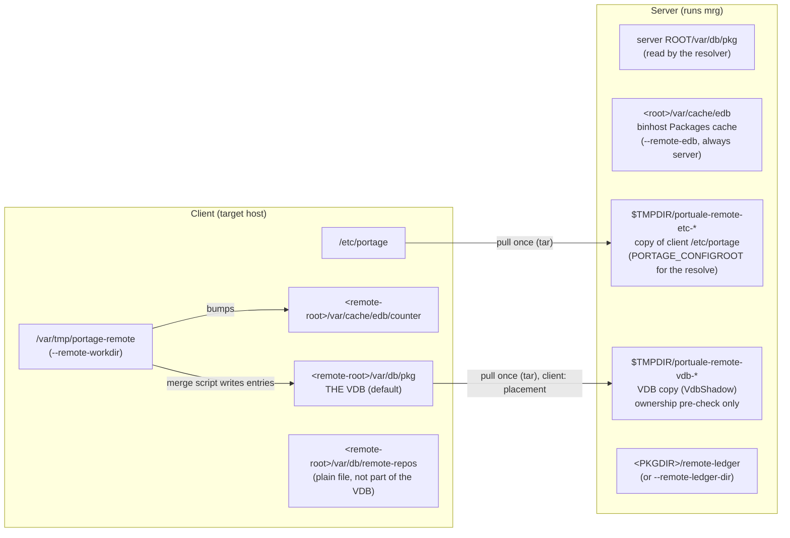
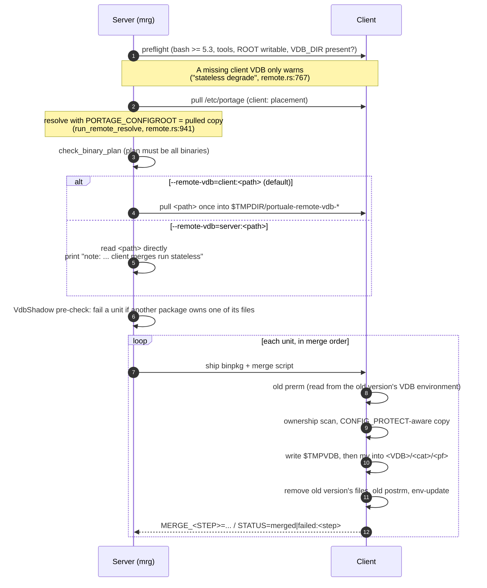

# Remote install (`mrg --remote-hostname`): where the VDB lives

Findings from reading the code on branch `backlog/30-l3-core-rerun`
(2026-09-25). The design doc is [`docs/remote-merge.md`](../docs/remote-merge.md),
§7 "Configuration placement". Code references point at
`rust/portuale/src/remote.rs` unless another file is named.

## Short answer

The VDB stays on the **client**, the machine being installed to, at
`<remote-root>/var/db/pkg`. `--remote-root` defaults to `/`, so the
path is normally just `/var/db/pkg` on the target. The server only
keeps a **temporary copy** of it, used to check file ownership before
anything is shipped.

`--remote-vdb` changes the placement:

| Value | VDB read from | VDB written to | Client merge mode |
|---|---|---|---|
| *(default)* `client:<root>/var/db/pkg` | client, copied once to the server's `$TMPDIR/portuale-remote-vdb-<pid>-<nanos>` | client, `<path>/<cat>/<pf>` | normal (runs old `prerm`/`postrm`, checks ownership) |
| `server:<path>` | server, `<path>` read directly | **nowhere**: no client entry, and the server copy is not updated | **stateless**: no old hooks, any collision fails |

The default is computed in `check_remote` (`remote.rs:277-280`):

```rust
let root = get(matches, "remote_root").unwrap_or_else(|| "/".to_string());
let vdb = match get(matches, "remote_vdb") {
    None => ConfigPlacement::Client(format!("{}/var/db/pkg", root.trim_end_matches('/'))),
    Some(raw) => ConfigPlacement::parse("--remote-vdb", &raw)?,
};
```

`ConfigPlacement` (`remote.rs:87`) has two variants. `Server(path)` is
read directly off the server filesystem. `Client(path)` is pulled once
over the multiplexed SSH connection at plan start.

## Where each piece of state lives



## Lifecycle of one remote run



### 1. Copy for the pre-check (`load_vdb_shadow`, `remote.rs:1708`)

- `client:` copies the client directory with `pull_dir` into
  `$TMPDIR/portuale-remote-vdb-<pid>-<nanos>` on the server. The copy is
  **left in place** for later inspection (it holds only file lists).
- `server:` loads `<path>` directly.
- `VdbShadow::load` walks `<dir>/<cat>/<pf>/CONTENTS` (two levels) and
  keeps only `obj` and `sym` paths, as a map from path to
  `(cat, pf)`. `dir` lines are ignored.
- The check is deliberately lenient. A unit fails early only if a
  **different** package owns one of its paths. Paths owned by the same
  package pass here, and the client driver makes the final decision
  against the live VDB. A passed pre-check is therefore necessary but
  not sufficient, and a failed one is final.

### 2. Writing the entry on the client (`MERGE_FLOW`, `remote.rs:2202`)

`merge_script` (`remote.rs:2470`) passes `VDB=<path>` and
`VDBROOT=<path>/<category>` into the shell driver. The path is:

- the `client:` path itself, or
- `<remote-root>/var/db/pkg` with `STATELESS=1` when the placement is
  `server:` (`remote.rs:2571-2577`). The script uses this path only to
  compute names. It never writes an entry there.

With a client VDB, the driver:

1. Finds the old same-slot version in `$VDBROOT/$PKG-*/`, picking the
   entry with the highest `COUNTER` whose `SLOT` matches.
2. Runs the old version's `pkg_prerm` from its saved VDB environment
   (`environment` or `environment.bz2`).
3. Builds the new entry in `$TMPVDB`: `build-info/*`, `environment`,
   `CATEGORY`, `SLOT`, `repository`, `CONTENTS`, `COUNTER`, and a
   consolidated `metadata` file. `COUNTER` is the highest existing
   counter plus one, taken over every `$VDBROOT/*/COUNTER` and
   `$ROOT/var/cache/edb/counter`, and the edb counter is updated to
   match.
4. Moves it into place with `mv "$TMPVDB" "$NEWVDB"` (`remote.rs:2386`),
   removes the old version's files, then runs the old `pkg_postrm`.

When `STATELESS=1`, the prerm, VDB, remove and postrm steps print
`MERGE_*=skip:stateless-no-vdb`. Files still merge, but any existing
destination outside the CONFIG_PROTECT divert fails the unit.

## Why the default is client-side

From `docs/remote-merge.md` §7: when a same-slot replace happens, the
**replaced** version's `pkg_prerm`/`pkg_postrm` has to run from that
version's saved environment, and that environment lives inside its
VDB entry. The VDB must therefore be on the client for those hooks to
run. `server:` exists for stateless client images and does less, in
the open: no old hooks, no ownership check, and any collision fails.

## Caveat: the resolver does not read the client VDB

The resolve step (`run_remote_resolve`, `remote.rs:941`) pulls only the
client's **`/etc/portage`**. It sets that copy as `PORTAGE_CONFIGROOT`
through `ConfigRootOverride` and calls `pretend::run`. Inside
`pretend::run` the installed root still comes from `root_from_env()`,
the **server's** `ROOT` (`pretend.rs:10718` and its callers). So
"already installed", upgrade and slot decisions are made against the
server's own `/var/db/pkg`, not the client's. The copy of the client
VDB feeds only the file-ownership pre-check.

This matches what the code does today. It is not listed as a known gap
in §7 of the design doc, which says "Resolution models the *client*"
but mentions only `/etc/portage` in that row. Decide whether this is
intended before relying on remote upgrades of a client whose installed
set differs from the server's.

## Related placements (for context)

| Data | Default | Option | Code |
|---|---|---|---|
| `/etc/portage` | client (copied once) | `--remote-etc-portage` | `run_remote_resolve` |
| VDB | client `<root>/var/db/pkg` | `--remote-vdb` | `check_remote:277` |
| edb / binhost cache | server `<root>/var/cache/edb` | `--remote-edb` (`server:` only; currently informational) | `check_remote:284` |
| target ROOT | client `/` | `--remote-root` | `check_remote:276` |
| work area | client `/var/tmp/portage-remote` | `--remote-workdir` | `docs/remote-merge.md` §7 |
| repo ledger, client side | `<root>/var/db/remote-repos` | — | `remote.rs:1483` |
| repo ledger, server side | `<PKGDIR>/remote-ledger` | `--remote-ledger-dir` | `remote.rs:1063` |
