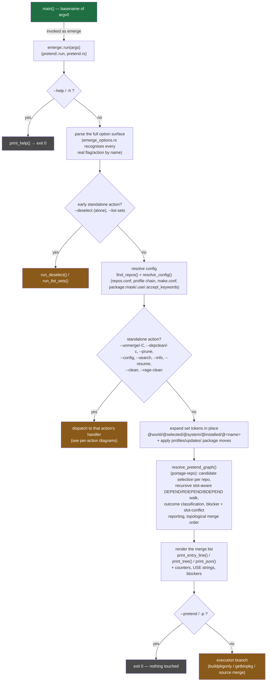

# Operation block diagrams

Block diagrams for four representative `emerge` invocations, as this
pilot's `portuale` binary actually implements them. Each diagram traces
the real call path through `rust/portuale/src/`; blocks are labelled with
the function that does the work so the diagram doubles as a map into the
source.

| Invocation | Diagram | Kind |
|---|---|---|
| `emerge --pretend @world` | [emerge-pretend-world.md](emerge-pretend-world.md) | read-only resolution + display |
| `emerge -v --getbinpkg=n sys-apps/portage` | [emerge-source-merge.md](emerge-source-merge.md) | source build + merge |
| `emerge -v --getbinpkgonly=y sys-apps/portage` | [emerge-getbinpkgonly.md](emerge-getbinpkgonly.md) | binary-only download + merge |
| `emerge -Cv app-portage/eix` | [emerge-unmerge.md](emerge-unmerge.md) | unmerge (removal) |

## Shared front end

Every `emerge` invocation enters through the same multicall dispatch and
argument/config pipeline before it branches to an action:

The execution branch (`if !pretend`, `pretend.rs:7127`) picks exactly one
of:

- `emerge_build::run_buildpkgonly` — `--buildpkgonly` / `-B`
- `emerge_getbinpkg::run_merge_plan` — `--getbinpkg` / `--getbinpkgonly`
- `emerge_build::run_source_merge` — plain `emerge <atom>`
