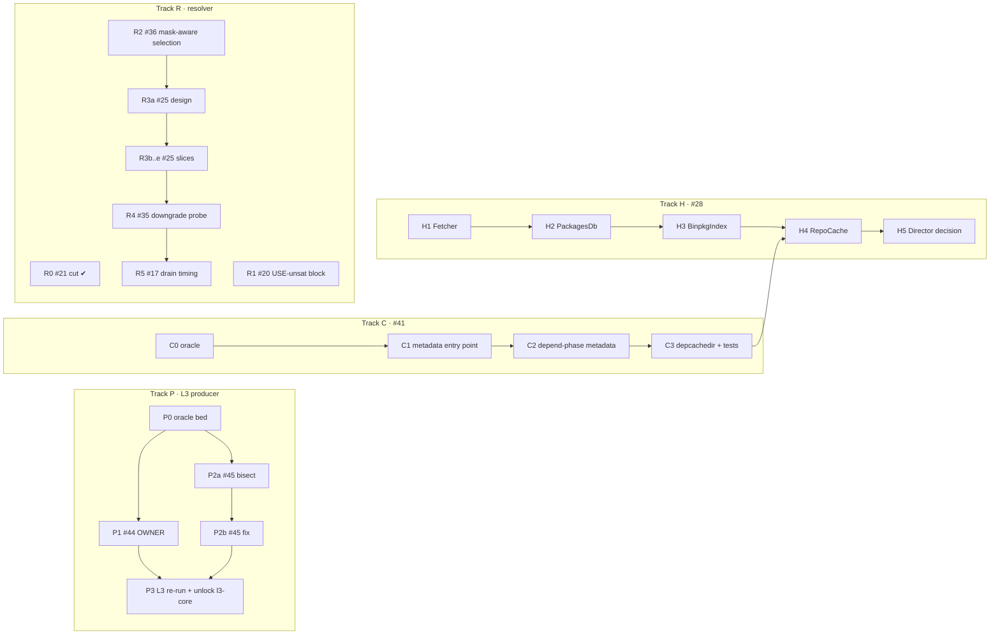

# Backlog Tiers 5 and 2, sliced: order, dependencies and agent-sized work

Status: proposed. Written 2026-09-14 against `main` @ `69f5877`.

**Progress 2026-09-14:** owner decisions D1–D6 answered (§3). D1
applied: #21 moved to the deliberate cuts (R0 done). D5 sets R5's time
box to **600 seconds**.

**Wave 1 done 2026-09-14:** P0 (oracle bed + kept work dirs; H2
confirmed with the exact `_needs_move` rule — see `TEST/findings/l3.md`
"P0"), C0 (cache-less oracle: depcachedir write, read-only branch,
`_md5_` validation — `TEST/findings/l2.md` "C0", plus a stale committed
`docs-1.0` cache entry fixed), R1 (#20 `[use]`-dep unsat block, dual
language, two new fixtures + pins; #20 closed in `backlog-tasks.md`),
H1 (`Fetcher` on the production path, trait reshaped to
`FetchRequest`). Docs in `what-this-proves.md`; wave 2 may start.

**Python reference removed 2026-09-15** (branch
`backlog/python-copy-removal`,
[`second_python_copy_removal.md`](second_python_copy_removal.md)).
This changes every remaining track-R slice (R3b–R5): **no Python
mirror, no Rust==Python pin.** Each slice pins Rust against its real
oracle, keeps `tests/test_output_invariants.py` green, and accepts any
harvested-corpus drift it causes with `PORTUALE_CORPUS_BLESS=1` in the
same commit after reviewing it. Rule 1 in §2, the R row of the
file-conflict map and R4's steps are updated below; the R1/R2 text is
kept as shipped. Side effect for #26 F-A1: with
`PORTUALE_DYNAMIC_DEPS_APPEND=1` only `test_oracle_slotop_undo_cascade`
still fails (the Python half of F-A1 left with the mirror). The removal
also found and fixed a C2 race (`dc8022b`: concurrent cache-miss
resolutions shared the depend phase's metadata file).

Scope: the **open** entries of **Tier 5** (#41, #44, #45) and **Tier 2**
(#17, #20, #21, #25, #28, #35, #36) in
[`backlog-tasks.md`](backlog-tasks.md). The DONE / DONE-PARTIAL entries
of both tiers are out of scope. An LLM-oriented mirror of this file is
[`backlog_tier_5_and_2_sliced.babeltele.md`](backlog_tier_5_and_2_sliced.babeltele.md).
If the two disagree, this file wins.

**Read first:** `AGENTS.md` (the rhythm; step 8 is the verification
pass), [`agent-context.md`](agent-context.md),
[`scope-backlog.md`](scope-backlog.md) §A / §H / §I / §K, and the plan
or findings file each track names below.

Line numbers drift. **Find things by symbol name before you trust a
line number.** Every anchor below was grepped on `69f5877`.

Model tiers follow the Tier 1 plan:

| Tier | Meaning | Examples |
|---|---|---|
| **F** | frontier | Claude Opus 5 / Fable 5.1 |
| **M** | mid | Claude Sonnet 5 |
| **S** | small | Claude Haiku 4.5 |

"F review" means a frontier model reads the full diff before the user is
asked to commit, whoever wrote it. **U** marks a user-owned action or
decision.

---

## 1. The short version

Ten open items fall into four tracks that barely touch each other:

| Track | Items | Kind | Python mirror? (until 2026-09-15) | Why this position |
|---|---|---|---|---|
| **P** — L3 producer parity | #44, #45 | real execution, container | no | Unblocks `l3-core` / `@system` (the #30 S4 stop rule). Highest leverage per hour. |
| **C** — cache-less repo | #41 | repo reader + depend phase | no (D2) | Self-contained drop-in gap; lets the porttest overlay stop committing a generated cache. Must land before H4. |
| **R** — resolver parity | #20, ~~#21~~ (cut, D1), #36, #25, #35, #17 | resolver | was yes; none from R3b on | Ordered cheapest-and-independent first, graph-shape changes before merge-order timing. |
| **H** — mrg-director | #28 | Rust refactor | no | Independent; H4 (`RepoCache`) waits for C. |

The recommended order, and why:

1. **P1 → P2** first (#44 then #45). Two filed bugs with repros, and
   they are the only thing holding back the next test-bed layer. #44 is
   smaller and is a warm-up in the same container bed #45 needs.
2. **C** (#41) in parallel with P. Different files (`portage-repo` repo
   reader vs `portuale` merge/phase code).
3. **R1** (#20) in parallel with P/C: an output-rendering slice with a
   known test pin. (#21 was the R0 owner decision — answered and cut.)
4. **R2** (#36) before **R3** (#25): #36 is a local change inside
   selection whose default-budget fixpoint is already proven identical,
   so it moves no L0 numbers; #25 is the big architectural change and
   should land on a stable base.
5. **R4** (#35) after #25: real's `conflict_downgrade` probe reads a
   `graph_db` that contains installed packages as nodes — which is
   exactly what #25 introduces.
6. **R5** (#17) last: F-B1's drain timing is measured on the final graph
   shape. The F-B3 finding already showed that the iteration-1 batch
   order is fed by `_create_graph` insertion order, which #25 ports.
   Tuning timing before #25 would be measuring a moving target.
7. **H** (#28) any time, one slice per sitting; H4 after C.



### File-conflict map (for running agents in parallel)

| Track | Main files touched |
|---|---|
| P | `rust/portuale/src/ebuild_merge.rs`, `ebuild_phases.rs`, `emerge_getbinpkg.rs`, `TEST/layers/l3/*` |
| C | `rust/portage-repo/src/lib.rs` (repo reader), `rust/portuale/src/ebuild_phases.rs::run_depend_phase`, no Python (D2) |
| R | `rust/portage-repo/src/lib.rs`, `merge_order.rs`, `rust/portuale/src/pretend.rs`, `tests/test_emerge_pretend_contract.py`, `tests/corpus/` (blessed drift) |
| H | `rust/mrg-director/src/lib.rs`, call sites in `rust/portuale/src/{fetch,pretend,emerge_build,emerge_getbinpkg}.rs` |

Conflicts to schedule around: **C × R** both edit
`portage-repo/src/lib.rs` (different regions — use worktrees, rebase C
first); **P × C** both touch `ebuild_phases.rs` (P2b changes env
save/restore, C2 calls `run_depend_phase` — land P2b first or keep C2
to a call site only); **H4 × C** by design.

---

## 2. Rules for every slice

1. **Resolver slices (track R) pin Rust against real Portage** in
   `tests/test_emerge_pretend_contract.py` (a `CASES` entry plus a
   pinned-output test), keep `tests/test_output_invariants.py` green, and
   bless any reviewed `corpus drift` in the same commit. (Until
   2026-09-15 this rule required a lockstep Python mirror; R1 and R2
   shipped under it.) Tracks P and H are real-execution only: no
   `CASES`.
2. **Expected output comes from real Portage, not from reading its
   source.** Every slice that changes output starts with an oracle step
   in the container bed (`TEST/`) or on this host's real `emerge`.
3. **Never weaken L0/L1/L2.** Resolver slices re-run L0
   (`TEST/layers/l0/in-container.sh`) and quote clean / parity / order
   before and after. A slice that *regresses* any L0 probe stops and
   reports, even if its own target improves.
4. **Fixtures:** `git add` a new fixture before any
   `git clean -fdq fixtures/` (the clean deletes untracked fixtures).
   Compare failing contract-test *names* against a clean-`main` baseline,
   not counts (known order-dependent flakes).
5. **Workspace build** before committing a `pub` signature change in a
   `portage-*` crate: `cargo build/test/clippy --release` at the
   workspace root.
6. Update `backlog-tasks.md`, the relevant `TEST/findings/*.md` entry and
   `scope-backlog.md` in the same commit that closes an item.
7. Nothing is pushed. Commits go on a `backlog/<track>` branch; the user
   merges.

---

## 3. Owner decisions (answered 2026-09-14)

All six are answered; the **Owner answer** column is binding for the
slices it blocks. The recommendation column is kept as the rationale.

| # | Question | Recommendation | Owner answer (2026-09-14) | Blocks |
|---|---|---|---|---|
| **D1** | #21 cycle `--tree` nesting: move to Part 3 deliberate cuts? | Yes. The flat cycle display, enumeration and trailer already match; nesting contradicts the dedup'd tree model (Gate G0.2). | **Yes — moved to deliberate cuts** (applied: `backlog-tasks.md`, `scope-backlog.md` Part 3). | R0 ✔ |
| **D2** | #41: does the Python reference mirror the ebuild fallback? | No. The fallback needs a bash depend phase; the Python reference stays cache-reading. | **No Python mirror; Rust-only test** in `tests/test_portuale.py`, not the contract suite. | C2 |
| **D3** | #41: write generated metadata to `depcachedir` (`/var/cache/edb/dep`) like real, or keep it in memory? | Mirror real — real `porttree.py` does exactly this split. | **Write to `depcachedir` when writable, otherwise keep in memory**, as real Portage does. | C3 |
| **D4** | #25 is allowed to move L0 merge-order rows in both directions during its slices, provided the net after R3e is not worse? | Yes, with a per-slice log of every flipped probe. | **Yes** — individual slices may move L0 order up or down; the net after R3e must not be worse. | R3b+ |
| **D5** | #17 stop rule: time box R5, file the residue as a deliberate cut if no lever closes it? | Yes, with a time box. | **Time box = 600 seconds.** At the limit, stop and file the residue (with the lever table so far) as a deliberate cut. | R5 |
| **D6** | #28 end state: is "all 8 slots dispatched on the production path" enough, or does `Director` itself become the production entry point? | Slots only; the `action_build` decomposition is a separate, later decision. | **Slots only.** | H5 |

---

## 4. Track P — L3 producer parity (#44, #45)

**Goal:** the L3 smoke candidate (`TEST/atomlists/l3-smoke.txt`) shows
0 unexplained rows for OWNER and VDB `environment`, so `l3-core` (344
ebuilds) can start.

**Evidence:** `TEST/findings/l3.md` "FILED (backlog #44)" and "FILED
(backlog #45)"; plan `docs/030_L3-source-build-parity.deepseek.md`
(S4 stop rule). Repro for both:
`L3_CONTROL=1 TEST/run/l3-source-parity.sh TEST/atomlists/l3-smoke.txt`
then `diff.py --layer l3`.

### P0 (S, ~1h) — oracle bed with kept work dirs

Re-run the smoke pair with `FEATURES=keepwork` (both containers) and
collect, for `sys-libs/ncurses`:

- `stat -c '%u:%g %n'` of `${D}/usr/include/curses.h` and one terminfo
  file **before** merge, in both containers;
- the same paths on the live root **before** and **after** merge;
- `${T}/environment` after every phase (copy it aside at each phase
  boundary — a `pre_*`/`post_*` hook in `/etc/portage/bashrc` is enough
  on the real side; the portuale side needs the equivalent hook or a
  debug env var if one exists).

**Accept:** the artefacts are in `TEST/logs/…` and the paths are quoted
in `TEST/findings/l3.md`. No code change.

### P1 (M, F review, 2–4h) — #44 merge keeps `1:1` ownership

The finding says real keeps the image's `bin:bin` and portuale writes
`root:root`, with identical contents. P0 decides which of these is true
before any code is touched:

- **H1 — the build image differs:** real's `${D}` already has `1:1`
  (for example, ncurses' install uses `-o`/`-g` or copies the live
  file's ownership) and portuale's phase runs lose it. Then the fix is in
  the install phase (`ebuild_phases.rs`), not the merge.
- **H2 — real's merge preserves the destination's ownership** when it
  replaces an existing file. Portuale has a similar exception only for
  existing *directories* (`lchown_or_chown`,
  `rust/portuale/src/ebuild_merge.rs:1889`, memory note "os.lchown
  complete"). Then the fix is the file case, mirroring real
  `vartree.py::_merge_contents` / `movefile` exactly — including *when*
  it does **not** preserve.
- **H3 — test-bed artefact** (uid mapping, snapshot normalisation).
  Then fix the harness and document it; no product change.

Steps: pick the hypothesis from P0's evidence; write a fixture-level
regression test that installs over a pre-existing `1:1` file (as root,
via `sudo` — the container has passwordless sudo); implement; re-run the
smoke pair.

**Accept:** L3 smoke OWNER rows for ncurses = 0; the regression test
fails on `main` and passes with the fix; L1 porttest still 0 findings.

### P2a (F, 2–3h) — #45 bisect the accumulation

Using P0's per-phase `${T}/environment` snapshots, find the **first
phase** where each of the three symptoms appears on the portuale side
but not on the real side:

| Symptom | Real | Portuale |
|---|---|---|
| `A` | distfile once | distfile ×3, patch list ×2 |
| `RESTRICT` | `"test"` | `"test test"` |
| locals | absent | `declare -- f`, `declare -- x=""` |

Expected root cause family (from the finding): portuale's per-phase
save/restore appends state that real's next phase re-derives by
re-sourcing the ebuild. Check the two portuale-specific pieces first:
the brush `___save_and_filter_ebuild_env` wrapper and
`run_one_phase_bash` (`ebuild_phases.rs:2743`) env assembly; also
whether a top-level helper loop leaks `f`/`x` because it runs outside a
function (real would have `local`).

**Accept:** a written root cause per symptom in `TEST/findings/l3.md`,
each with the file/function and the real-Portage counterpart
(`bin/ebuild.sh`, `bin/phase-functions.sh`). If the three symptoms turn
out to have three independent causes, split P2b into three commits.

### P2b (F, 3–6h) — #45 fix

Implement the fix at the cause, not by de-duplicating the saved file.
De-duping `A` after the fact would hide the bug for the next variable.

Tests: a fixture whose ebuild appends to `A` and `RESTRICT` in a way
that accumulates when phases re-source incorrectly, plus a helper that
assigns a non-local variable; assert the vdb `environment.bz2`
(`bzip2 -dc`) has each value once and no stray locals, under both
`--shell bash` and `--shell brush`.

**Accept:** L3 smoke VDB `environment` rows = 0 (apart from the
already-normalised `LANG`/`LC_*`); L1 porttest vdb `environment` still
byte-matches real; `cargo test --release` + pytest green.

### P3 (S/M, ~1h + container time) — close out and unlock `l3-core`

Re-run L3 smoke (candidate and control). If 0 unexplained, update
`TEST/findings/l3.md` (#44/#45 → FIXED with log dirs), `backlog-tasks.md`
(#44, #45 DONE; #30 note), and lift the S4 stop rule in the #30 plan.
Starting `l3-core` itself is a separate, user-triggered run (U).

---

## 5. Track C — ebuild fallback for a cache-less repo (#41)

**Goal:** `emerge -p porttest/docs` on a repo with no
`metadata/md5-cache` resolves the way real Portage does.

**Evidence:** `TEST/findings/l2.md` `l2-no-md5-cache-ebuild-fallback`;
workaround: the committed cache under
`TEST/images/overlay/porttest/metadata/md5-cache/`. Real side:
`3rdparty/portage/lib/portage/dbapi/porttree.py` (`depcachedir`, auxdb
selection, `_pull_valid_cache` / `doebuild` depend).

**Current shape:** 35 call sites read `metadata/md5-cache` directly
(`read_md5_cache`, `rust/portage-repo/src/lib.rs:1315`; 18 in that file
alone). Candidate enumeration (`list_candidates`, both languages)
already walks `<cat>/<pkg>/*.ebuild` like real `portdbapi.cp_list`, but
on a cache miss it **silently skips** the version (`except OSError:
continue` in the Python reference; same shape in Rust). So the listing
is right and the gap is *metadata*: every miss becomes an invisible
version. Other walkers (e.g. `mrg-director`'s `Md5Cache::category`)
do list from the cache directory and need the same treatment.

### C0 (S, ~1h) — oracle

In the container, on a copy of the porttest overlay with
`metadata/md5-cache` removed: run real `emerge -p porttest/docs`, record
output, then inspect `/var/cache/edb/dep/<repo path>/…` for what real
wrote. Repeat as a non-root user with an unwritable `depcachedir`
(real's read-only branch). Also record what real does when **both** a
stale md5-cache entry and a newer ebuild exist (does it validate
`_md5_`/`_mtime_` and regenerate?). That last answer decides whether C
also has to validate existing cache entries — if it does, file it as a
follow-up rather than growing this track.

**Accept:** outputs + cache-dir listing quoted in `TEST/findings/l2.md`.

### C1 (M, 2–3h) — one metadata entry point, cache misses made visible

Introduce one repo-level function, "aux metadata for `cat/pf` in this
repo", that every one of the 35 `read_md5_cache` call sites goes
through (mechanical, behaviour-neutral), plus a per-repo "has a usable
md5-cache?" flag. A miss no longer means "skip silently" at the call
site; it means "ask the fallback" (C2), which in this slice still
returns the old error. Switch cache-directory listers (e.g.
`Md5Cache::category`) to list `*.ebuild` files when the flag is false.
Do **not** change behaviour for repos that have a cache (every L0/L1
probe).

**Accept:** grep shows `read_md5_cache` called only from the new entry
point; contract suite + L0 unchanged.

### C2 (F review, 3–5h, needs D2) — metadata from the depend phase

When the cache has no entry, produce the aux dict by running the depend
phase (`run_depend_phase`, `rust/portuale/src/ebuild_phases.rs:2954`,
already used by `--regen`) and parse its output into the same
`HashMap<String, String>` shape `read_md5_cache` returns. The layering
problem: `portage-repo` cannot call into `portuale`. Recommended shape:
`portage-repo` exposes a metadata-provider hook (a trait object or
function pointer registered at startup) that `portuale` fills with the
depend-phase runner; with no provider registered, behaviour is today's.

**Accept:** `portuale emerge -p porttest/docs` on the cache-less copy
matches C0's real output byte for byte; the Rust-only test lands in
`tests/test_portuale.py`.

### C3 (M, 2h, needs D3) — `depcachedir` write-back and harness cleanup

Write generated entries to `depcachedir` in real's flat layout when it
is writable; otherwise keep them in memory for the process. Second run
must not re-run the depend phase. Then add an L2 variant that deletes
the overlay's committed cache before running, and note in
`TEST/images/overlay/porttest/README.md` that the committed cache is now
an optimisation, not a workaround (keep it — L2 speed).

**Accept:** second-run timing shows no depend phases; L2 porttest track
still `strict hard=0 soft=0` with and without the committed cache;
finding → FIXED.

---

## 6. Track R — resolver parity (Tier 2)

### R0 (U, 10 min) — #21 decision — **DONE 2026-09-14**

D1 answered yes and applied: #21 moved to `backlog-tasks.md` "Deliberate
cuts" and `scope-backlog.md` Part 3 with one sentence of rationale (tree
model dedups by design; flat cycle display already matches). If the
owner ever re-opens it, it goes to the end of track R.

### R1 (M, F review, 2–4h) — #20 `[use]`-dep unsat block

**Target:** a `[use]`-dep dependency atom with no autounmask flip prints
real's

```
emerge: there are no ebuilds built with USE flags to satisfy "<atom>".
!!! One of the following packages is required to complete your request:
- <cpv>::<repo> (<reason>)
...
```

instead of portuale's bare `!!! no visible ebuild for dependency` line
(`rust/portuale/src/pretend.rs:1216`, Python mirror
`emerge_pretend_reference.py:22591`; the helper that produces the
line's context is documented at `rust/portage-repo/src/lib.rs:8474`).
Exit code 1 and Rust==Python are already right.

Steps:

1. Oracle: build the fixture from
   `test_or_group_use_unsat_alternative_reports_the_dependency_it_enqueued_without_autounmask`
   (`tests/test_emerge_pretend_contract.py:3789`) in the container and
   capture real's full output, including the `(dependency required by
   …)` chain and the exact `<reason>` wording (`change USE: …`,
   `missing IUSE: …`). Also capture the gnome-shell `samba[client]`
   case from F-B5 as a real-tree check.
2. Port real `depgraph._show_unsatisfied_dep`'s USE branch: which
   candidates are listed, their order, the reason text. Reuse the masked
   block's dependency-chain renderer shipped with #19 — do not write a
   second one.
3. Re-pin the existing contract test to the new text; add one case per
   reason kind.

**Accept:** fixture output == real byte for byte; contract suite green
(names vs baseline); L0 clean count ≥ before.

### R2 (F, 4–6h) — #36 mask-aware candidate fallback in selection

**Target:** real `_select_pkg_highest_available` walks versions
highest-first and runs `dep_check` with masks applied, so a version whose
dependency is masked is skipped *during selection*. Portuale picks the
highest visible version and only reaches the lower one through a
missing-dep mask on the next backtrack step.

**Oracle already exists:** `docs/023-oracle.md` case mg3; fixtures
`btparent`, `mgf`, `mgfa`. The observable difference is at tight
budgets: `mgfa --backtrack=1` — real merges, portuale reports.

Steps:

1. Add the failing pin first: `mgfa --backtrack=1` expected == real.
2. Implement the selection-time probe for the **masked** case only
   (the case the finding proves). Resist generalising to "any
   unsatisfiable dep" — real's `dep_check` there also consults the
   graph, which is R4's territory.
3. Confirm the default-budget cases (`btparent`, `mgf`, `mgfa`) still
   settle to the same result, and that backtrack counts in `--debug`
   narration match real where the contract already pins them.

**Accept:** new pin green both languages; L0 unchanged (expected, since
default-budget fixpoints are proven identical — any L0 movement is a
stop-and-report).

### R3 — #25 `_complete_graph` installed nomerge nodes (the big one)

**What it owns** (from `docs/025-tier2-closeout.deepseek.md` §11):

- **F-B4:** real draws no edge for a dependency initially satisfied by
  an installed package, and drops an installed node's in-edges when a
  same-slot merge supersedes it (`nghttp2 -> systemd` absent in real;
  gedit #5, nautilus #8). A static `build_digraph` rule cannot fix it —
  `MULTI_deep-update-world` needs the opposite edge — the resolver's
  walk order is the information.
- **F-B3:** the `-pe @system` tie-break is real's `_create_graph` LIFO
  insertion order vs portuale's `build_digraph` DFS from the expanded
  top-level atoms (`_system` #11, `_world` #14, `MULTI_emptytree-system`
  #13).
- The original item: real keeps every `@world`/`@system`-reachable
  installed package as a graph node; portuale keeps only their
  reverse-dep atoms (`add_installed_dependency_closure`,
  `rust/portage-repo/src/merge_order.rs:1044`).

It is too large to hand to one agent. Slice it:

#### R3a (F, 4h, docs only) — design note

Write `docs/025b-complete-graph-nodes.md`: how real records nodes and
edges during `_create_graph` / `_add_pkg` / `_complete_graph`
(insertion order, `DepPriority.satisfied`, superseded-in-edge removal),
what portuale records today (resolver output → `GraphEntry` →
`build_digraph`), and the **data** the resolver must hand the scheduler
graph: (1) insertion sequence number per node, (2) per-edge "satisfied
by installed at the time" flag, (3) installed nodes as first-class
entries. Include the mo-trace harness commands
(`TEST/scripts/mo-trace/`) for gtk:4, gedit, `-pe @system`, and
`MULTI_deep-update-world` as the acceptance probes. **F review; user
reads before R3b.**

#### R3b (F, 4–6h) — record insertion order

Carry the resolver's node-insertion sequence into `GraphEntry` and use
it as the pre-bias order in `build_digraph` instead of the DFS order.
No edge changes yet.

**Accept:** `MO_ORDER` on `-pe @system` matches real's pre-bias order
(368 == 368 nodes, same sequence); record every L0 probe that flips
(D4).

#### R3c (F, 4–6h) — "initially satisfied → no edge"

Record, at the moment the resolver adds an edge, whether the atom was
satisfied by an installed package; drop those edges from the scheduler
graph the way real's priority does.

**Accept:** gedit's `nghttp2` has only its `virtual/pkgconfig` edge;
`MULTI_deep-update-world` keeps `portage`/`gentoolkit` order (the B2
regression guard).

#### R3d (F, 4–6h) — installed nomerge nodes + superseded in-edges

Promote reachable installed packages to nodes; when a same-slot merge
supersedes one, move/drop in-edges as real does. Retire the reverse-dep
atom approximation once parity holds.

**Accept:** gtk:4 / gedit / nautilus node and edge sets match real's
`--debug` digraph dump; `MO_NODES` equality on all four probes.

#### R3e (M, 2h + container) — close-out

Full L0 run; update `TEST/findings/l0.md` "## I", §11 F-B3/F-B4 →
resolved (or residue explained), `backlog-tasks.md`. Net L0 order count
must not rise (D4).

### R4 (F, 4–6h) — #35 `downgrade_probe` + live `graph_db`

**Target:** real `dep_zapdeps` demotes a `||` alternative when the slot
conflict it would create is solvable by downgrade
(`conflict_downgrade` / `installed_downgrade`,
`3rdparty/portage/lib/portage/dep/dep_check.py`, soft lines 476–521, bug
531656). The seam is already marked in
`rust/portage-repo/src/lib.rs:9069` (`disjunction_preference`'s doc
comment).

Why after R3: `graph_db.match_pkgs` sees installed packages as graph
nodes, which R3d introduces. With R3 in place, a "live graph_db" is a
read of the resolver's current node set plus a slot index, not a new
parallel structure.

Steps: oracle fixture from `docs/023-backtracking_resolve.md` B2 (build
one if the plan only describes it: `||` group whose first alternative
conflicts with an installed higher version in the same slot);
implement `downgrade_probe` (does config/CLI accept the downgrade?) and
the two guards; pin against the oracle fixture.

**Accept:** fixture == real; L0 ≥ before.

### R5 (F, time-boxed 600 s per D5) — #17 F-B1 frontier drain timing

**State:** node sets equal (398 == 398 on gtk:4), but portuale runs 578
drain iterations vs real's 290; first divergence is the order inside the
iteration-1 greedy batch (`sys-libs/zlib` real position 9 vs portuale
45). Plan/evidence: `docs/025-tier2-closeout.deepseek.md` §11,
`TEST/findings/l0.md` "## I".

Steps:

1. Re-measure after R3: if R3b's insertion order already fixed the
   iteration-1 batch order (likely, per F-B3's stable-sort argument),
   record the new L0 numbers and stop — close #17.
2. Otherwise, replay real's `_serialize_tasks` frontier loop against
   the `--debug` dump with the mo-trace harness, one lever from the
   14-probe installed-chain family at a time, keeping a table of
   lever → probes flipped.
3. At the 600-second time box, stop: file the residue as a deliberate
   cut with the lever table gathered so far (D5).

**Accept:** either #17 closed with numbers, or a deliberate-cut entry
with the lever table as evidence.

---

## 7. Track H — mrg-director remaining slots (#28)

**State** (verified on `69f5877`): production traffic flows through
`SchedulerPolicy` (`emerge_build.rs` uses `UnlimitedPolicy`),
`MergeEngine` (`merge_engines.rs`, `emerge_getbinpkg.rs`) and
`NewsSelector` (`FilesystemNews` in `pretend.rs`). `Fetcher`
(`WgetFetcher`), `PackagesDb` (`VdbReader`), `BinpkgIndex`
(`PkgdirBinIndex`, `RemoteBinhostIndex`) and `RepoCache` (`Md5Cache`,
`VolatileCache`) are referenced only inside
`rust/mrg-director/src/lib.rs` and its tests. `Director`
(`lib.rs:1120`) is test-only.

**Invariant for every H slice:** behaviour-neutral. The trait call
replaces a direct call with the same implementation underneath; the
contract suite, L1 porttest and `cargo test --release` must be
unchanged. One slot per commit.

### H1 (M, 2–3h) — `Fetcher` on the production path

Tier 1's F-track rewrote the fetch candidate loop (layout.conf mirrors,
retries, fsmirrors). Check first that the trait's doc comment
(`lib.rs:192–234`, "fsmirror … out of scope") is now stale — fsmirrors
shipped in `5ca67f9` — and fix it. Then route
`portuale::fetch::fetch_src_uri`'s per-candidate download through
`&dyn Fetcher`. If the trait's signature (`entry` + `distdir`, no
Manifest) can't carry the new candidate list, change the trait, not the
fetch semantics.

### H2 (M, 2–3h) — `PackagesDb` via `VdbReader`

Pick the narrowest production consumer first (e.g. `--depclean`'s
reverse-dependents or `CONTENTS` reads that call
`installed_contents_files` / `installed_reverse_dependents`) and switch
it to the trait. Stop when those two functions have a production caller
through `VdbReader`.

### H3 (M, 2h) — `BinpkgIndex`

Route the local `PKGDIR` index read (and, if the call site is the same,
the remote `Packages` read) in `emerge_getbinpkg.rs` through
`PkgdirBinIndex` / `RemoteBinhostIndex`.

### H4 (M, 2–3h, after track C) — `RepoCache`

Once C1/C2 have introduced the single metadata decision point, make
that decision point *be* a `RepoCache`: `Md5Cache` when the cache
exists, a depend-phase-backed implementation (write-through to
`VolatileCache` / `depcachedir`) when not. This is the natural home for
#41's fallback and avoids implementing it twice.

### H5 (F, 2h, docs, D6) — `Director` proposal

Write a short proposal for whether `Director` becomes the production
`action_build` entry, with the call graph as it stands after H1–H4.
Close #28 per D6.

---

## 8. Suggested agent schedule

| Wave | Parallel slices | Gate before next wave |
|---|---|---|
| 1 | P0, C0, R1, H1 (R0 done) | oracles captured (D1–D6 answered 2026-09-14) |
| 2 | P1, P2a, C1, R2, H2 | P2a root cause reviewed |
| 3 | P2b, C2, R3a (design, user reads), H3 | R3a approved (D4 answered: yes) |
| 4 | P3, C3, R3b | L3 smoke clean; C finding FIXED |
| 5 | R3c, H4 | — |
| 6 | R3d → R3e | full L0 |
| 7 | R4, H5 | — |
| 8 | R5 (600 s time box) | D5 |

Sizes are agent-hours of focused work, excluding container runs (L0 is
the long one).

---

## 9. What "done" looks like

- **Tier 5:** #41, #44, #45 DONE; L3 smoke 0 unexplained; `l3-core`
  unblocked for a user-triggered run.
- **Tier 2:** #20, #36, #25, #35 DONE; #21 in deliberate cuts; #17
  either DONE or a deliberate cut with evidence; #28 DONE per D6.
- L0/L1/L2 never regressed at any commit; contract suite green;
  `backlog-tasks.md`, `scope-backlog.md` and the findings files updated
  in the closing commits.

**Wave 2 progress 2026-09-14:** P1 (#44 fixed; 0 OWNER rows at L3,
L1 0 findings), P2a (#45 bisected: RESTRICT flatten + missing
postinst `PORTAGE_UPDATE_ENV`; `A` no longer reproduces), C1 (#41
entry point, committed), H2 (#28 `PackagesDb` CONTENTS on the
production path, committed). **R2 stopped**: a fresh oracle shows real
3.0.82.2 *aborts* `mgfa --backtrack=1` (partial list + `backtracking:
slot conflict` masked block), contradicting `docs/023-oracle.md`'s
mg3-bt1 row ("real merges") and this plan's R2 target — see that file's
"R2 oracle correction" + `TEST/logs/r2-blocker-20260914/`. Needs an
owner decision before R2/R3 resume. Wave 3 not started.

**Wave 2 closed + wave 3 done 2026-09-14:** R2 was re-scoped per the
owner's decision (a): a genuine upstream oracle (`test_backtracking.py::
testBacktrackingGoodVersionFirst` through portage's own
`ResolverPlayground`) settles at `--backtrack=4` and portuale reaches
the same fixpoint at 2/4, so #36 closed as not-reproducible-as-framed
(`docs/023-oracle.md` "R2 — genuine upstream oracle"). Wave 3:
**P2b-1** (`flat_field_on` dedup+sort), **P2b-2** (source-merge
postinst `PORTAGE_UPDATE_ENV` + `A`) -- L3 smoke `l3-20260914T192147Z`
now has **0 environment rows, 0 OWNER rows** (the 12 left are
`BUILD_TIME`/`metadata`, filed #47); **C2** (depend-phase metadata
provider; cache-less `porttest/docs` resolves, Rust-only pin);
**R3a** (`docs/025b-complete-graph-nodes.md`, awaiting the owner's read
before R3b); **H3** (remote `Packages` via
`RemoteBinhostIndex::metadata_with_source`; #28 now 6/8 slots). Full
wave verification: cargo fmt/clippy/test green, L1 `l1-20260914T215056Z`
0 findings, full pytest green (count in the wave report).

**Wave 4 progress 2026-09-15:** **P3** — full candidate+control L3 smoke
`TEST/logs/l3-20260914T234404Z` is **0 hard / 0 unexplained on both**
(the last 12 rows were #47's `BUILD_TIME`/`metadata` gap, fixed at
`write_post_install_metadata` like real `doebuild.py:2727-2732`), so the
#30 S4 stop rule is lifted and `l3-core` is unblocked. **C3** —
`depcachedir` write-back in the C2 provider (validated read through the
shared `regen::entry_is_valid`, real `flat_hash` write-back through
`regen::render_entry`/`write_entry`, best-effort on an unwritable
directory) plus the `L2_CACHELESS=1` variant: normal
`l2-20260915T004600Z` rc 0 and cache-less `l2-20260915T004923Z` rc 0
with all ten archive pairs `hard=0 soft=0`, cross-install/control 0
unexplained; #41 closed, finding FIXED. **R3b** — the F-B3 pre-bias
order was the `SetArg` seed order, not a missing `insertion` field:
real `_resolve` sorts each set's atoms (`depgraph.py:5500`), so sorting
the `@system` segment brings `-pe @system`'s 368-node `MO_ORDER` to
three localized residues (`TEST/logs/r3b-20260915T000000Z/`) and L0 to
clean 100 / parity 0.833 / order 17 (from 98 / 0.817 / 19), with
`_system` #11, `_world` #14 and `MULTI_emptytree-system` #13 fixed and
the latter's first divergence at #304 (`TEST/findings/l0.md` "R3b").
Full wave verification: fmt/clippy/test green, pytest 1594 passed, L2
tracks rc 0, L0 as above. R3c/R3d resume the #25 line with the
installed-nomerge model.
