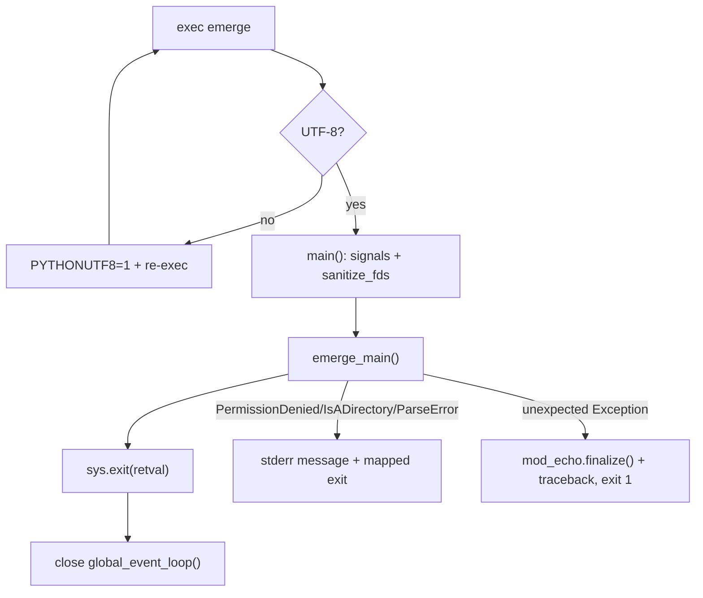

# 01 — Entry point and CLI (`bin/emerge`, `_emerge/main.py`)

## 1.1 `bin/emerge` (110 lines) — process shim

Responsibilities, in order:

1. Force UTF-8. If `sys.getfilesystemencoding()` or
   `locale.getpreferredencoding(False)` is not `utf-8`, set
   `PYTHONUTF8=1` and re-exec self (`bin/emerge:9-14`). Portuale MUST
   run all parsing/logging in UTF-8.
2. Extend `sys.path` with `<repo>/lib` when `.portage_not_installed`
   exists next to the repo root (`bin/emerge:38-43`). Installed mode
   MUST NOT do this.
3. Set `portage._internal_caller = True` and disable legacy globals
   (`bin/emerge:46-47`).
4. `main()` (`bin/emerge:54`):
   - `SIGPIPE → SIG_DFL`; `SIGTERM → signal_interrupt` (raises
     `SignalInterrupt(signum)`, a `KeyboardInterrupt` subclass carrying
     `signum`, `bin/emerge:21-27`); `SIGUSR1 → debug_signal` (drops
     into `pdb`, `bin/emerge:30-33`).
   - Sanitize FDs (`portage.process.sanitize_fds()`).
   - Call `emerge_main()`; map exceptions:
     `PermissionDenied → "Permission denied: '…'" + exit(errno)`;
     `IsADirectory → “… is a directory…” + exit(errno)`;
     `ParseError → message + exit(1)`; unexpected `Exception →`
     `mod_echo.finalize()` then traceback to stderr, exit 1
     (`bin/emerge:62-87`).
   - `sys.exit(retval)`.
5. `__main__` guard (`bin/emerge:91-110`): on `KeyboardInterrupt`,
   reset the signal disposition to `SIG_DFL`, print
   `"\n\nExiting on signal N"`, re-raise the OS signal; in `finally`,
   close the global event loop (only for `__main__`, so spawned
   multiprocessing children are unaffected).



## 1.2 `lib/_emerge/main.py` (1382 lines)

### 1.2.1 Small helpers

| Symbol | Signature | Behavior |
|---|---|---|
| `multiple_actions` | `multiple_actions(action1, action2)` (`main.py:93`) | Prints `Multiple actions requested: …` error and exits 1. At most one action flag is allowed. |
| `insert_optional_args` | `insert_optional_args(args)` (`main.py:99`) | Pre-processor run before `argparse`: for flags declared with optional values it inserts the default `"True"` token, and expands combined short flags (e.g. `-ab`). Returns the rewritten argv list. |
| `valid_integers.__contains__` | `__contains__(self, s)` (`main.py:108`) | True iff `int(s) >= 0`. Used as argparse validator. |
| `valid_floats.__contains__` | `__contains__(self, s)` (`main.py:117`) | True iff `float(s) >= 0`. |
| `valid_integers_or_y_or_n.__contains__` | `__contains__(self, s)` (`main.py:131`) | True iff `s` is a non-negative int or `y`/`n`. |
| `emerge_help` (in `help.py:7`) | `emerge_help()` | Prints short `Usage/Options/Actions` summary pointing at the man page. No return contract beyond stdout. |

### 1.2.2 `parse_opts(tmpcmdline, silent=False)` (`main.py:293`)

Builds the full `argparse` parser from three tables:

- `actions` set (e.g. `clean, config, depclean, deselect, info, list-sets,
  metadata, regen, search, sync, unmerge, prune, rage-clean, version,
  moo, status, check-news`),
- `options[]` long-option descriptors with defaults and validation,
- `shortmapping{}` and `argument_options{}` for short flags and flags
  taking arguments.

Steps:

1. `insert_optional_args()` rewrite.
2. `argparse.parse_args`.
3. Normalize: literal `"True"` → `True`; `"y"/"n"` strings for
   tri-state options; `None` for unset.
4. Validate: atoms (`is_valid_package_atom`), `--backtrack`,
   `--deep`, `--jobs`, `--load-average` numerics.
5. Detect multiple actions → `multiple_actions()` exit 1.
6. Synthesize the `deselect` action when `--deselect` is passed with an
   install action.
7. Return `(myaction, myopts: dict, positional_args: list)`.

`myopts` keys use the long-option spelling (`--ask`, `--pretend`,
`--update`, `--deep`, `--jobs`, `--load-average`, `--keep-going`,
`--resume`, `--usepkg`, `--getbinpkg`, `--autounmask`, `--backtrack`,
`--complete-graph`, `--with-bdeps`, `--root-deps`, `--onlydeps`,
`--nodeps`, `--oneshot`, `--emptytree`, `--noreplace`, `--quiet`,
`--verbose`, `--tree`, `--columns`, etc.).

### 1.2.3 `profile_check(trees, myaction)` (`main.py:1165`)

- Returns `EX_OK` immediately for `help/info/search/sync/version`.
- Otherwise verifies every target root has a valid `profiles/` link and
  `ARCH`; on failure calls `validate_ebuild_environment()` and returns
  an error that restricts the allowed actions. Portuale MUST refuse
  build/merge actions with a broken profile.

### 1.2.4 `emerge_main(args=None)` (`main.py:1197`) — orchestrator

```
emerge_main(args=sys.argv[1:])
  1. locale setup, havecolor=0, HTTP-trace enable        (1211-1229)
  2. parse_opts(args, silent=True) → early opts           (1234)
     → export PORTAGE_CONFIGROOT/SYSROOT/ROOT/EPREFIX/
        ACCEPT_* into os.environ                         (1241-1252)
  3. fast paths: help→emerge_help(); moo→cowsay;
     status→snapshots; sync→_sync_mode=True               (1255-1283)
  4. sanity: /dev/null is a char device; bash supports
     process substitution                                (1288-1323)
  5. os.umask(0o22); load_emerge_config(action,args,opts)(1327)
  6. locale vars from config; prepend EMERGE_DEFAULT_OPTS
     (unless --ignore-default-opts); parse_opts() again
     → emerge_config.action/opts/args                    (1330-1365)
  7. try: run_action(emerge_config)
     finally: close portdb caches; emergelog("*** terminating.")
     (unless --pretend); xtermTitleReset()                (1367-1382)
```

Two-pass parsing is REQUIRED: the first pass learns only the filesystem
roots so configuration can be loaded; the second pass applies
`EMERGE_DEFAULT_OPTS` and full validation.

```mermaid
sequenceDiagram
    participant E as bin/emerge:main()
    participant M as emerge_main()
    participant P as parse_opts()
    participant C as load_emerge_config()
    participant R as run_action()
    E->>M: call
    M->>P: early parse (silent)
    M->>C: create trees + RootConfig
    M->>P: full parse (+EMERGE_DEFAULT_OPTS)
    M->>R: dispatch
    R-->>M: exit code
    M->>M: finally: caches, emergelog, title reset
    M-->>E: retval
