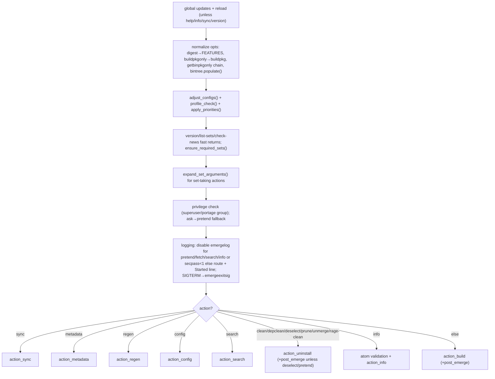

# 02 — Actions and configuration (`_emerge/actions.py`)

`actions.py` (4300 lines) owns the action dispatcher, all `action_*`
implementations, and per-root configuration assembly.

## 2.1 Action implementations

| Symbol | Location | Behavior |
|---|---|---|
| `action_build` | `actions.py:99` | Default install/update path. Validates resume data; resolves `--resume` via `backtrack_depgraph()` / `resume_depgraph()`; handles `--autounmask-only/--pretend/--ask/--tree` display; checks writable `vartree/bintree`; unlocks GPG when needed; runs `Scheduler(...).merge()`; auto-cleans when `AUTOCLEAN=yes`. Returns exit code. |
| `action_config` | `actions.py:711` | Runs the `config` phase (`portage.doebuild(..., "config")` + `elog_process` + `clean`) for exactly one valid installed atom; supports `--ask` disambiguation. |
| `action_depclean` | `actions.py:793` | Forces `AUTOCLEAN=yes`; warns about `preserve-libs/world`; calls `calc_depclean()` then `unmerge()`; prints `installed/world/system/required/removed` summary. |
| `calc_depclean` | `actions.py:916` | Unpacks `_calc_depclean()` namedtuple to `(returncode, cleanlist, ordered, req_pkg_count)`. |
| `_calc_depclean` | `actions.py:929` | Builds a depgraph over the installed `vartree` with `world/selected/system/protected` required sets; validates sets/world; computes ordered removal list via nested `create_cleanlist()`; honors `--pretend/--ask/--quiet`. Nested helpers: `show_invalid_depstring` (:1015), `unresolved_deps` (:1137), `show_parents` (:1256, reverse-dependency explanation), `cmp_pkg_cpv` (:1295), `create_cleanlist` (:1303, honors `args_set` and `--prune`). |
| `action_deselect` | `actions.py:1740` | Removes matching atoms/sets from the mutable `@selected` world file (expands `null/` category and `cp:slot`); supports `--pretend/--ask`; returns `EX_OK`. |
| `action_info` | `actions.py:1854` | Prints `Portage/GCC/libc/profile/kernel/USE/FEATURES` plus per-package `ebuild/vartree/bindb` metadata; handles ambiguous atoms. Helper class `_info_pkgs_ver` (:1838, `__init__/__lt__/__str__` version-sort via `vercmp`). |
| `action_regen` | `actions.py:2421` | Regenerates ebuild metadata cache via `MetadataRegen` + scheduler; returns its code. |
| `action_search` | `actions.py:2437` | Per term runs `search(...).execute(term); .output()` with `searchdesc/usepkg/index/similarity/fuzzy/regex` options. |
| `action_sync` | `actions.py:2461` | Delegates to `SyncRepos(emerge_config).auto_sync()` or `.repo()` when positional args name repos; returns `EX_OK/1`. |
| `action_uninstall` | `actions.py:2501` | Validates atoms/paths/`@set`/wildcards/owners for `clean/prune/unmerge/rage-clean/depclean/deselect`; dispatches to `action_deselect()`, `unmerge()`, or `action_depclean()`; handles `PORTAGE_BACKGROUND` jobs/quiet mapping. |
| `getportageversion` | `actions.py:3038` | Formats `Portage X (python …, profile, gcc-…, libc, release machine)`. Helpers: `get_libc_version` (:2977, from `find_libc_deps` else `unavailable`), `get_profile_version` (:2992, symlink/`parent` lookup), `getgccversion` (:3125, probes `gcc-config`, `${CHOST}-gcc -dumpversion`, `gcc -dumpversion`). |
| `relative_profile_path` | `actions.py:2967` | Profile path relative to `<portdir>/profiles`, else `None`. |

## 2.2 Configuration assembly

| Symbol | Location | Behavior |
|---|---|---|
| `class _emerge_config` | `actions.py:3061` | Tuple-like container with slots `(action,args,opts,running_config,target_config,trees)`. `__iter__/__getitem__/__len__` expose the legacy 3-tuple `(target_settings, trees, target_mtimedb)`. |
| `load_emerge_config` | `actions.py:3077` | Creates/refreshes `_emerge_config`: maps `PORTAGE_CONFIGROOT/ROOT/SYSROOT/EPREFIX` env to `portage.create_trees()`; runs `_init_dirs()`; `load_default_config()` + one `RootConfig` per root; selects `target_config/running_config` via `_target_eroot/_running_eroot`; attaches `MtimeDB(CACHE_PATH/mtimedb)`; sets `QueryCommand._db`. |
| `adjust_configs` | `actions.py:2713` | Per root: unlock settings, propagate bintree config under `--usepkgonly`, call `adjust_config()`, clone into `portdb.doebuild_settings`, lock. |
| `adjust_config` | `actions.py:2734` | Mutates live settings: strips `noauto` from `PORTAGE_RESTRICT`; maps `--fail-clean/--buildpkg/--quiet/--verbose/--noconfmem/--debug/--color/--pkg-format` to `FEATURES` / `PORTAGE_*` vars + color state; then calls `binpkg_selection_config()`. |
| `binpkg_selection_config` | `actions.py:2837` | Normalizes `--getbinpkg-*/--usepkg-*` include/exclude lists; resolves overlaps and `--nobindeps`/repos.conf conflicts; writes canonical lists back. |
| `validate_ebuild_environment` | `actions.py:3191` | `settings.validate()` per root; warns on `keeptemp/keepwork`; checks locale. |
| `check_procfs` | `actions.py:3213` | On Linux, error if `/proc` is not mounted; else `EX_OK`. |
| `config_protect_check` | `actions.py:3226` | Warns per root if `CONFIG_PROTECT` is empty. |
| `apply_priorities` (+`nice`, `ionice`, `set_scheduling_policy`) | `actions.py:3237-3388` | Applies `PORTAGE_NICENESS/IONICE/SCHEDULING_POLICY` to main + forkserver PIDs (`renice`, ionice command with `$PID` expansion, `os.sched_setscheduler` for `other/fifo/round-robin/batch/idle/deadline` with priority validation). |
| `setconfig_fallback/get_missing_sets/missing_sets_warning/ensure_required_sets` | `actions.py:3389-3448` | Re-creates default set config when `selected/system/world` sets are missing; warns once with a pointer at `sets/portage.conf`. |
| `expand_set_arguments` | `actions.py:3450` | Rewrites `system/world → @system/@world`; parses `@set{args}`; validates existence and unmerge support; expands to atoms (skipped when `myaction is None` so the depgraph can expand lazily). Returns `(newargs, retval)`. |
| `repo_name_check/repo_name_duplicate_check` | `actions.py:3582-3660` | Warn about repos missing `profiles/repo_name` or ignored due to duplicate `repo_name`. |
| `display_missing_pkg_set` | `actions.py:2952` | Error-logs unknown set name + sorted list of existing sets. |

Plus: `create_depgraph_params(myopts, myaction)` (`create_depgraph_params.py:10`)
translates CLI opts into the resolver `myparams` dict (`recurse/deep/
complete/empty/selective/remove/autounmask/bdeps/dynamic_deps/binpkg_*`;
side effect: sets `myopts["--update"]=True` when `--update-if-installed`
is given). `create_world_atom(pkg, args_set, root_config,
before_install=False)` (`create_world_atom.py:9`) computes the world-file
atom: slot-qualified `cp:slot` + `::repo` iff the user arg precisely
identifies one slot and the atom is not already in `@selected`; suppresses
unslotted non-virtual system atoms; returns atom string or `None`.
`clear_caches(trees)` (`clear_caches.py:7`) melts porttree aux cache, clears
bintree/vartree linkmap caches per root, then `gc.collect()`.

## 2.3 `run_action(emerge_config)` (`actions.py:3661`) — dispatcher

Details:

1. Global updates + reload for target (and running root if different)
   unless action is `help/info/sync/version` or `--package-moves=n`; on
   change commit `mtimedb`, reload config, force `AUTOCLEAN=yes`
   (`actions.py:3669-3692`).
2. Option normalization: xterm title; `--digest → FEATURES` reload;
   `--buildpkgonly → --buildpkg`; `getbinpkgonly → getbinpkg +
   usepkgonly → usepkg`; `bintree.populate()` for `search|None` with
   usepkg (`3694-3763`).
3. `adjust_configs()` → `profile_check()` gate → `apply_priorities()`
   → immediate `version/list-sets/check-news` returns →
   `ensure_required_sets()` with fallback (`3765-3855`).
4. Set expansion + guards: `expand_set_arguments()` for
   `clean/config/depclean/info/prune/unmerge/rage-clean/None`
   (`3870-3892`); reject `--tree+--columns` and
   `--emptytree+--noreplace`; spinner/quiet setup;
   `--fetch-all-uri → --fetchonly`; `--skipfirst → --resume`;
   `--pretend` drops `--ask`; `--ask` requires a tty (`3894-3926`).
5. Privilege + logging: superuser/portage-group check with
   `--ask → --pretend` fallback (`3965-4012`); emergelog routing and
   `Started emerge …` line (`4014-4095`); install
   `SIGTERM → emergeexitsig` (nested `actions.py:4099`, exits
   `128+signum`).
6. Action branch (`4113-4300`), each followed by `post_emerge()` where
   applicable; numeric exit status propagates to `emerge_main()`.
