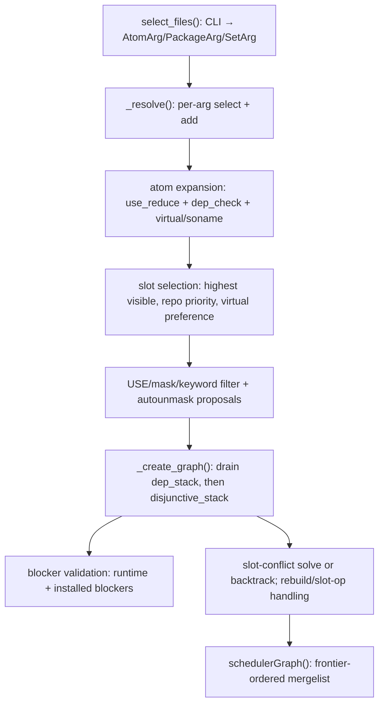

# 03 — Dependency resolution (`depgraph.py`, `resolver/`, priorities, blockers)

The resolver turns CLI args into an ordered, installable package graph.
It is the most complex subsystem. Portuale MUST reproduce its selection
semantics (highest visible version wins; invisible candidates rejected
unless already in the graph; slot conflicts resolved or reported
deterministically) even if internal data structures differ.

## 3.1 Resolver inputs

`create_depgraph_params()` output `myparams` (see doc 02) plus:

- Frozen config (`depgraph.py:301 _frozen_depgraph_config`): immutable
  snapshot — `pkgsettings`, `roots`, `trees_orig`, `pkg_cache`,
  required sets (`world/selected/system`), spinner.
  Helpers: `_depgraph_sets` (:400), `_rebuild_config` add/needs/trigger
  (:413), `_use_changes` (:579).
- Dynamic config (`depgraph.py:630 _dynamic_depgraph_config`): mutable
  per-attempt state — `digraph`, `dep_stack`, `disjunctive_stack`,
  `package_tracker`, `filtered_trees`/`graph_trees`, `runtime_pkg_mask`,
  `needed_*` (USE/keyword/license/p_mask), `backtrack_infos`,
  `need_restart`.
- Scheduler graph config (`depgraph.py:293 _scheduler_graph_config`).

## 3.2 Supporting node/edge types

| Symbol | Location | Behavior |
|---|---|---|
| `Dependency` | `Dependency.py:9` | Edge `parent -(atom,priority)-> child` with `depth`; `collapsed_*` is the disjunction-collapsed view. `__init__(**kwargs)` defaults `priority=DepPriority()`, `depth=0`. |
| `DependencyArg` | `DependencyArg.py:5` | User CLI arg root node. `__init__(arg,force_reinstall,internal,reset_depth,root_config)`; `reset_depth=False` exempts from `--deep` depth accounting. `__eq__/__hash__` by `(arg,root)`; `__str__` is the raw token. |
| `AtomArg(DependencyArg)` | `AtomArg.py:9` | Single-atom CLI arg; stores `atom` + singleton `pset=InternalPackageSet((atom,))`. |
| `PackageArg(DependencyArg)` | `PackageArg.py:12` | File-path CLI arg resolved to an exact `Package`; synthesizes `=cpv[-repo]` atom + singleton pset. |
| `SetArg(DependencyArg)` | `SetArg.py:9` | `@world/@system/…` set arg; stores `pset`, derives `name=arg[1:]`. |
| `Blocker(Task)` | `Blocker.py:7` | `!atom` graph node; `__init__` derives `cp=atom.cp`, hash key `("blocks",root,atom,eapi)`. |
| `BlockerDB` | `BlockerDB.py:16` | `__init__(fake_vartree)` binds vartree/porttree/fake_vartree; `findInstalledBlockers(new_pkg)` (:32) returns installed pkgs whose cached `RDEPEND/PDEPEND/IDEPEND` blockers match `new_pkg` and vice versa (tolerates invalid depstrings, refreshes `BlockerCache`); `discardBlocker(pkg)` (:128) evicts same-`cpv`/`cp:slot` from `FakeVartree`. |
| `BlockerCache(MutableMapping)` | `BlockerCache.py:15` | On-disk `vdb_blockers.pickle` `{cpv:(counter,(atoms))}` v`"1"`. `_load()` (:45) drops corrupt entries; `flush()` (:121) atomic-writes iff `>=5` modified and `secpass>=2`; dict facade `__setitem__/__iter__/__len__/__delitem__/__getitem__` normalizes atoms via `str()`. |
| `BlockerDepPriority(DepPriority)` | `BlockerDepPriority.py:7` | Blocker edge marker: `int→0`, `str→"blocker"`. |
| `AbstractDepPriority` | `AbstractDepPriority.py:9` | Comparable base via `__int__`; `__lt__/__le__/__eq__/__ne__/__gt__/__ge__` delegate to `int()`; `copy()` shallow-copies. Slots: `buildtime,buildtime_slot_op,installtime,runtime,runtime_post,runtime_slot_op`. |
| `DepPriority` | `DepPriority.py:7` | Hardness: `buildtime_slot_op:0 > buildtime:-1 > runtime_slot_op:-2 > runtime:-3 > runtime_post:-4 > optional:-5 > soft/none:-6`; `__str__` is the first set flag name. Extra slots: `cross,ignored,optional,satisfied`. |
| `DepPriorityNormalRange` | `DepPriorityNormalRange.py:7` | Leaf-scan levels for ordering: `HARD(buildtime)`, `MEDIUM=3(runtime)`, `MEDIUM_SOFT/POST=2(runtime_post)`, `SOFT=1(optional)`, `NONE=0`. `_ignore_optional/:25`, `_ignore_runtime_post/:31`, `_ignore_runtime/:37` (keeps hard `runtime_slot_op & !cross`); tuple `ignore_priority[0..3]` at :54. |
| `DepPrioritySatisfiedRange` | `DepPrioritySatisfiedRange.py:7` | Satisfied-aware levels (unsat buildtime HARD … sat runtime_post 2, optional/SOFT 1). Seven `_ignore_*` filters progressively treat satisfied deps as prunable; aliases :104-108, tuple :111-120 (8 levels). |
| `UnmergeDepPriority` | `UnmergeDepPriority.py:7` | Removal ordering `installtime:0 > runtime_slot_op:-1 > runtime:-2 > runtime_post:-3 > buildtime/soft:-4`. `__init__` forces `optional=True` if `buildtime`; `__int__/__str__` numeric hardness / `"hard"/"soft"/"install time"/"hard slot op"`. |

## 3.3 Core algorithm

### Step 1 — Args → atoms (`select_files:4999`, `_select_files:5015`, `_resolve:5485`)

- Classify CLI into `AtomArg/PackageArg/SetArg` (incl. `.tbz2/.ebuild`
  paths). `PackageArg` bypasses selection via `_add_pkg:3550`.
- `_expand_set_args:3271` flattens nested `SetArg`s, optionally linking
  parent→nested edges. Honors `package.provided` skips,
  `--update-if-installed`, `@world/@selected` missing-ebuild warnings.

### Step 2 — Atom expansion (`_select_atoms_from_graph:5994`, `_select_atoms_highest_available:6003`, `_expand_virt_from_graph:6168`, `_virt_deps_visible`, `_minimize_children:4751`, `_queue_disjunctive_deps:4857`, `_pop_disjunction:4897`)

- `use_reduce(uselist=effective USE)` → `dep_check` with
  `pkg_use_enabled/parent/atom_graph` callbacks → `||` branches
  minimized; `virtual/` + `||` deferred to the disjunctive stack so
  plain deps bind first. Virtuals expand to real atoms; sonames via the
  provides index. Cycle in virtual expansion raises
  `_virtual_cycle_error`.

### Step 3 — Slot selection (`_wrapped_select_pkg_highest_available_imp:7799`, `_select_pkg_highest_available:7233` + cache, `_pkg_visibility_check:7562`, `_pkg_use_enabled:7669`, `_iter_match_pkgs*`, `_too_deep:7359`)

- Iterate `dbs=[ebuild,binary,installed]`; skip `runtime_pkg_mask`,
  `rebuild_list`, `--emptytree` installed, `--exclude`,
  `usepkg_exclude/include/live`, `--useoldpkg`.
- Ignore USE for the initial unbuilt match (avoids missed updates);
  enforce visibility lazily; prefer highest version honoring repo
  priority, new-style virtuals over old, installed reuse unless
  `--update/deep/force-reinstall`. Cache in `_highest_pkg_cache`
  (invalidated by `_prune_highest_pkg_cache:7269`).

### Step 4 — USE/mask/keyword filtering (`Package._eval_masks:428`, `_eval_visibility:483`, `_get_masking_status:12548`, `_autounmask_levels:7446`)

- Effective USE = `pkg.use.enabled + _needed_use_config_changes`.
- Masks: `KEYWORDS(missing|unstable)`, `package.mask`, `LICENSE`,
  `CHOST`, `EAPI`, `PROPERTIES`, `RESTRICT`, invalid metadata.
- Invisible candidates rejected unless already in the graph.
- `--autounmask` iterates levels `USE → license → ~arch →
  missing-keywords → masks`, recording `needed_*` and setting
  `_need_restart`. `REQUIRED_USE` failure → unsatisfied-deps display +
  restart for USE suggestion.

### Step 5 — Graph growth (`_create_graph:3254`, `_add_dep:3349`, `_add_pkg:3550`, `_check_slot_conflict:3532`, `_add_pkg_deps:4151`, `_wrapped_add_pkg_dep_string:4465`, `_ignore_dependency:4423`, `_add_parent_atom:4136`, `_add_slot_operator_dep:4143`, `_remove_pkg:4058`, `_eliminate_rebuilds:3859`)

- `_add_pkg_deps` emits 5 prioritized dep-strings per package:
  `RDEPEND→runtime`, `IDEPEND→installtime+runtime`,
  `PDEPEND→runtime_post`, `DEPEND→buildtime`, `BDEPEND→buildtime`,
  with `ESYSROOT`/running-root roots, `use_reduce` by effective USE
  (+`test` subset), `bdeps/with-bdeps/--root-deps/--onlydeps-with-rdeps`
  filtering.
- Each string → `_select_atoms` → one `Dependency` per
  `(atom,child)`; already-satisfied non-slot-op children park in
  `_ignored_deps`; `||`/virtual minimized/deferred.
- Depths increment; `--deep=N|True`, `--update`, `--complete`,
  `--nodeps`, `--onlydeps-with-*`, `--root-deps`, `bdeps/with-bdeps`,
  `cross(ESYSROOT)` (`_cross:4928`, `_priority:4914`, `_dep_expand:4928`,
  `_have_new_virt:4959`, `_iter_atoms_for_pkg:4973`) control recursion.

### Step 6 — Blocker resolution (`_validate_blockers:8891`, `_accept_blocker_conflicts:9259`)

- Build-time blockers recorded during `_add_dep`; runtime blockers from
  all installed pkgs added in `_validate_blockers` (cached).
- Non-matching blockers pruned; hard blockers (`!cat/pkg-ver` blocking a
  merge target) force order edges or `uninstall` tasks; overlapping
  blockers schedule post-install uninstalls in
  `_serialize_tasks:9457`.

### Step 7 — Slot ops, rebuilds, cycles

- `:`/`:=` logic (`_slot_operator_update_probe:2576`,
  `_slot_operator_unsatisfied_probe:2881`,
  `_slot_operator_trigger_reinstalls:3089`,
  `_slot_conflict_backtrack*:2205-2472`, `_in_blocker_conflict:2918`,
  `_upgrade_available:2935`, `_downgrade_probe:2946`,
  `_reinstall_for_flags:3134`, `_changed_deps:3180`, `_changed_slot:3247`,
  `_installed_libc_deps:3163`): probe whether a parent needs rebuild on
  slot/sub-slot change; schedule `rebuild_list`/`reinstall_list`; emit
  `backtrack_infos["config"]`.
- `_solve_non_slot_operator_slot_conflicts:1774` greedily keeps one
  package per slot without restart (drops losers + orphans).
- Merge order ignores soft edges by bands (`NormalRange` then
  `SatisfiedRange` leaf scans via `_SerializeFrontier`, doc 04).
  Residual cycles → `circular_dependency_handler` (doc: `resolver/
  circular_dependency.py`) proposes minimal USE flips
  (`extract_affecting_use` + bounded `2^n` search, `REQUIRED_USE`
  checked). Slot-op cycles trigger rebuild lists instead.
- `slot_collision.py` handler is a pure reporter/explainer (does not
  autofix); message flags `conflict_is_unspecific`
  (needs `--update/--newuse`) and `is_a_version_conflict`.

### Step 8 — Backtracking (`backtrack_depgraph:12148`, `_backtrack_depgraph:12175`, `resume_depgraph:12285`, `resolver/backtracking.py`, `resolver/package_tracker.py`, `resolver/DbapiProvidesIndex.py`)

- `BacktrackParameter` (zeroed masks: circular/keywords/p_mask/
  runtime_pkg_mask/use/license/rebuild/reinstall/slot_op_*/prune_rebuilds),
  `_BacktrackNode(parameter,depth,mask_steps,terminal)`,
  `Backtracker(max_depth)`: DFS stack; `_add` rejects
  `runtime_pkg_mask` cycles (`_check_runtime_pkg_mask`) and enforces
  `--backtrack` depth; `get()` LIFO-pops a deepcopy;
  `_feedback_slot_conflicts/_feedback_missing_dep` mask one child node
  per conflict; `_feedback_config` merges keyword/use/license/rebuild/
  slot-op/circular changes without consuming depth; `feedback(infos)`
  dispatches config + at most one of slot-conflict/missing-dep;
  `get_best_run` returns the deepest terminal node for `--autounmask`
  error display.
- `PackageTracker` live model: `(cp→[to-merge])`,
  `(cp→[installed])`, multi/conflict cache, `replacing/replaced_by`,
  provides index. `add_pkg/add_installed_pkg/remove_pkg/discard_pkg`
  maintain indexes; `match(root,atom,installed=True)` routes sonames to
  the provides index else version-sorted `match_from_list` over to-merge
  + non-replaced installed (cached); `conflicts/slot_conflicts`
  emit `PackageConflict` for slot (same slot ≥2 pkgs) and cpv (same cpv,
  distinct slots) collisions. `PackageTrackerDbapiWrapper` is the legacy
  `dbapi` facade. `DbapiProvidesIndex/PackageDbapiProvidesIndex` index
  `(soname→[pkgs])` with `bisect.insort` version order.
- Retry loop: at most `max(1,(backtrack+1)//2)` attempts and
  `backtracked <= --backtrack(20)`; each `feedback → new depgraph`
  (frozen config reused); fallback `get_best_run` + `autounmask=False`
  rerun.
- `_complete_graph:8562` (`--complete-graph`): switch selectors to
  graph/installed-only, `deep=True`, re-add `@system/@world` with
  `_UNREACHABLE_DEPTH` + `allow_unsatisfied`; any newly-broken
  initially-satisfied dep pulls the installed pkg (deliberate slot
  conflict for the backtracker). Deep `@system` runtime closure comes
  from `_find_deep_system_runtime_deps` (doc 04).

## 3.4 Ordering (`_merge_order_bias:9274`, `altlist:9309`, `schedulerGraph:9375`, `break_refs:9443`, `_resolve_conflicts:9443`, `_serialize_tasks:9457`, `_show_circular_deps:10425`, `display*:10612-11691`)

- Prune args/`nomerge` roots; bias order (e.g. `portage` last);
  leaf-pull alternating `Normal/Satisfied` priority bands via the
  serialized frontier; defer `uninstall`s past blockers; break cycles via
  the circular handler. Display/problem helpers compute restart
  predicates (`need_restart/need_display_problems/need_config_change/
  _have_autounmask_changes/need_config_reload/autounmask_breakage/
  get_backtrack_infos`) consumed by `_backtrack_depgraph`.
- Mask aggregation for display: `get_mask_info:12409`,
  `show_masked_packages:12453`, `_get_masking_status:12548`
  (`CHOST/EAPI/KEYWORDS/PROPERTIES/RESTRICT/package.mask/LICENSE/
  invalid/SLOT`).
