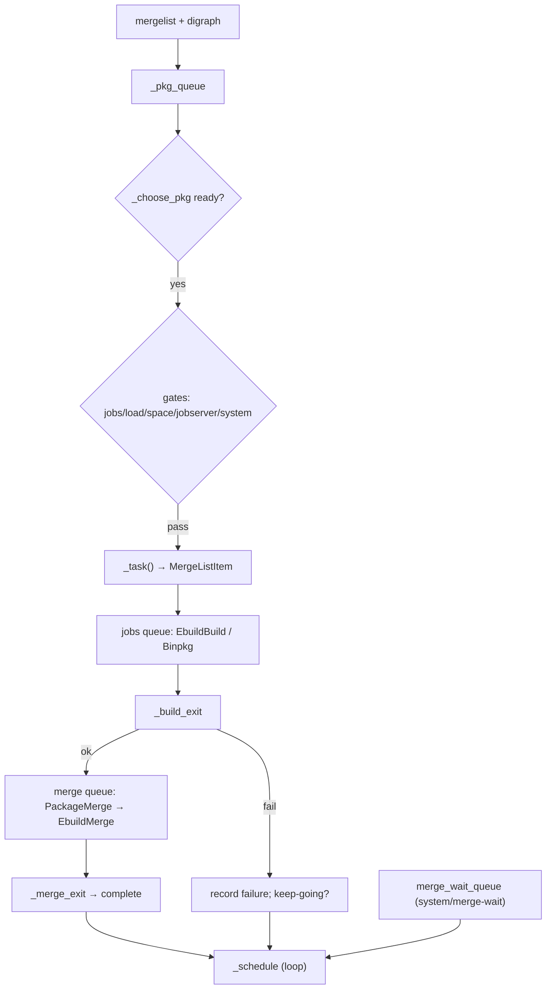

# 05 — Task framework and scheduler

## 5.1 Task primitives

### `Task(SlotObject)` (`Task.py:7`) — tuple-key identity

`__eq__` (:10) / `__ne__` (:18): compare `_hash_key`, or key-vs-scalar
lookup. `__hash__` (:24): precomputed `_hash_value`. `__len__` (:27),
`__getitem__` (:30), `__iter__` (:33), `__contains__` (:36): delegate to
`_hash_key`. `__str__` (:39): `('a','b')`. `__repr__` (:47):
`<Cls ('a',…)>`.

### `AsynchronousTask` (`AsynchronousTask.py:11`) — async contract

Slots `background,cancelled,returncode,scheduler`;
`_cancelled_returncode=-SIGINT` (:27).

| Method | Behavior |
|---|---|
| `start()` (:29) | Runs `_start_hook` + `_start`; returns immediately. |
| `async_wait()` (:36) | `Future` resolving with `returncode`; immediate-fire if done. |
| `_start()` (:61) | Default: `EX_OK` + notify. |
| `isAlive()` (:65) | `returncode is None`. |
| `poll()` (:68) | `_poll()` + `_wait_hook()`. |
| `_poll()` (:75) | No-op template. |
| `wait()` (:78) | Blocks via `run_until_complete`; raises `InvalidStateError` if the loop is running and the task is unready. |
| `_async_wait()` (:96) | Subclass completion entry (default: `wait()`). |
| `cancel()` (:106) | Idempotent; sets flag, calls `_cancel`, never blocks. |
| `_cancel()` (:119) | No-op template. |
| `_was_cancelled()` (:125) | Stamps the cancelled code. |
| `add/removeStartListener` (:136/:148), `add/removeExitListener` (:161/:171) | `f(self)` callbacks; immediate-fire if already finished. |
| `_start_hook` (:153), `_wait_hook` (:183) | One-shot `call_soon` drains. |
| `_exit_listener_cb` (:206) | Invokes the listener. |

### `AbstractPollTask` (`AbstractPollTask.py:13`)

FD helpers: `_read_array(f)` (:18, `array.fromfile→bytes`,
`EOF/EIO→b''`, `EAGAIN→None`); `_read_buf(fd)` (:54, one
`os.read(4096)`, `EIO→b''`, `EAGAIN→None`, loop-until-empty);
`_async_wait` (:90, `_unregister` + super); `_unregister` (:94);
`_wait_loop(timeout)` (:97, `run_until_complete(wait(FIRST_COMPLETED,
async_wait vs sleep))`, cancels both).

### `CompositeTask` (`CompositeTask.py:9`, `_TASK_QUEUED=-1`)

Chained subtask. `isAlive` (:14): started + unfinished. `_cancel` (:20):
queued → fail `1`; live → cancel child; unstarted → mark cancelled.
`_poll` (:33): polls the changing `_current_task` until stable, once per
instance. `_assert_current` (:56). `_default_exit(task)` (:65): adopt
failure + `cancelled`, clear current. `_final_exit` (:82): always adopt
code + clear. `_default_final_exit` (:93): + `wait()`.
`_start_task(task,handler)` (:103): propagate `scheduler`, listen,
set-current, start. `_task_queued` (:120) + `_task_queued_start_handler`
(:124) + `_task_queued_wait` (:127).

### `TaskSequence(CompositeTask)` (`TaskSequence.py:11`) — fail-fast FIFO

`__init__` (:20): empty deque. `add` (:24): append. `_start` (:27):
start head. `_cancel` (:30): clear + super. `_start_next_task` (:34):
pop + start, or `EX_OK` if empty. `_task_exit_handler` (:45):
non-zero → stop + notify, else next or `_final_exit`. `__bool__` (:54),
`__len__` (:57): queue state.

### `SequentialTaskQueue` (`SequentialTaskQueue.py:10`) — `max_jobs` throttle (default 1, `True`=∞)

`add` (:20) / `addFront` (:24): enqueue + `schedule`. `schedule` (:28):
reentrancy-guarded fill while capacity; skip `cancelled`; track
`running_tasks`; `task.start()`. `_task_exit` (:48): remove +
reschedule. `clear` (:58): cancel queued + running async. `wait(loop)`
(:69): coroutine until empty (await an arbitrary running
`async_wait`). `__bool__` (:81), `__len__` (:84): backlog + running.

## 5.2 Process primitives

### `SubProcess(AbstractPollTask)` (`SubProcess.py:15`) — pid lifecycle

`isAlive` (:22): `(_registered or pid) and returncode is None`.
`pid` (:26). `_poll` (:29): return code only (callback sets it).
`_cancel` (:33): `SIGTERM` if alive (`EPERM` warn, `ESRCH` ignore).
`_async_wait` (:48): raise if unready else unregister + notify.
`_async_waitpid` (:56): done → notify, else `ensure_future(proc.wait())`
+ `_async_waitpid_cb` (:72, set code + notify). `_unregister` (:79):
cancel waiter, close `_files`.

### `SpawnProcess(SubProcess)` (`SpawnProcess.py:19`) — `spawn()` + log pipeline

Forwards `args,env,opt_name,fd_pipes,uid,gid,groups,umask,logfile,
path_lookup,pre_exec,close_fds,unshare_*` (:26). `_start` (:54): build
pipes (pty via `_pipe` unless `create_pipe=False`); `/dev/null` stdin if
background; default 0/1/2; flush stdio; `spawn(returnproc=True)`; close
slave; direct-waitpid when no fds else `_start_main_task`.
`_start_main_task(pr,log_path,stdout_fd)` (:160): start
`BuildLogger→PipeLogger` + async `_main` future + `_main_exit`.
`_main` (:192): await pipe then build logger; cancel propagates.
`_main_cancel` (:202): cancel loggers. `_main_exit` (:208):
cancelled → `cancel()` self; then `_async_waitpid` (drains output
first). `_async_wait` (:217) / `_async_waitpid` (:222): no-op until main
done. `_can_log` (:227). `_pipe` (:230): `_create_pty_or_pipe`.
`_spawn` (:241): `portage.process.spawn`, SELinux wrap
(`bash -c exec "$@"`). `_unregister` (:254): super + cancel main.
`_cancel` (:259): cancel loggers/main + `SIGTERM`. `_elog` (:268):
fan-out via `EOutput`.

### `PipeReader` (`PipeReader.py:10`) — capture fds to memory

`_start` (:20): nonblock fds + `add_reader`. `_cancel` (:36):
close + stamp cancelled. `getvalue()` (:41): join buffer. `close` (:45).
`_output_handler` (:49) / `_array_output_handler` (:62): loop-read
append; `None` → break; `b''` → unregister + `EX_OK` + notify.
`_unregister` (:77): remove readers, close ints/objects, null map.

### `AsynchronousLock` (`AsynchronousLock.py:20,100,161`) — nonblocking lockfile

- `AsynchronousLock` (`_use_process_by_default=True`): `_start` (:41):
  fast `lockfile(NONBLOCK)` → `EX_OK`, else `_LockProcess`/`_LockThread`
  + `_imp_exit` (:64, copy code). `_cancel` (:69) / `_poll` (:73)
  delegate. `async_unlock()` (:78): one-shot release future.
- `_LockThread` (:100): daemon blocking-`lockfile` (:110-125) +
  `call_soon_threadsafe` wakeup; `_cancel` (:127) no-op;
  `_unlock/async_unlock` (:131-151) sync `unlockfile` + resolved future;
  `_unregister` (:153) join.
- `_LockProcess` (:161): `lock-helper.py` child + in/out pipes.
  `_start` (:178): `add_reader(in,_output_handler)`, spawn
  `python lock-helper.py path` (`0=out_pr,1=in_pw`).
  `_proc_exit` (:206): pre-acquire fail → propagate; post-acquire death
  → assert unless cancelled/unlocking; unlock waiter → resolve.
  `_cancel` (:248) / `_poll` (:252) delegate; `_output_handler` (:257)
  bytes → acquired + `EX_OK`; `_unregister` (:267); `_unlock/async_unlock`
  (:279-302) `write(pipe_out,b"\0")`, future resolved on child exit.

## 5.3 `PollScheduler` (`PollScheduler.py:13`)

Loop/terminate/gate base. `__init__(main,event_loop)` (:17): RLock +
terminated event, `max_jobs=1`, global vs local loop,
`SchedulerInterface`. `_loop` (:43). `_is_background` (:49).
`_cleanup` (:52): cancel + poison term handle. `terminate` (:67):
thread-safe set-event + `call_soon_threadsafe(_termination_check)`.
`_termination_check(retry)` (:81): event-thread once; set
`_terminated_tasks`; call `_terminate_tasks`; requeue if contended.
`_terminate_tasks` (:106): abstract kill-all-no-wait.
`_keep_scheduling` (:120) default false. `_schedule_tasks` (:128) hook
(non-reentrant, no concurrent terminate). `_schedule()` (:145):
guard + call hook; safe from exit listeners.
`_is_work_scheduled` (:162): `bool(running)`.
`_running_job_count` (:165) abstract. `_can_add_job` (:168): false if
terminated / at cap / `loadavg1 ≥ max_load` / `OSError`.

## 5.4 `Scheduler(PollScheduler)` (`Scheduler.py:70`) — emerge orchestrator

Nested: `_iface_class` (:87), `_fetch_iface_class` (:90),
`_task_queues_class(merge,jobs,ebuild_locks,fetch,unpack)` (:93),
`_build_opts_class` (:97), `_binpkg_opts_class` (:107),
`_pkg_count_class` (:110), `_emerge_log_class.log` (:116, drops
`short_msg` without titles), `_failed_pkg` (:122),
`_ConfigPool.allocate/deallocate` (:125-142),
`_unknown_internal_error` (:144), `_pkg_failure(status=1)` (:658).

Key methods:

| Method | Behavior |
|---|---|
| `__init__` (:153) | Parse opts → build/binpkg opts; 5 `SequentialTaskQueue`s; merge-wait/system-dep sets; `JobStatusDisplay`; observability/cgroup; `--load-average/--jobs` (`_set_max_jobs:464`, `parallel-install` → merge queue parallel); config pools; fetch iface; `_init_graph:428`; `pkg_count/maxval:296`; job-delay/`SIGCONT` memo; `parallel-fetch` iff `distlocks` + >1 merge. |
| `_background_mode()` (:470) | Parallel\|quiet and not pretend/fetch → background; interactive pkgs → force foreground + `jobs=1`; single pkg → foreground; sets display quiet/title flags. `_get_interactive_tasks:534`. |
| `_set_graph_config` (:543) | Adopt `mergelist/digraph/pkg_cache`; precompute `world_atoms`; `nodeps\|jobs<2` → drop graph; else `_find_system_deps:591` (deep runtime), `_prune_digraph:611` (drop nomerge/completed/onlydeps roots), `_prevent_builddir_collisions:634` (same-cpv buildtime edges), `_init_graph:428` / `_destroy_graph:453`. |
| `_handle_self_update` (:356) | Portage self-update tmpdir prep. |
| `_terminate_tasks` (:380) | Quiet display, cancel running, `clear()` queues, release tokens. |
| `_schedule_fetch` (:671) | `jobs>1` → start now, else `fetch.addFront`. `_schedule_setup` (:687): merge or `ebuild_locks` queue when `parallel-install+ebuild-locks`. `_schedule_unpack` (:706): unpack queue. |
| `_find_blockers[_impl]` (:713-723) | Installed blockers minus same slot/cpv; ignored under buildpkgonly/fetchonly/fetch-uri/nodeps/pretend. |
| `_generate_digests` (:739), `_check_manifests` (:789) | Pre-parallel digest/manifest gates. |
| `_add_prefetchers` (:835), `_create_prefetcher` (:856), `_get_prefetcher` (:2301) | Enqueue `EbuildFetcher(prefetch)` / `BinpkgPrefetcher` for the whole list; pop + validate (remove dead from fetch queue). |
| `async _run_pkg_pretend` (:890) | Serial `clean → (fetch+verify+inject binary) → pretend → clean` with per-pkg config alloc, tempdir check, `REPLACING_VERSIONS`, elog processing. |
| `merge()` (:1164) | Resume banner; save resume; background/self-update/tmpdir gates; digests/manifests; install `INT/TERM→terminate+exit(128+sig)` (:1228), `USR2→flush merge-wait` (:1235), `CONT/WINCH`; loop `_merge:1722` + `--keep-going` resume (strip failed, `_calc_resume_list:2435` via `resume_depgraph`, recalc counts); teardown observability/cgroup/`_cleanup`; print single-fail log or die-msgs/summary; return `FAILURE=1` if any failed. |
| `_merge` (:1722) | Prefetchers; quiet `pkg_pretend`; `_add_packages:1474` (pkgs → `_pkg_queue`); `_main_loop:1672` (jobserver fifo parse, loadavg timer, `_schedule`, `run_until_complete(_main_exit)`); `_main_loop_cleanup:1779`. |
| `_build_exit` (:1604) | Pop/observe/cgroup/token; interrupted-success → count + drop; success → `PackageMerge` → merge queue or `_merge_wait_queue` when `merge-wait\|system` (+ start-listener), `jobs--`; fail → failed list + msg + dealloc; `_schedule`. `_extract_exit` (:1662) = build exit. |
| `_merge_exit` (:1532) | Pop/observe/dealloc/`curval++` when real merge/`merges=len` + schedule. `_merge_wait_exit_handler` (:1528). `_do_merge_exit` (:1543): fail → record; postinst-fail → `_failed_pkgs_all` nonfatal; success → complete + replacee-complete + per-merge mtimedb commit. |
| `_choose_pkg` (:1803) | FIFO when no graph (memo-block when work scheduled under `--nodeps`-parallel); else prune, prefer leaf `uninstall`, else first with no incomplete deep deps via `_dependent_on_scheduled_merges:1855` (DFS ignoring completed/later/nomerge, not through uninstall). |
| `_allocate` (:1899) / `_deallocate` (:1915) | Pool-pop + `reload/reset` / push. |
| `_task(pkg)` (:2320) | Resolve replaced slot pkg via `_pkg:2619` (cache/`aux_get`); steal prefetcher; build `MergeListItem` with args/config/world-atom. `_world_atom:2549` records world iff selected + target-root + not oneshot-ish. |
| `_keep_scheduling` (:1918) | Queue non-empty + not failed (unless fetchonly) + not terminated. `_is_work_scheduled` (:1925): `bool(running)`. `_running_job_count` (:1928): `_jobs`. `_can_add_job` (:1933): super + forward-progress when idle + `statvfs(PORTAGE_TMPDIR/portage)` ≥ `--jobs-tmpdir-require-free-gb` (default 18) + `1GiB×jobs`, else warn-once + block. |
| `_job_delay()` (:2132) | `SIGCONT` 5s (:314) or `min(5×avg1/max_load,5)` (:309) pacing via `call_later`. Jobserver `_acquire` (:2178) / `_release` (:2207) fifo byte, implicit slot, death → disable + terminate; `_unblock_jobs` (:2232) reader → schedule. |
| `_schedule_tasks` (:2014) + `_schedule_tasks_imp` (:2236) | Flush `merge_wait_queue` when `jobs==0 and merge empty` or `USR2` (system pkgs serialize one-at-a-time); `+_schedule_tasks_imp`, `display`, cancel lone prefetchers on failure; empty + no-keep → resolve `_main_exit`; rearm loadavg; arm `merge.wait()` → `_schedule_merge_wakeup:2120`. `_schedule_tasks_imp` gates (`keep`, early-memo, `merge_wait_scheduled`, `jobs×unsatisfied_system`, `can_add`, `job_delay`), `_choose_pkg`, jobserver token for non-installed (`EAGAIN` → requeue + reader), `pkg_count++`, `_task`, installed → `PackageMerge+addFront+_merge_exit` else `jobs++/tokens/running+queues.jobs+( _extract\|_build_exit)`. |
| Failure bookkeeping | `_record_pkg_failure:1148`, `_failed_pkg_msg:2366` / `_status_msg:2383` via `displayMessage`, `_save_resume_list:2398` (mtimedb `myopts/favorites/mergelist/binpkgs`), `_task_complete:1665` (completed + unsatisfied-discard + blocker-discard + clear early-memo), `_system_merge_started:1482` (record unsatisfied runtime/post deps of starting system pkg, ROOT==/ only), `_elog_listener:1450` (ERROR → die msgs), `_locate_failure_log:1455` (first non-empty build log), `_sigcont:2126`, `_sigwinch:2129`. |

## 5.5 Display / interaction helpers

| Symbol | Location | Behavior |
|---|---|---|
| `JobStatusDisplay` | `JobStatusDisplay.py:16` | Renders `Jobs: c of m[, r running][, f failed][, w merge wait] Load avg:…`. `__init__(quiet,xterm_titles)` (:38): zero counters, tty detect, termcap/default `CR/CLEOL/NL`, width (`_set_width:70`, clamp ≤100, jobs-col=`w-32`). `sigwinch` (:78), `out` (:85), `_write` (:90, utf8-flush), `_init_term` (:97, curses setupterm), `_format_msg` (:134, `>>>msg`), `_erase/:137`, `_display/:141`, `_update/:145` (tty overwrite vs plain line), `displayMessage` (:156), `reset` (:169), `__setattr__` (:179, `curval/failed/running` trigger `_property_change:187` → display), `_load_avg_str` (:191), `display` (:206, quiet → no-op, tty-throttle 2s), `_display_status` (:229, colored/padded/truncated + xterm title). |
| `ProgressHandler` | `ProgressHandler.py:7` | Throttled sink: `__init__` (:8, `curval/maxval=0, min_latency=0.2`); `onProgress(max,cur)` (:14, store, display at most per latency); `display` (:22, abstract). |
| `stdout_spinner` | `stdout_spinner.py:45` | Modes `QUIET/STATIC/TWIRL/SCROLL`; `start/stop/begin_notice/resume_notice/end_notice/interrupt_notice/cancel_notice`; twirl `/-\|` cycle, scroll bounce; hide/show DECTCEM cursor + atexit restore. Driver `_SpinnerDriver` (:16): daemon thread + `wait(deadline)` + `update()`. |
| `UserQuery` | `UserQuery.py:10` | `__init__(myopts)` (:14); `query(prompt,enter_invalid,responses=[Yes,No],colours)` (:17): bold prompt + `[a/b]`, `--alert` bell, empty → first unless invalid, prefix-case-insensitive, reprompt, `EOF/Ctrl-C` → `Interrupted.` + `exit(128+SIGINT)`. |
| `UseFlagDisplay/pkg_use_display` | `UseFlagDisplay.py:11/55` | `UseFlagDisplay(name,enabled,forced)`: `__str__` (:19, enabled red, disabled blue `-x`, forced `(x)`); `sort_combined` (:36, by name), `sort_separated` (:48, enabled-first + name). `pkg_use_display(pkg,opts,modified_use)` (:55): group IUSE into `USE="…"` + `EXPAND="…"` (USE first, alpha var order), strip `ARCH`, skip `expand_hidden`, mark `force\|mask`, `--alphabetical` → combined else separated sort. |
