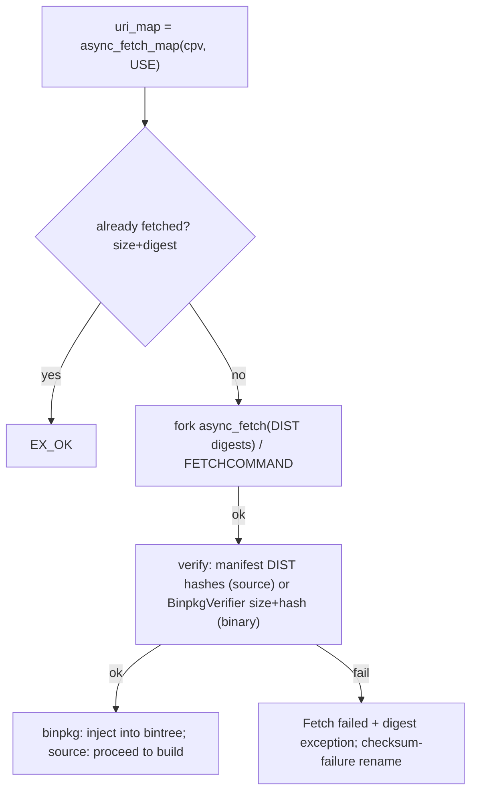

# 06 — Fetch phase

Fetches distfiles (source) or binary packages, then verifies size +
checksums. All fetchers are `CompositeTask`s so the scheduler can run
them in parallel and cancel them.

## 6.1 Source fetch

### `EbuildFetcher(CompositeTask)` (`EbuildFetcher.py:29`)

Async source-distfile fetcher.

| Method | Behavior |
|---|---|
| `__init__(**kwargs)` (:42) | Wraps inner `_EbuildFetcherProcess`. |
| `async_already_fetched(settings)` (:46) | `Future[bool]`; `True` + messages iff all `uri_map` files are present with correct digests. |
| `_start()` (:58) | `_async_uri_map() → _start_fetch`. |
| `_start_fetch(uri_map_task)` (:64) | `InvalidDependString → eerror + returncode 1`; else `async_aux_get(SRC_URI) → _start_with_metadata`. |
| `_start_with_metadata(aux_get_task)` (:93) | Injects `SRC_URI`, starts the fork proc. |

### `_EbuildFetcherProcess(ForkProcess)` (`EbuildFetcher.py:103`)

Forked `async_fetch`.

| Method | Behavior |
|---|---|
| `async_already_fetched(settings)` (:118) | Chains `_async_uri_map → _check_already_fetched`. |
| `_check_already_fetched(settings,uri_map)` (:144) | `stat` non-empty + `size` match + `_check_distfile(hash_filter)`; silent on `False`. |
| `_start()` (:215) | Empty map → `EX_OK`; else `config_pool.allocate/setcpv/doebuild_environment(fetch)`; `prefetch + _prefetch_size_ok → EX_OK`; else set `PARALLEL_FETCHONLY/NOCOLOR/log_filter`, `target=_target`, fork, deallocate parent. |
| `_target(settings,manifest,uri_map,fetchonly,pre_exec)` static (:268) | Child: `pre_exec`, force `spawn` (py3.14), `havecolor`, `_drop_privs_userfetch`, `asyncio.run(async_fetch(DIST digests,allow_missing))`; `SIGTERM → cancel+terminate/join/kill children+suicide`; `EX_OK/1`. |
| `_get_ebuild_path()` (:337) | Cached `findname`; assert exists. |
| `_get_manifest()` (:346) | Lazy `load_manifest`. |
| `_get_digests()` (:356) | Lazy `getTypeDigests(DIST)`. |
| `_async_uri_map()` (:361) | Cached or `async_fetch_map(cpv,use,tree)`; `fetchall → use=None`. |
| `_prefetch_size_ok(uri_map,settings,ebuild_path)` (:391) | Size-only check + writes `* file size ;-) [ ok ]` to the log. |
| `_pipe(fd_pipes)` (:430) | Pty when foreground-tty else pipe. |
| `_eerror(lines)` (:443) | `eerror(phase=unpack)` to scheduler/log. |
| `_proc_join_done(proc,future)` (:451) | Non-prefetch failure adds `Fetch failed for 'cpv' [+logfile]`. |

### `EbuildFetchonly(SlotObject)` (`EbuildFetchonly.py:11`)

Sync fetch: `execute()` (:14) runs
`doebuild(path,fetch,listonly=pretend,fetchonly=1,fetchall)`;
non-pretend failure logs `eerror(Fetch failed)`; returns `rval`.

## 6.2 Binary fetch

### `BinpkgFetcher(CompositeTask)` (`BinpkgFetcher.py:22`)

Remote binpkg → `*.partial`.

- `__init__(**kwargs)` (:25): `PATH` from `_remotepkgs` else
  `FileNotFound`; `pkg_allocated_path=getname(+allocate_new/
  remote_format)`, `pkg_path=+.partial`.
- `_start()` (:50): `AsyncTaskFuture(_main())`.
- `_main()` async (:56): `ensure_dirs`; `distlocks → async_lock`;
  `BASE_URI/PATH` URI; `file:` → `FileCopier`, else
  `_BinpkgFetcherProcess`; success → `sync_timestamp`; unlock.
- `_main_exit(main_task)` (:136): copy future result to `returncode`.

### `_BinpkgFetcherProcess(SpawnProcess)` (`BinpkgFetcher.py:143`)

- `_start()` (:146): resume iff `*.partial` is in `bintree.invalids`
  else unlink; `FETCHCOMMAND/RESUMECOMMAND` from the index or
  `FETCHCOMMAND[_PROTO]`; `pretend → print URI + EX_OK`; else
  `varexpand(DISTDIR/URI/FILE/SSH_OPTS)`, fd 0/1/2, SELinux
  `PORTAGE_FETCH_T`.
- `_pipe(fd_pipes)` (:234): pty when foreground-tty.
- `sync_timestamp()` (:247): `utime(pkg_path, remote _mtime_)`.
- `async_lock()` (:272): `AsynchronousLock(pkg_path)`; `AlreadyLocked`
  when held. `class AlreadyLocked` (:300), `async_unlock()` (:303).

### `BinpkgPrefetcher(CompositeTask)` (`BinpkgPrefetcher.py:17`)

Background `fetch → verify → inject`.

- `_start()` (:24): `BinpkgFetcher(fetch.log)`, save paths.
- `_fetcher_exit(fetcher)` (:36): fail → wait, else `BinpkgVerifier`.
- `_verifier_exit(verifier)` (:50): fail → wait; local repo →
  `rename → EX_OK`; else `bintree.inject`; `None → eerror(Binary package
  is not usable) + 1`, else `EX_OK`.
- `_elog(elog_funcname,lines,phase)` (:97): `elog.messages` with
  `no_color` to the fetch log.

### `BinpkgVerifier(CompositeTask)` (`BinpkgVerifier.py:22`)

Size + hash check.

- `_start()` (:25): no `size → EX_OK`; filter hashes +
  `CHECKSUM_FILTER`; missing → `non-existent binary/outdated index` or
  `Fetching Binary failed + 1`; size mismatch → digest-exception + 1;
  else `FileDigester → _digester_exit`.
- `_digester_exit(digester)` (:83): mismatch → exception + 1; else
  optional success display → `EX_OK`.
- `_display_success()` (:103): `ebegin(basename hashes ;-) ).eend(0)`.
- `_digest_exception(name,value,expected)` (:131): rename to
  checksum-failure temp + report `Got/Expected`.

## 6.3 Fetch flow

