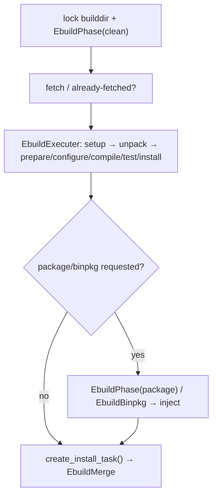

# 07 — Build phase

## 7.1 `EbuildBuild(CompositeTask)` (`EbuildBuild.py:29`) — source build driver

| Method | Behavior |
|---|---|
| `_start()` (:44) | `_check_temp_dir` (unless fetchonly), then `async_aux_get(SRC_URI)`. |
| `_start_with_metadata(task)` (:64) | `setcpv`; `EMERGE_FROM=ebuild`; `MERGE_TYPE=source\|buildonly`; `findname + doebuild_environment(setup)`; `_check_manifest`; wait/cancel the live prefetcher. |
| `_check_manifest()` (:126) | `strict ∧ ¬digest → digestcheck(strict)`. |
| `_prefetch_exit(prefetcher)` (:144) | `fetchonly+pretend → ForkExecutor(EbuildFetchonly.execute)`; `fetchonly → EbuildFetcher` (fetch queue when log writable); else `EbuildBuildDir.async_lock → _start_pre_clean`. |
| `_start_pre_clean(lock_task)` (:210) | Log `Cleaning(cur/max)` + `EbuildPhase(clean)`. |
| `_fetchonly_exit(fetcher)` (:231) | Unwrap future; fail → `SpawnNofetchWithoutBuilddir`. |
| `_nofetch_without_builddir_exit(nofetch)` (:254) | Return `1`. |
| `_pre_clean_exit(phase)` (:259) | Fail → unlock; else `prepare_build_dirs` + `async_already_fetched → _start_fetch`. |
| `_start_fetch(fetcher,task)` (:283) | Invalid `SRC_URI → elog + unlock 1`; already-fetched → skip queue; else `scheduler.fetch.schedule`. |
| `_fetch_exit(fetcher)` (:312) | Fail → `_fetch_failed`; else `clean_log`, log `Compiling/Packaging\|Merging`, `EbuildExecuter → _build_exit` (records `syspkg/buildpkg`). |
| `_fetch_failed()` (:350) | `fetch ∉ restrict ∧ nofetch ∉ defined → unlock`; else `EbuildPhase(nofetch)`. |
| `_nofetch_exit(phase)` (:373), `_async_unlock_builddir(rc)` (:377), `_unlock_builddir_exit(task,rc)` (:391) | Elog + unlock helpers. |
| `_build_exit(build)` (:403) | Fail → unlock; non-buildpkg → wait; else per-`PORTAGE_BINPKG_FORMAT`: `EbuildPhase(rpm)` or `EbuildBinpkg + _RecordBinpkgInfo`. |
| `class _RecordBinpkgInfo` (:457), `_start()` (:469) | Sync `_record_binpkg_info`. |
| `_buildpkg_exit(packager)` (:473) | Fail → unlock; `buildpkgonly → MiscFunctions(success_hooks)`; else hold lock, wait. |
| `_record_binpkg_info(task)` (:502) | Write `build-info/BINPKGMD5[/BUILD_ID]`. |
| `_buildpkgonly_success_hook_exit(h)` (:525) | `elog_process + EbuildPhase(clean)`. |
| `_clean_exit(phase)` (:539) | buildpkgonly/fail → unlock. |
| `create_install_task()` (:545) | Log `Merging` + return `EbuildMerge(exit_hook=_install_exit)`. |
| `_install_exit(task)` (:583) | Unlock; return the unlock future. |

## 7.2 `EbuildExecuter(CompositeTask)` (`EbuildExecuter.py:17`)

Runs `setup → unpack → prepare/configure/compile/test/install`.

- `_can_skip_source_phases()` (:32): true iff no `noauto`/`live`,
  empty `A`, `DEFINED_PHASES ∩ {unpack,prepare,configure,compile,test}
  = ∅`, no `.src_patches`.
- `_start()` (:68): `prepare_build_dirs`; `REPLACING_VERSIONS` when EAPI
  exports it; `EbuildPhase(setup)` on the setup queue.
- `_setup_exit(p)` (:95): fail → wait; skippable → `install` only; else
  `EbuildPhase(unpack)` (unpack queue for `live`).
- `_unpack_exit(p)` (:128): old EAPI drops `prepare/configure`.
- `_start_phases(phases)` (:141): `TaskSequence(EbuildPhase)`.

## 7.3 `EbuildPhase(CompositeTask)` (`EbuildPhase.py:113`) — one phase

Helpers: `_setup_locale(settings)` async (:51, EAPI
`posixish_locale → split_LC_ALL + async_check_locale → C.UTF-8/C`);
`_setup_repo_revisions(settings)` async (:74,
`PORTAGE_REPO_REVISIONS=json(retrieve_head)` for pkg + eclass repos).

| Method | Behavior |
|---|---|
| `_start()` (:144) | `notifyPhase(mycpv,phase)` + `async _async_start`. |
| `_async_start()` async (:156) | Locale/repos; drop stale `$T/logging/phase` unless `.ed` marker; `ensure empty/`; `nofetch/pretend/setup` header (`Package/Repo/Maintainer/Upstream/USE/FEATURES`); `package` allocates `PORTAGE_BINPKG_TMPFILE (.tbz2/.gpkg.tar)`. |
| `_async_start_exit(task)` (:252) | `pretend/prerm` with saved env → `BinpkgEnvExtractor`, else lock. |
| `_env_extractor_exit(e)` (:272), `_start_lock()` (:279) | `setup/preinst/postinst/prerm/postrm + ebuild-locks → AsynchronousLock(VDB-ebuild)`, else ebuild lock. |
| `_lock_exit(lock)` (:295), `_get_log_path()` (:301) | `None` for `clean/cleanrm`/subprocess-bg. |
| `_start_ebuild()` (:313) | `package → PackagePhase`; `unpack → fake distdir/filesdir`, `install → filesdir symlink`; `nofetch → stderr`; `EbuildProcess`. |
| `_ebuild_exit(p)` (:358), `_ebuild_exit_unlocked(p,unlock)` (:368) | `test + test-fail-continue → .tested`; `install → _check_build_log`; fail → `die_hooks`; success → `userpriv_perms/emptydir_cleanup`, `unpack: utime WORKDIR`, `install: write_metadata + uid_fix`, `bsdflags`, `_post_phase_cmds → _PostPhaseCommands` (temp log for install) else `EX_OK`. |
| `_post_phase_exit(p)` (:472) | Merge the temp log; fail → die. |
| `_append_temp_log(a,b)` (:493) | Gz-aware append + unlink. `_open_log(path)` (:507): `ab` (+gzip). |
| `_die_hooks()` (:519), `_die_hooks_exit(d)` (:533) | `MiscFunctions(die_hooks)`; `fail-clean → _fail_clean` else `1`. |
| `_fail_clean()` (:546), `_fail_clean_exit(c)` (:559) | `elog + EbuildPhase(clean) → 1`. |
| `_elog(name,lines,bg)` async (:564) | `elog.messages` via `BuildLogger + async_output`. |

`_PostPhaseCommands(CompositeTask)` (:616): `_start()` (:619) filters
`selinux_only`, runs `TaskSequence(MiscFunctionsProcess)`;
`_commands_exit(t)` (:651): `install → _post_src_install_soname_symlinks`
+ optional async QA; `_soname_deps_qa()` async (:684):
`ForkExecutor(_get_all_provides)` + `eqawarn Unresolved soname`.

## 7.4 Process wrappers

### `AbstractEbuildProcess` (`AbstractEbuildProcess.py:23`)

Builddir lock + IPC + diagnostics base.

| Method | Behavior |
|---|---|
| `__init__(**kwargs)` (:56) | `phase=EBUILD_PHASE\|other`. |
| `_start()` (:64) | Missing `BUILDDIR → 1`; IPC on → clear exit-file, lock `EbuildBuildDir` unless locked; off → `.exit_status` tempfile. |
| `_start_post_builddir_lock(lock_future,start_ipc_daemon)` (:119) | Cancel handling, `_start_ipc_daemon`, stdin `/dev/null` (unless interactive/config), `SpawnProcess._start`. |
| `_init_ipc_fifos()` (:155) | `.ipc/in\|out` fifos `0770`. |
| `_start_ipc_daemon()` (:184) | `ExitCommand + QueryCommand(exit/best_version/has_version/…)` on `EbuildIpcDaemon`. |
| `_exit_command_callback()` (:207) | 10s grace timer. `_exit_command_timeout_cb()` (:214): `cancel` + re-arm. `_cancel_timeout_cb()` (:227): `waitpid`. |
| `_orphan_process_warn()` (:231) | Eerror orphan background procs. |
| `_can_log(slave_fd)` (:241) | False only for `sesandbox+selinux` non-tty. |
| `_killed_by_signal(signum)` (:252), `_unexpected_exit()` (:256) | Eerror bash/exit-vs-die/hardware text. |
| `_eerror(lines)` (:283), `_elog(name,lines)` (:286) | `elog.messages` to the log. |
| `_async_waitpid_cb(*a,**k)` (:304) | Cancel timer, cancel IPC; IPC `exitcode → returncode`, else `killed → signal msg`, else `1 + unexpected`; non-IPC: missing exit-file → same. |
| `_async_wait()` (:339), `_async_unlock_builddir(rc)` (:351), `_unlock_builddir_exit(f,rc)` (:368) | One-shot builddir unlock. |

### `EbuildProcess(AbstractEbuildProcess)` (`EbuildProcess.py:7`)

`_spawn(args,**kwargs)` (:10): `actionmap=_spawn_actionmap` when none;
inject `PORTAGE_PIPE_FD`; `_doebuild_spawn(phase)`.

### `EbuildSpawnProcess(AbstractEbuildProcess)` (`EbuildSpawnProcess.py:7`)

`doebuild.spawn()` runner: `_spawn(args,**kwargs)` (:16):
`env=settings.environ() + PORTAGE_PIPE_FD`, `spawn_func(args,env)`.

### `MiscFunctionsProcess(AbstractEbuildProcess)` (`MiscFunctionsProcess.py:12`)

`misc-functions.sh` runner: `_start()` (:19):
`args=[misc.sh]+commands`, default logfile. `_spawn(args,**kwargs)`
(:35): `free=¬ld_preload_sandbox`, `fakeroot` when featured, hide
`EBUILD_PHASE`, separate `sandbox-misc.log`, `spawn(cmd,settings)`.

## 7.5 Build directories and metadata

### `EbuildBuildDir(SlotObject)` (`EbuildBuildDir.py:14`)

`PORTAGE_BUILDDIR` lock + log. `__init__(**kwargs)` (:17):
`locked=False`. `_assert_lock(l)` (:21). `clean_log()` (:28): unlink
`PORTAGE_LOG_FILE` unless `keepwork`. `async_lock()` (:42): lock
`catdir → ensure → lock builddir → set PORTAGE_BUILDDIR_LOCKED →
unlock catdir`; `Future[None]`; `AlreadyLocked` when held.
`async_unlock()` (:117): unlock builddir, lock catdir, `rmdir catdir`,
unlock; no-op future when unlocked. `class AlreadyLocked` (:161).

### `EbuildMetadataPhase(SubProcess)` (`EbuildMetadataPhase.py:16`)

Async `depend` metadata extractor.

- `_start()` (:43): `ensure_future(_async_start)`.
- `_async_start()` async (:49): parse `EAPI` head; empty → invalid + 1;
  unsupported → `metadata={EAPI} + EX_OK`; else
  `setcpv + EAPI + locale`, pipe `PORTAGE_PIPE_FD`,
  `doebuild(depend,returnproc)`, return settings via
  `deallocate_config`.
- `_async_start_done(f)` (:167): propagate cancel, save `EXTRA_SOURCE`,
  complete config, wait when done.
- `_output_handler()` (:184): drain pipe to `_raw_metadata`; EOF →
  waitpid/wait.
- `_unregister()` (:199): remove reader + unlink extra source.
- `_async_waitpid_cb(*a,**k)` (:206): parse `KEY=VAL` lines; require
  `EAPI`, EAPI-match; resolve `_eclasses_`; `_write_cache` (unless
  `write_auxdb=False`); sandbox-log non-empty → `rc=2`, else `1`.
- `_eapi_invalid(metadata)` (:278): `eapi_invalid(cpv,repo,EAPI,lineno)`.

### `BinpkgEnvExtractor(CompositeTask)` (`BinpkgEnvExtractor.py:14`)

`environment.bz2 → $T/environment`: `saved_env_exists()` (:21),
`dest_env_exists()` (:24), `_get_saved_env_path()` (:27,
`dirname(EBUILD)/environment.bz2`), `_get_dest_env_path()` (:30,
`$T/environment`), `_start()` (:33,
`bash -c "bunzip2 -c saved > dest"`, logfile unless subprocess-bg),
`_remove_dest_env()` (:52, unlink ignoring `ENOENT`),
`_extractor_exit(proc)` (:59, fail → cleanup; else touch `.raw`,
filter `SANDBOX_*` → `EX_OK`).

### `PackagePhase(CompositeTask)` (`PackagePhase.py:16`)

`package` phase + `PKG_INSTALL_MASK`:

- `_start()` (:32): read `build-info/PKG_INSTALL_MASK` (+ packdebug
  `/usr/src/debug /usr/lib/debug`); empty → `proot=D` + package phase;
  else copy `D → T/packaging` (`cp -pPR [-l]`) then mask.
- `_copy_proot_exit(p)` (:78): fail → wait, else
  `AsyncFunction(install_mask_dir(root+EPREFIX,mask))`.
- `_pkg_install_mask_exit(p)` (:95): fail → wait, else package phase.
- `_start_package_phase()` (:101): `EbuildProcess(package)` with
  `D=proot` when masked.
- `_pkg_install_mask_cleanup(p)` (:122): fail → wait, else `rm -rf
  proot`.

