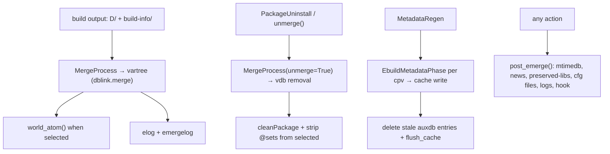

# 08 — Merge, uninstall, metadata regen, post-run

## 8.1 `EbuildMerge(CompositeTask)` (`EbuildMerge.py:13`)

`${D} + build-info → vartree`.

- `_start()` (:29): `MergeProcess(mycat/mypkg/D/infloc/ebuild,
  treetype,vartree,blockers,ldpath_mtimes,logfile)`.
- `_merge_exit(task)` (:61): fail → exit-hook; else
  `world_atom(pkg)`, logs `Post-Build Cleaning / completed emerge
  (cur/max)`.
- `_start_exit_hook(rc)` (:86): `AsyncTaskFuture(exit_hook(self))`,
  defer code. `_exit_hook_exit(rc,task)` (:97): set `returncode`.

## 8.2 `Binpkg(CompositeTask)` (`Binpkg.py:29`) — binary install driver

| Method | Behavior |
|---|---|
| `_writemsg_level(msg,level,noiselevel)` (:54) | To `PORTAGE_LOG_FILE`. |
| `_start()` (:62) | `setcpv`; `EMERGE_FROM=binary / MERGE_TYPE=binary`; fake `PORTAGE_BUILDDIR=image+build-info`; `EBUILD=build-info/PF.ebuild`; `doebuild_environment(setup)`; assert builddir path; `REPLACING_VERSIONS`; wait/cancel the prefetcher. |
| `_prefetch_exit(p)` (:141) | Cancelled → wait; non-pretend/fetchonly → lock + `prepare_build_dirs + clean_log → _start_fetcher`. |
| `_start_fetcher(lock_task)` (:154) | `getbinpkg ∧ download_required → BinpkgFetcher` on the fetch queue with `Fetching Binary` log; else direct. |
| `_fetcher_exit(fetcher)` (:196) | Save `fetched/allocated` paths; fail → unlock; `pretend → EX_OK`; else `BinpkgVerifier` (unless no-verify). |
| `_verifier_exit(v)` (:231) | Fail → unlock; local repo → rename; else `inject`; `None → unlock 1`; set `PORTAGE_BINPKG_FILE`; delete fetch log; `fetchonly → EX_OK`; else log `Merging Binary` + `EbuildPhase(clean)`. |
| `_clean_exit(p)` (:316) | Fail → unlock, else `_unpack_metadata` async. |
| `_unpack_metadata(loop)` async (:326) | Ensure `image/build-info`; `prepare_build_dirs`; `Extracting info`; `dbapi.unpack_metadata`; backfill `CATEGORY/PF`; write `BINPKGMD5` (aux or md5); `BinpkgEnvExtractor` else `PortageException`. |
| `_unpack_metadata_exit(t)` (:397) | Error → `Error extracting…` + unlock; else `EbuildPhase(setup)` on the setup queue. |
| `_setup_exit(p)` (:424) | Fail → unlock, else `unpack_contents(image)`. |
| `_unpack_contents_exit(t)` (:439) | Fail → error + unlock; `PROVIDES` blank-`.so` check; read `EPREFIX`; same prefix → `ensure ED → EX_OK`; else `chpathtool.py D build_prefix EPREFIX`. |
| `_chpathtool_exit(p)` (:502) | Fail → unlock; rewrite `EPREFIX`, move `D/build_prefix → ED` (virtual → fresh `ED`). |
| `_async_unlock_builddir(rc)` (:539), `_unlock_builddir_exit(t,rc)` (:558) | pretend/fetchonly → direct; else elog + unlock. |
| `create_install_task()` (:570) | `EbuildMerge(tree=bintree,pkg_path)`. |
| `_install_exit(task)` (:586) | Pop `BINPKG_FILE`; delete log unless `binpkg-logs`; unlock. |

`BinpkgExtractorAsync(SpawnProcess)` (`BinpkgExtractorAsync.py:25`):
`xpak → image_dir` pipeline. `_start()` (:30): `xpak → _xpak_start`,
else `InvalidBinaryPackageFormat`. `_xpak_start()` (:39): `xattr →
--xattrs…`; probe decompressor (`{JOBS}` from `MAKEOPTS`, fallback
`cat`); missing binary → error + missing package;
`bash -c "head -c tar+xpak | decomp | gtar -xp -C image"` with
`PIPESTATUS/SIGPIPE(141)` tolerance.

## 8.3 `EbuildBinpkg(CompositeTask)` (`EbuildBinpkg.py:15`)

Post-`src_install` binpkg creator.

- `_start()` (:26): `getname_build_id(allocate_new) + _ensure_dir`,
  `mktemp(PORTAGE_BINPKG_TMPFILE,0644)`, `BUILD_ID` when
  multi-instance, `EbuildPhase(package)`.
- `_package_phase_exit(p)` (:59): pop tmpfile var; fail → unlink +
  wait; else `bintree.inject(tmp → allocated)` capturing output → log;
  `None → 1`, else `EX_OK`.
- `get_binpkg_info()` (:101): returns the inject result.

## 8.4 `PackageMerge(CompositeTask)` (`PackageMerge.py:10`)

Status wrapper around the install task.

- `_should_show_status()` (:13): false for
  fetchonly/pretend/buildpkgonly.
- `_make_msg(pkg,action,prep,counter)` (:20):
  `Installing/Uninstalling… cpv::repo [to/from root]`, colored (binary
  vs source).
- `_start()` (:32): `scheduler=merge.scheduler`; installed →
  `Uninstalling`, else `Installing(cur/max)`; `create_install_task →
  _install_exit`.
- `_install_exit(task)` (:56): save `postinst_failure`;
  `Completed/Failed` status; final exit.

## 8.5 Uninstall

### `PackageUninstall(CompositeTask)` (`PackageUninstall.py:19`)

Async uninstall in a subprocess-safe way.

- `_start()` (:39): missing `vardb.getpath(cpv) → EX_OK`;
  `setcpv + doebuild_environment(prerm)` (ignore
  `UnsupportedAPIException`); lock `EbuildBuildDir`.
- `_start_unmerge(lock_task)` (:73): `prepare_build_dirs(cleanup)`;
  `_unmerge_display(unmerge,[cpv])`; non-OK → unlock; else
  log/emergelog `Unmerging`, `MergeProcess(vartree,unmerge=True)`.
- `_unmerge_exit(t)` (:117): elog success/failure, `world_atom`,
  unlock.
- `_async_unlock_builddir(rc)` (:125),
  `_unlock_builddir_exit(t,rc)` (:138): unlock helpers.
- `_emergelog(msg)` (:150): `emergelog` unless `notitles`.
- `_writemsg_level(msg,level,noiselevel)` (:153): scheduler output when
  logfile else `writemsg_level`.

### `unmerge.py`

- `_unmerge_display(root_config,myopts,action,files,clean_delay=1,
  ordered=0,writemsg_level)` (:24): pure selection + preview. Returns
  `(rc,pkgmap[{selected,protected,omitted}])`. Locks vdb; expands system
  set/old virtuals; `rage-clean/unmerge` need args; ebuild-path args
  validated inside `VDB_PATH`; `--pretend/ask` header; `unmerge: all
  matches selected`; `prune: keep best (slot+counter+best)`;
  `clean: per-slot keep max counter`; guards portage/python-interpreter,
  `@set` parents, system-profile warnings; sorts/groups by cp; prints
  `selected/protected/omitted + All selected`; `1` on empty. Nested
  `_pkg(cpv)` (:48): cached `Package(built,installed,type=installed,
  operation=uninstall)`.
- `unmerge(root_config,myopts,action,files,ldpath_mtimes,autoclean=0,
  clean_world=1,clean_delay=1,ordered=0,raise_on_error=0,scheduler,
  writemsg_level)` (:574): executes. `--deselect=n` disables
  world-clean; `_unmerge_display`; `pretend → EX_OK`;
  `ask → No → 128+SIGINT`; read-only vdb → 1;
  `countdown(CLEAN_DELAY)` (unless rage/autoclean); loop
  `portage.unmerge(cat,pf) + emergelog`; fail → elog +
  `raise UninstallFailure` or `sys.exit`; `cleanPackage` per pkg + strip
  `@sets` from `selected`; `EX_OK`.
- `class UninstallFailure(PortageException)` (`UninstallFailure.py:7`):
  `__init__(*pargs)` (:15): `status=pargs[0] if given else 1`.

## 8.6 `MetadataRegen` (`MetadataRegen.py:15,55`)

- `metadata_regen_retry(*a,max_tries=3,**k)` async (:15): fresh
  `MetadataRegen` per try; merges `cpv_failed − successful`;
  `failed → rc|=1`; returns last `rc`.
- `class MetadataRegen(AsyncScheduler)` (:55): parallel `depend` regen
  + stale-cache cleanse. `__init__(portdb,cp_iter,consumer,write_auxdb,
  **k)` (:56): `None → _iter_every_cp + global_cleanse`; tracks
  `valid_pkgs/cp_set/retry/failed/successful`. `_next_task()` (:77):
  `next(_process_iter)`. `_iter_every_cp()` (:80): category-sorted
  `cp_all`. `_iter_metadata_processes()` (:87): per `cp → cpv`:
  `findname2`; `_pull_valid_cache` hit → `consumer(cached)`; else pooled
  `config + deallocate_config` future → yield
  `EbuildMetadataPhase(cpv,hash,portdb,repo,settings,write_auxdb)`.
  `_cleanup()` (:142): `flush_cache`; collect `auxdb − valid` (global
  or `cp_set` scope); `del` dead; `CacheError → skip`.
  `_task_exit(p)` (:199): `EX_OK → successful`, else `failed`;
  `rc != 1 → cp_retry`; drop valid; warn; always
  `consumer(cpv,repo,metadata,hash,eapi_supported)`.

## 8.7 Post-run and search

- `post_emerge(myaction,myopts,myfiles,target_root,trees,mtimedb,retval)`
  (`post_emerge.py:60`): reload `profile.env` settings; log exit
  status; flush elog; commit `mtimedb` + update info files under the
  vdb lock when `_pkgs_changed`; display preserved-libs / config-file /
  news; execute `$CONFIGROOT/…/bin/post_emerge` hook; clean logs
  (`clean_logs` :21, when `clean-logs ∈ FEATURES` and `PORTAGE_LOGDIR`
  is a dir → `CleanLogs().clean()`); suggest depclean
  (`show_depclean_suggestion` :49); news notification
  (`display_news_notification` :37, when `news ∈ FEATURES` and unread
  count non-zero → bool shown).
- `emergelog(xterm_titles,mystr,short_msg=None)` (`emergelog.py:18`):
  append a timestamped line to `$EMERGE_LOG_DIR/emerge.log` under lock
  with secure permissions (no-op when `_disable=True`); optionally set
  the xterm title; swallow `OSError/PortageException`.
- `chk_updated_cfg_files(eroot,config_protect)`
  (`chk_updated_cfg_files.py:13`): scan for `._cfg*` pending updates
  via `find_updated_config_files()`; print `IMPORTANT: config file
  needs updating` + man-page hint.
- `search` (`search.py:21`): `emerge --search`. `__init__(root_config,
  searchdesc,verbose,usepkg,usepkgonly,search_index,similarity,fuzzy,
  regex_auto)` (:31): builds `_dbs=[portdb?,bintree?,vardb]` (indexed
  when asked), `matches={pkg:[]}`. `_cp_all()` (:78): merged deduped cp
  stream via `MultiIterGroupBy`. `_aux_get(*a,**k)` (:91): first db hit
  else `KeyError`. `_aux_get_error(cpv)` (:99): warn + skip.
  `_findname(*a,**k)` (:104): portdb only. `_getFetchMap(*a,**k)`
  (:119): first non-empty. `_visible(db,cpv,metadata)` (:128):
  `Package(type=ebuild|binary|installed).visible`.
  `_first_cp(cp)` (:145). `_xmatch(level,atom)` (:160):
  `match-all/match-visible/bestmatch-visible` union across dbs filtered
  to `atom.cp`, sorted ascending. `execute(key)` (:237): store key.
  `_iter_search()` (:241): `% → regex`, `@|/ → category`, auto-regex
  detect, `fuzzy=difflib(3×ratio≥cutoff)` per part; yields
  `(pkg|desc,cp) + (set,name)` (desc via `DESCRIPTION`). `addCP(cp)`
  (:361): pin result. `output()` (:372): header; per match
  `bestmatch-visible` else `match-all[Masked]`; ebuild → manifest dist
  size (`Unknown(missing digest)`); binpkg → file size; verbose:
  `Latest available/installed, Size, Homepage/Description/License`;
  footer `Applications found: N`. `class msg` (:375),
  `append(m)` (:377) static → `writemsg_stdout`.
  `getInstallationStatus(package)` (:520):
  `Latest version installed: ver | [Not Installed]`.
  `getVersion(pkg,detail)` (:543): `PV[-rX]` (`r0` suppressed).

