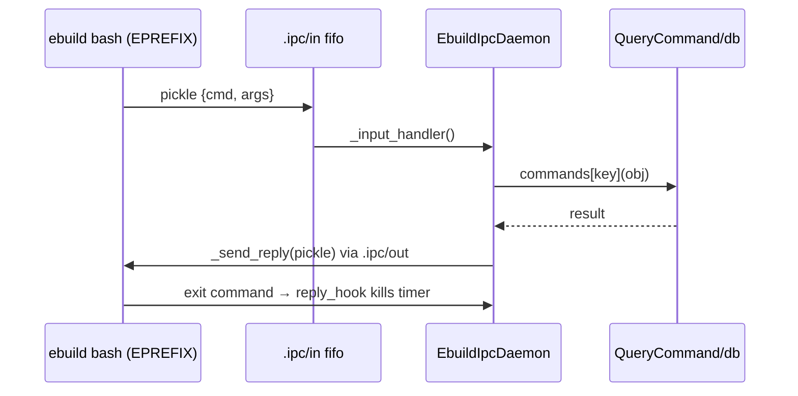

# 09 — IPC, process utilities, display helpers

## 9.1 FIFO IPC

### `FifoIpcDaemon(AbstractPollTask)` (`FifoIpcDaemon.py:11`)

- `_start()` (:17): non-blocking open of `input_fifo`;
  `add_reader → _input_handler`.
- `_reopen_input()` (:28): close/reopen to suppress `POLLHUP`
  (historical bug 339976 — Portuale MUST handle `HUP` without spinning).
- `_cancel()` (:39): `returncode=1`, unregister, wait.
- `_input_handler()` (:46): abstract. `_unregister()` (:49): remove
  readers, close fds.

### `EbuildIpcDaemon(FifoIpcDaemon)` (`EbuildIpcDaemon.py:19`)

Pickle IPC (`die/portageq/exit-detect`).

- `_input_handler()` (:40): atomic read →
  `NoGlobalsUnpickler → commands[key](obj) → _send_reply`; then
  `reply_hook` (exit killer); `EIO/HUP` → non-blocking `lock`-guarded
  `_reopen_input` (historical bug 401919).
- `_send_reply(reply)` (:99): non-blocking open/write of the pickle;
  `ENXIO`/failures tolerated/logged.

IPC commands served to ebuild bash processes (via `QueryCommand`):
`exit`, `best_version`, `has_version`, plus elog and phase queries.
Portuale MUST implement at least: `die` (abort phase with message),
`exit` (terminate with code), `best_version`/`has_version` (query the
live package DBs), and the exit-status handshake file protocol
(`AbstractEbuildProcess._start_ipc_daemon`, doc 07 §7.4).

## 9.2 Small utilities

| Symbol | Location | Behavior |
|---|---|---|
| `getloadavg` (fallback) | `getloadavg.py:9` | Only defined when `os.getloadavg` is missing: parse `/proc/loadavg` first three floats; raise `OSError("unknown")` on failure. Scheduler gates `--load-average` on this. |
| `countdown` | `countdown.py:10` | `countdown(secs=5, doing="Starting")`: print an interruptible `N…1` second countdown to stdout; no-op when `secs==0`. Used before destructive unmerges (`CLEAN_DELAY`). |
| `_flush_elog_mod_echo` | `_flush_elog_mod_echo.py:7` | `_flush_elog_mod_echo()`: `mod_echo.finalize()`; returns true iff items were shown (flush so later notifications sort last). |
| `emergelog` | `emergelog.py:18` | See doc 08 §8.7. |
| `_observability` helpers | `_observability.py:45-418` | `_task_pkg(t)` (:45, `t.pkg\|t.merge.pkg`); `_task_pid(t)` (:56, walk `_current_task ≤16 → pid`); `build_snapshot(m)` (:99, `{type,schema,emerge_pid,timestamp,jobs{running,max,completed,total,failed,merge_wait,merges_pending},tasks[{cpv,category,pf,root,operation,binary,kind=merge\|build,phase\|merge-wait,merge_wait,pid,start,elapsed,build_elapsed,resources}]}` sorted by start); `freeze_resources(s)` (:195, drop `mem_current/swap_current/zswap_current`); `status_dir(eprefix)` (:204, `EPREFIX+PORTAGE_RUN_PATH`); `_status_path_pid(p)` (:217); `_snapshot_is_live(s,p)` (:226, dict + pid match + alive); `_read_socket_snapshot(p,t)` (:243, one JSON line or `None`); `read_snapshots(eprefix)` (:259, socket-first then json fallback, dedup by pid, sorted); `_pid_alive(pid)` (:291, `kill 0`); `average_parallelism(cpu,el)` (:305); `_format_cpu(c,el)` (:316, `12.34s (1.23x)`); `_format_bytes(v,_)` (:324, `bytes_to_human`); `format_resources(r,el)` (:342, `CPU/Mem/MaxMem/Swap/…` non-`None` join); `format_snapshots(ss)` (:358, `emerge[pid]: running, done/total, failed` + `cpv phase elapsed [resources]` or `No emerge…`); `missing_feature_hint(ss,features)` (:398, `NOT_ENABLED_HINT` iff empty and `observability ∉ FEATURES`). |
| `class _BuildTimes` | `_observability.py:71` | `__init__(start)` (:81); `elapsed(now)` (:88, frozen at `finished`). |
| `class ObservabilityMonitor` | `_observability.py:418` | File `emerge-PID.json` + socket `emerge-PID.sock` publisher; all no-ops unless `observability ∈ FEATURES` (timing still kept for `cgroup`). `__init__(sched)` (:437, paths, `{task_start,phases,build_times,last_snapshot,writers}`, `_min_write_latency=1s`, `_refresh_interval=2s`); `note_task_started(t)` (:467); `note_task_finished(t)` (:478); `note_build_resources(cpv,stats)` (:492, freeze → times, return it); `build_elapsed(cpv)` (:506); `forget_build(t)` (:517); `note_phase(cpv,phase)` (:531); `update(force)` (:537, rate-limited `publish`); `_publish()` (:547); `_schedule_refresh()` (:565) / `_refresh()` (:577, 2s timer); `_write_status_file(s)` (:587, atomic json sorted, `OSError → disable`); `_ensure_server()` (:604) / `_server_ready(f)` (:624, `start_unix_server(_client_connected)`, `chmod 0600`); `_client_connected(r,w)` async (:638); `_broadcast(s)` (:665) / `_send(w,d)` static (:674); `close()` (:685, disable, cancel timer, close writers/server, unlink paths). |

