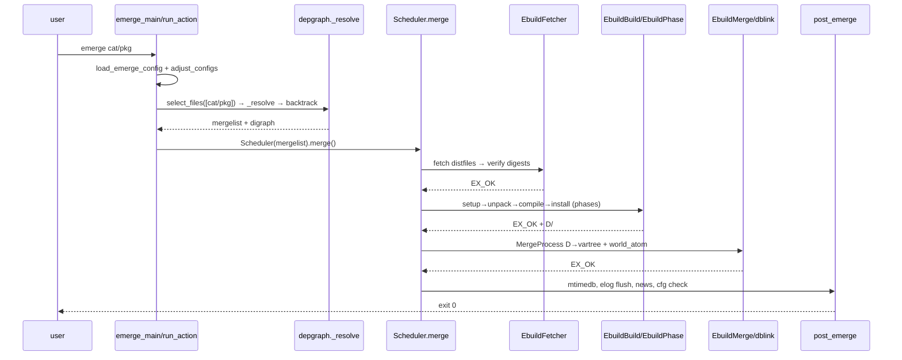
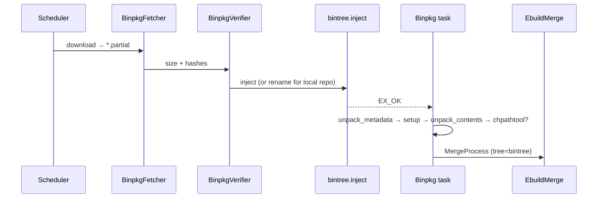
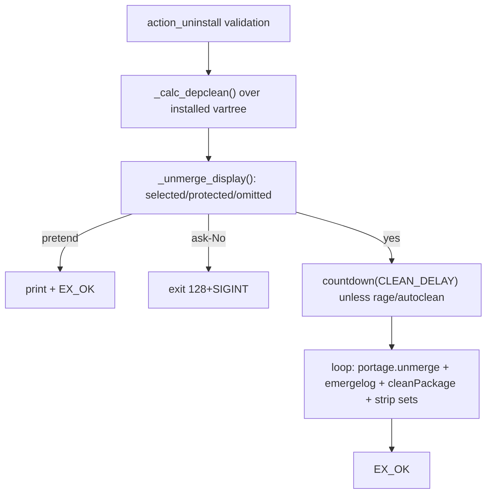

# 11 — End-to-end flows

All diagrams are Mermaid. "Display" steps (`--pretend/--ask/--tree/
--verbose`) never mutate the filesystem except for log files.

## 11.1 Simple install `emerge cat/pkg`

Failure at F/B/G records `_failed_pkgs`, prints
`Failed to emerge …`, and (without `--keep-going`) stops scheduling;
exit code is the failing task's code.

## 11.2 `@world` update `emerge -uDN @world`

Adds `--update + --deep + --newuse` semantics to the resolver:
installed pkgs are reused only when no update/USE/slot change applies;
`--complete-graph` re-adds `@system/@world` with
`_UNREACHABLE_DEPTH`; deep system runtime closure via
`_find_deep_system_runtime_deps`. Success ends with
`show_depclean_suggestion()` (doc 08 §8.7).

## 11.3 `--pretend / --ask / --tree`

- `--pretend`: resolver runs fully; scheduler runs `_run_pkg_pretend`
  serially (clean → fetch + verify → pretend → clean) and prints the
  merge list; no builds, no merges, no world writes; emergelog
  disabled.
- `--ask`: same as pretend, then `UserQuery.query()` per confirmation;
  `No → 128+SIGINT`.
- `--tree/--columns/--verbose`: display-only projections of the same
  graph (`output.py` `Display`, `_tree_display/_ordered_tree_display/
  _prune_tree_display`).

## 11.4 `--fetchonly / --fetch-all-uri`

`EbuildBuild._prefetch_exit` routes to `EbuildFetchonly.execute()` (sync)
or `EbuildFetcher` on the fetch queue; `fetchonly + pretend` uses the
fork executor; failure without `fetch ∈ RESTRICT` unlocks and returns;
`nofetch ∈ DEFINED_PHASES` runs `EbuildPhase(nofetch)`. Nothing is
built or merged.

## 11.5 Binary install (`--getbinpkg / --usepkg`)

`--usepkgonly` additionally propagates the bintree config into every
root (`adjust_configs`) and never falls back to source builds.
`BinpkgPrefetcher` runs this pipeline in the background ahead of the
build queue.

## 11.6 `--depclean / --prune / --unmerge`

- `depclean`: required sets = `world + selected + system + protected`;
  removal list from `create_cleanlist()`; prints
  `installed/world/system/required/removed` summary.
- `prune`: per package keep the best (slot + counter + best version).
- `clean`: per slot keep the newest counter.
- Guards: portage/python-interpreter self-protection, `@set` parents,
  system-profile warnings; empty selection → `1`.
- `PackageUninstall` is the async single-package equivalent used by the
  scheduler for replacee removal (`prerm` env + lock + `MergeProcess
  (unmerge=True)` + world update + unlock).

## 11.7 `--resume / --keep-going / --skipfirst`

- `_save_resume_list` stores `myopts/favorites/mergelist/binpkgs` in
  `mtimedb` after scheduling.
- `--resume`: `backtrack_depgraph()` or `resume_depgraph()` rebuilds
  the graph minus completed pkgs; `--skipfirst` sets `--resume` and
  drops the first entry.
- `--keep-going`: the outer `merge()` loop strips `_failed_pkgs`,
  recalculates via `_calc_resume_list` (`resume_depgraph`), and
  continues; final exit is still `FAILURE=1`, with the single-fail log
  path or die-message summary.

## 11.8 Metadata regen `emerge --regen / --metadata`

`action_regen → MetadataRegen` (doc 08 §8.6): per-`cp → cpv` skip
`_pull_valid_cache` hits, else pooled `EbuildMetadataPhase(depend)`;
then delete `auxdb − valid` + `flush_cache`; `metadata_regen_retry`
retries up to 3 times with a fresh instance. Returns non-zero when any
`cpv_failed − successful` remains.

## 11.9 Sync / info / search / config / deselect

- `sync`: `SyncRepos.auto_sync()` or `.repo(names)`; `EX_OK/1`.
- `info`: print Portage/GCC/libc/profile/kernel/USE/FEATURES + per-pkg
  metadata; ambiguous atoms produce an error list.
- `search`: `search.execute(term); .output()` per term (doc 08 §8.7).
- `config`: exactly one installed atom → `doebuild(config)` +
  `elog_process` + `clean`.
- `deselect`: remove atoms/sets from `@selected` (no `post_emerge`).

## 11.10 Signal / failure matrix

| Event | Behavior |
|---|---|
| `SIGINT` (Ctrl-C) | `KeyboardInterrupt → terminate()`: quiet display, cancel running, clear queues, release jobserver tokens; in-flight success after terminate is counted but never merged; exit `128+SIGINT`. |
| `SIGTERM` | `signal_interrupt → SignalInterrupt → same as SIGINT`, exit `128+SIGTERM` (`emergeexitsig` in `run_action`). |
| `SIGUSR1` | `pdb.set_trace()` (debug only). |
| `SIGUSR2` | Flush `_merge_wait_queue`. |
| `SIGCONT` | Stamp for 5s job-delay pacing. |
| `SIGWINCH` | Resize `JobStatusDisplay`. |
| Build failure | Record `_failed_pkgs + _failed_pkgs_all`, immediate message, deallocate; stop new starts unless `--keep-going`/fetchonly. |
| Postinst failure | Nonfatal: recorded in `_failed_pkgs_all`, merge still counts. |
| Uninstall failure | `elog + raise UninstallFailure` (scheduler) or `sys.exit` (sync path). |
