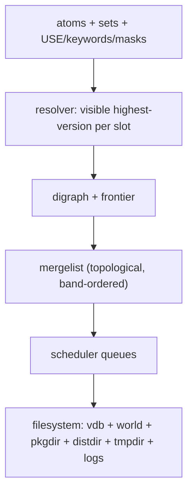

# 12 — Data structures and invariants

## 12.1 Atoms

Grammar (see doc 10 §10.3 `dep/__init__.py`, `versions.py`):

```
atom      := ["!"] category "/" name ["-" version [revision]]
             [":" slot ["/" subslot]] ["::" repo]
             ["[" use-deps "]"] | soname-atom
blocker   := "!" atom            (strong "!!" blocks overlap too)
version-op:= "<" | "<=" | "=" | "~" | ">=" | ">"
slot-op   := ":" | ":=" | ":slot=" | ":*"
```

- `cp` = `category/name`; `cpv` = `cp-version[-rN]`; `pf` = basename.
- `=cpv` pins an exact version; `~cpv` pins the same base with any
  revision; `*` suffix = prefix match (glob); `::repo` pins the repo.
- `:slot` requires a slot; `:=` (slot-operator rebuild) additionally
  forces a rebuild of the parent when the provider's slot/sub-slot
  changes; `:*` accepts any slot.
- `[USE]` conditionals: `flag`, `!flag`, `flag?`, `flag=`, `flag?=`,
  with `,`/space separators; evaluated by `use_reduce()` against the
  effective USE.
- Soname atoms (`libfoo.so:x`) resolve through the provides index, not
  the `cp` namespace.
- Portuale MUST validate with the EAPI-gated rules (`isvalidatom`):
  blocker strength, wildcards, repo and build-id qualifiers depend on
  the EAPI.

## 12.2 Slots, versions, USE, keywords, masks

- **Version order** (`vercmp`): numeric components, then letter,
  then suffixes `_alpha < _beta < _pre < _rc < (release) < _p`, then
  `-rN` revision. Total order; `best()` = maximum.
- **Slots**: `SLOT="1/1.2"` = slot/sub-slot. Same `cp:slot` with two
  different versions = slot conflict unless one replaces the other.
  Sub-slot change with `:=` dependents ⇒ rebuild list.
- **USE**: `IUSE` (declared, with `+`/`-` defaults, `prefix` flags),
  `USE` (enabled), `USE_EXPAND` (`VIDEO_CARDS`, `LINGUAS`, …).
  Effective USE = profile + `make.conf` + `package.use/*` + env +
  `needed_use_config_changes` (autounmask proposals). `REQUIRED_USE`
  is a SAT formula over `||/^^/??/!` groups checked after USE binding.
- **Keywords**: `KEYWORDS="amd64 ~arm x-?"`. `missing` = arch absent;
  `unstable` = `~arch` without `~arch` acceptance. `--autounmask`
  proposes `~arch` acceptance levels.
- **Masks** (union, any match hides the candidate):
  `CHOST`, `EAPI` (unsupported/deprecated), `KEYWORDS`,
  `PROPERTIES`, `RESTRICT`, `package.mask` (+ `p_mask` from autounmask),
  `LICENSE` (unaccepted), invalid metadata.
  `isHardMasked()` = masked for a reason autounmask cannot propose
  around (e.g. `package.mask` without `--autounmask` for masks).

## 12.3 Graph nodes and edges

| Node | Identity | Meaning |
|---|---|---|
| `DependencyArg/AtomArg/PackageArg/SetArg` | `(arg,root)` | CLI roots of the digraph. |
| `Package` | `(type,root,cpv,operation,repo,build_id,…)` | Candidate (ebuild/binary/installed). `operation=merge\|nomerge`. |
| `Blocker` | `("blocks",root,atom,eapi)` | `!atom` constraint. |
| `Dependency` | `(parent,atom,child,priority,depth)` | Edge with hardness (doc 03 §3.2). |

Edge priorities: `buildtime_slot_op(0) > buildtime(-1) >
runtime_slot_op(-2) > runtime(-3) > runtime_post(-4) > optional(-5) >
soft/none(-6)`; cross-root (`ESYSROOT` vs `/`) flagged separately.
`satisfied` marks children already fulfilled by an installed package
(they are parked in `_ignored_deps` and revisited only in
`--complete-graph` / deep traversals).

Invariants Portuale MUST hold:

1. No two `merge`-operation pkgs share a `cp:slot` in the final list
   (slot conflicts are solved or the run fails with a report).
2. Topological order respects surviving hardness bands: all
   `buildtime` deps of a package precede it in the merge list unless a
   reported cycle exists.
3. `uninstall` nodes run after the blockers that require them
   (`_serialize_tasks` deferral).
4. Same-`cpv` buildtime edges exist to prevent builddir collisions
   (`_prevent_builddir_collisions`).

## 12.4 Merge list and scheduler state

- `mergelist`: ordered `Package | Blocker | MergeListItem` produced by
  `schedulerGraph()` via the serialized frontier (alternating
  `Normal`/`Satisfied` bands, leaf-pull).
- `_pkg_queue`: FIFO of not-yet-started items; `_jobs`: running builds;
  `_merges`: completed merges; `_failed_pkgs` / `_failed_pkgs_all`:
  failed (fatal) vs all-failed incl. nonfatal postinst.
- `merge_wait_queue`: `merge-wait` + `@system` pkgs serialized when
  `jobs==0 and merge==0` (or `SIGUSR2`); system pkgs one at a time.
- Resume data (`mtimedb`: `myopts/favorites/mergelist/binpkgs`) allows
  `--resume` to skip completed pkgs.

## 12.5 Sets and world files

- `@world` = `world` file (`/var/lib/portage/world`,
  one atom per line) + `@selected` (user-selected, incl. sets) +
  `@system` (profile `packages` system set). `@selected` is the only
  file `emerge` writes on install (via `world_atom()`) / `deselect` /
  unmerge (`clean_world`).
- `world_atom(pkg)`: `cp:slot[::repo]` when the user arg precisely
  identifies one slot and the atom is absent from `@selected`;
  suppresses unslotted non-virtual system atoms.
- Required sets for `--depclean`: `world + selected + system +
  protected` (profile-protected + `@preserve-rebuild` remnants).
  Anything installed and not reachable from them (through anyichtlich
  dependency, honoring `preserve-libs`) is a removal candidate.

## 12.6 On-disk layouts touched by `emerge`

| Path | Writer | Contents |
|---|---|---|
| `$EROOT/var/db/pkg/*/*/…` (vdb) | `dblink.merge/unmerge` | Installed metadata (`SLOT`, `USE`, `*DEPEND`, `CONTENTS`, `COUNTER`, `environment.bz2`, …). |
| `$EROOT/var/lib/portage/world` | `world_atom()` | User world atoms. |
| `$EROOT/var/lib/portage/world_sets` / `selected` | sets/files | Selected sets/atoms. |
| `$PKGDIR` (+ `Packages` index) | `EbuildBinpkg.inject` | Binary packages created with `--buildpkg`. |
| `$DISTDIR` | fetchers | Distfiles, `*.partial` during download. |
| `$PORTAGE_TMPDIR/portage/*` | build phases | `PORTAGE_BUILDDIR` per package (locked). |
| `$PORTAGE_LOGDIR` / `$EMERGE_LOG_DIR` | loggers | Per-phase logs + `emerge.log`. |
| `$EROOT/var/cache/*blockers*.pickle` | `BlockerCache` | Blocker index (flush iff ≥5 modified, `secpass≥2`). |
| `$CACHE_PATH/mtimedb` | scheduler/post_emerge | Resume + mtime data. |
| `$EPREFIX/.../bin/post_emerge` | hook runner | Optional site hook after each run. |


