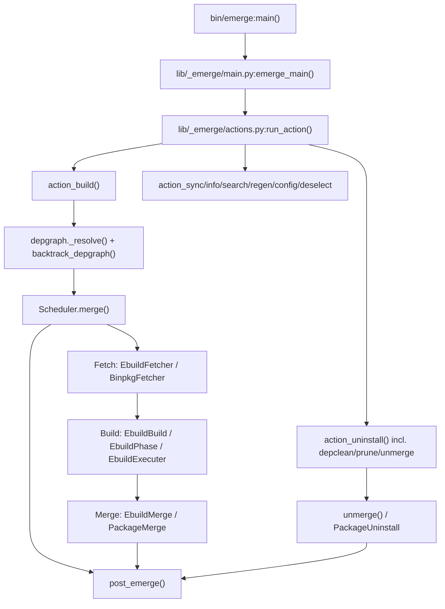

# Portuale — Clean-Room Specification of `emerge`

This directory is a **clean-room, behavior-only** description of what
`emerge` (the command-line package manager frontend of Portage) does.
It is written so that a new implementation ("Portuale") can be built
without copying Portage source code. It describes **observable behavior**:
inputs, outputs, side effects, ordering guarantees, error handling, and
control/data flow — not source listings.

> Source of truth analyzed: `3rdparty/portage` — `bin/emerge`,
> `lib/_emerge/*.py` (~86 modules), and the `lib/portage/*` library
> surface that `emerge` consumes (dbapi, dep, versions, locks, process,
> checksum, manifest, getbinpkg, eapi, sets, elog, repository, cache,
> binrepo). File:line references (e.g. `lib/_emerge/main.py:1197`) point
> at the analyzed snapshot so a reviewer can verify each claim.

## Document index

| # | File | Contents |
|---|------|----------|
| — | `README.md` | This index, conventions, glossary pointer, master flow map |
| 01 | `01-entry-and-cli.md` | `bin/emerge` shim, `main.py` option parsing, `emerge_main()` orchestration, `help.py`, early vs full parse, env seeding |
| 02 | `02-actions-and-config.md` | `actions.py`: `run_action()` dispatcher, every `action_*`, `load_emerge_config`, `adjust_config(s)`, `expand_set_arguments`, priorities, logging setup |
| 03 | `03-dependency-resolution.md` | `depgraph.py` + `resolver/`: arg classification, atom expansion, slot selection, USE/mask/keyword filtering, graph growth, blockers, cycles, backtracking, deep/system semantics; `Dependency*`, `*Priority`, `Blocker*` |
| 04 | `04-package-model.md` | `Package.py`, `MergeListItem.py`, `RootConfig.py`, `FakeVartree.py`, `PackageVirtualDbapi.py`, arg nodes (`AtomArg/PackageArg/SetArg/DependencyArg`), world-atom creation, frontier serialization, deep-system helper |
| 05 | `05-task-scheduler.md` | `Scheduler.py`, `PollScheduler.py`, `Task/AsynchronousTask/AbstractPollTask/CompositeTask/TaskSequence/SequentialTaskQueue`, `SpawnProcess/SubProcess/PipeReader/AsynchronousLock`, `JobStatusDisplay/ProgressHandler/stdout_spinner/UserQuery/UseFlagDisplay` |
| 06 | `06-fetch-phase.md` | `EbuildFetcher`, `EbuildFetchonly`, `BinpkgFetcher/Prefetcher/Verifier`, fetch maps, digest/size verification |
| 07 | `07-build-phase.md` | `EbuildBuild`, `EbuildExecuter`, `EbuildPhase`, `EbuildProcess/AbstractEbuildProcess/EbuildSpawnProcess`, `EbuildBuildDir`, `EbuildMetadataPhase`, `MiscFunctionsProcess`, `PackagePhase` |
| 08 | `08-merge-unmerge-phase.md` | `EbuildMerge`, `EbuildBinpkg`, `Binpkg`, `PackageMerge`, `PackageUninstall`, `unmerge.py`, `MetadataRegen.py`, `post_emerge.py`, `emergelog.py`, `chk_updated_cfg_files.py`, `search.py` |
| 09 | `09-ipc-process-utils.md` | `EbuildIpcDaemon`, `FifoIpcDaemon`, IPC commands, `PipeReader`, locks, `getloadavg`, `countdown`, spinner, observability, elog flush |
| 10 | `10-portage-lib-support.md` | `lib/portage/*` consumed by emerge: `vartree/porttree/bintree`, `dep`, `versions`, `eapi`, `locks`, `process`, `checksum`, `manifest`, `getbinpkg`, `sets`, `elog`, `repository`, `cache`, misc `util/` |
| 11 | `11-end-to-end-flows.md` | Full sequence diagrams: install, `@world` update, `--depclean/--prune/--unmerge`, `--fetchonly/--pretend/--ask`, binpkg install, metadata regen, failure/`--keep-going`/`--resume` paths |
| 12 | `12-data-structures-invariants.md` | Atoms, slots, USE, keywords, masks, graph nodes/edges, merge list, world/selected/system sets, config files, resume data, on-disk layouts |

## Conventions used in all documents

- **Function tables**: `Symbol | Signature | Behavior` — behavior is one or
  more sentences of observable contract (preconditions, outputs, side
  effects, error mapping). No code is reproduced.
- **Flows**: numbered steps in execution order + Mermaid diagrams
  (`flowchart` / `sequenceDiagram`). Render with any Mermaid renderer.
- **Refs**: `path:line` refers to the analyzed Portage snapshot.
- **MUST / MUST NOT / SHOULD**: normative requirements on a Portuale
  reimplementation derived from observed behavior.
- **Errors**: exit codes — `EX_OK=0`, `FAILURE=1`, `128+signum` on signals.

## Master flow map

## How to reimplement (reading order)

1. `01` + `02` for the outer shell (parse → config → dispatch).
2. `12` for the data model (atoms, slots, sets, masks).
3. `03` + `04` for the resolver (the hardest part).
4. `05` for the async scheduler skeleton (can be simplified first to a
   serial executor, then parallelized — the spec marks what is
   order-critical vs. performance-only).
5. `06` → `07` → `08` for the phase pipeline.
6. `09` + `10` for IPC, locking, and library contracts.
7. `11` to validate each end-to-end scenario.

## Clean-room notice

- Do not copy Portage code or comments into Portuale. Use these specs as
  the interface contract and write fresh code.
- Behavior not specified here (exact wording of informational messages,
  exact timing/pacing constants) MAY differ as long as exit codes, file
  system effects, ordering guarantees, and error semantics match.
- Where Portage has known workarounds (referenced bug numbers), the spec
  states the required end state, not the workaround.
