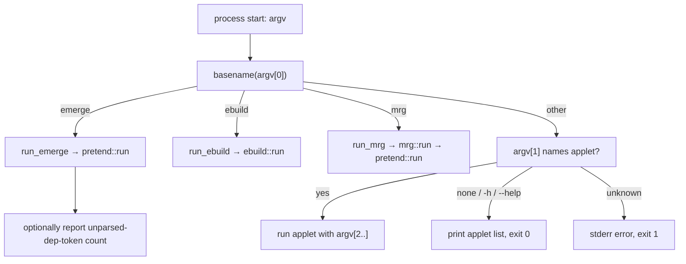

# 01 — Overview: what `emerge` is

## 1.1 Product definition

`emerge` is the package-manager front end. Given one or more *target
atoms* (e.g. `sys-fs/fuse`, `=app-arch/unzip-6.0-r3`, `@world`,
`@system`, `@preserved-rebuild`, `@selected`, a set name, or a bare
package name), it:

1. loads configuration (profiles, `make.conf`, repositories),
2. resolves the dependency graph for the targets,
3. displays the merge list (or writes JSON),
4. optionally asks for confirmation (`--ask`),
5. executes the plan: fetch → unpack/build (source) or download (binary)
   → install → merge into `${ROOT}` → update VDB, world file, news state,
6. maintains system state: resume list (`mtimedb`), config protection,
   preserved libraries, `env-update` outputs, elog/mail.

`emerge` also hosts read-only query actions (`--search`, `--info`,
`--list-sets`, `--check-news`, `--metadata`, `--version`), repository
maintenance actions (`--sync`, `--regen`, `--metadata`), and removal
actions (`--unmerge`/`-C`, `--depclean`/`-c`, `--prune`/`-P`,
`--clean`, `--deselect`/`-W`, `--config`).

## 1.2 The multicall binary

There is **one** executable. Its behaviour is selected by `argv[0]`
(busybox-style dispatch, `rust/portuale/src/main.rs`):

- invoked as `emerge` → `Applet::Emerge` → `run_emerge` (`main.rs:99`),
  which calls `pretend::run(args)` (`pretend.rs:8389`) and then, if
  `PORTUALE_REPORT_UNPARSED_DEP_TOKENS` is set in the environment,
  reports the count of dropped unparseable dependency tokens to stderr
  (`main.rs:103-109`).
- invoked as `ebuild` → `Applet::Ebuild` → `ebuild::run(args)`
  (`main.rs:113-115`, `ebuild.rs:122`).
- invoked as `mrg` → `Applet::Mrg` → `mrg::run(args)` (`main.rs:117-119`,
  `mrg.rs:1385`): the same emerge codepath driven through a `clap`
  option surface, then translated back to emerge-style argv
  (`mrg.rs:1231` `to_emerge_argv`).
- invoked as `portuale` (or any other name) with a first argument naming
  an applet (`portuale emerge …`) → runs that applet (`main.rs:149-151`).
- invoked as `portuale` with no applet, `-h`, or `--help` → prints the
  applet list and exits 0 (`main.rs:73` `print_applets`, `main.rs:154`).
- invoked with an unrecognized applet name → error to stderr, exit 1
  (`main.rs:158-164`).

Before dispatch, `main` (`main.rs:129-139`) registers the ebuild
cache-miss metadata provider (`ebuild_phases::depend_phase_metadata`,
`ebuild_phases.rs:3277`) with `portage-repo`, so repository metadata
reads can fall back to running the ebuild `depend` phase. In unit-test
contexts the provider is absent and a cache miss stays a read error.

## 1.3 Global concepts

### ROOT vs config root vs running root

- **ROOT** (`portage-repo::root_from_env`, `lib.rs:828`): the filesystem
  `emerge` installs into. Defaults to `/`; tests override it. All merges,
  unmerges, VDB paths (`${ROOT}/var/db/pkg`), world files
  (`${ROOT}/var/lib/portage/world`), and news state hang off ROOT.
- **Config root** (`portage-repo::config_root_from_env`, `lib.rs:205`):
  where configuration is read from (`PORTAGE_CONFIGROOT`, default `/`).
  `emerge` has **no** `--config-root` CLI flag; the environment variable
  is the only source (`pretend.rs:8400-8409`).
- **Running root** (`portage-repo::running_root_from_env`, `lib.rs:879`):
  the host prefix used only to decide whether `--root-deps=rdeps`
  output needs a root suffix (`pretend.rs:594-636`).

### Repositories

Repository layout comes from `repos.conf` under the config root
(`portage-repo::find_repos`, `lib.rs:1111`). Each entry yields a
`RepoConfig` (`lib.rs:886`): name, location, priority, whether it is the
main repo, masters chain, aliases. Exactly one repo MUST be main; if none
is found, `emerge` prints `emerge: no main repo found in repos.conf` and
exits 1 (`pretend.rs:8430-8433`). A `find_repos` failure prints
`emerge: {error}` and exits 1 (`pretend.rs:8423-8429`).

### The VDB (installed-package database)

`${ROOT}/var/db/pkg/<category>/<PF>/` holds one directory per installed
package: `CONTENTS` (file list), `SLOT`, `USE`, `IUSE`, `EAPI`,
`repository`, `BUILD_TIME`, `NEEDED.ELF.2`, `environment.bz2` (saved
build environment), `USE`/`CFLAGS` and friends. The merge flow writes
these (`ebuild_merge.rs:2115` `write_vdb_entry`); the unmerge flow reads
`CONTENTS` and deletes them (`ebuild_unmerge.rs:178` `parse_contents`,
`:702` `run_unmerge`).

### Configuration

`portage-profile::resolve_config` (`portage-profile/src/lib.rs:2490`)
folds, in priority order: profile chain (`parent` files, cascading
`package.use`, `package.mask`, `package.unmask`, `package.keywords`,
`use.mask`, `use.force`, …), `make.conf` (including
`EMERGE_DEFAULT_OPTS`, `FEATURES`, `USE`, `PORTAGE_FEATURES`,
`INSTALL_MASK`, `PORTAGE_BINHOST`, `FETCHCOMMAND`, …), and per-repo
`package.mask` scoping by `::reponame`. See `04-resolver-and-output.md`
§4.1 for the full layering.

## 1.4 Design constraints the specification inherits

1. **Determinism.** All directory reads go through the single
   `portage-util::read_dir_entries` seam (sorted by default; seeded
   shuffle only under test-only `PORTAGE_SHUFFLE_DIRS`). Repeated runs
   MUST produce identical output and merge order.
2. **No second implementation copy.** Expected outputs are grounded in
   real Portage behaviour (differential test bed, upstream resolver
   test cases), never in a mirrored reference implementation.
3. **EAPI floor.** Only EAPI 5+ behaviour is specified; older-EAPI
   branches are out of scope.
4. **Privilege model.** Filesystem mutation requires privilege; running
   as an unprivileged user against a root-owned ROOT MUST fail cleanly
   (`privileges.rs:26` `is_privileged`, `:68` `deny_superuser`).
5. **Static minimal-Linux binary.** One statically linked executable, no
   assumption of glibc or a system package manager. Behaviourally this
   means: no reliance on external tools except a real `bash` for phase
   execution, `wget` (or configured `FETCHCOMMAND`) for downloads, and
   optional `gpg`, `ldconfig`, `sendmail`/SMTP helpers.
