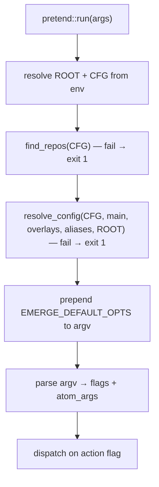
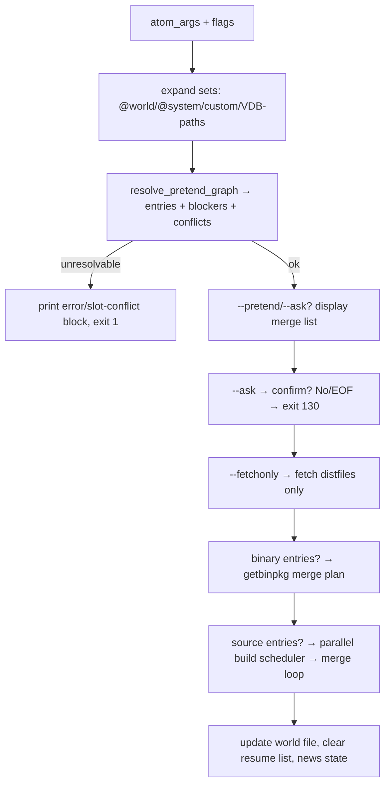
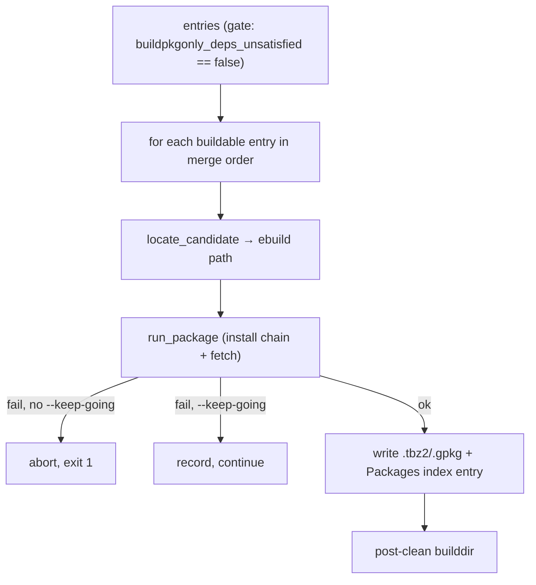
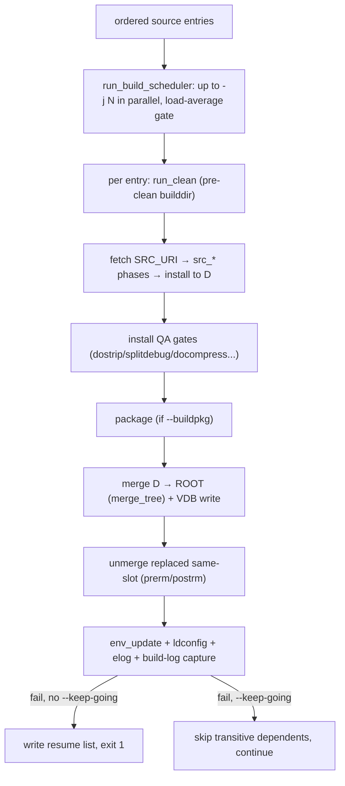
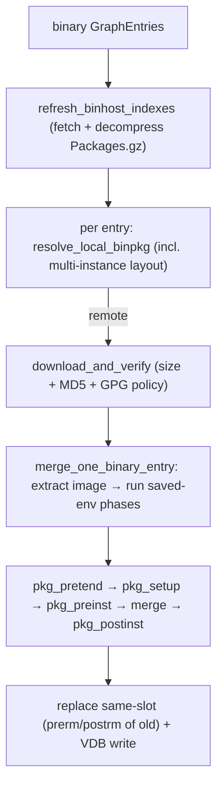
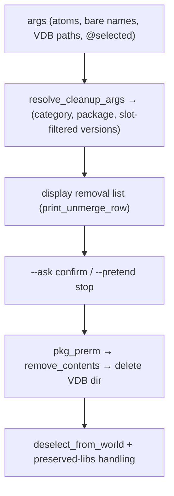

# 03 — `emerge` action flows

Each flow below is the observable contract: entry function, ordered
steps, side effects, outputs, exit codes. Small helper functions are
named with their `pretend.rs` (or other module) line so the clean-room
team can anchor behaviour precisely.

Notation: `ROOT` = target root, `CFG` = config root.

## 3.1 Common preamble (every action except `--help`)

## 3.2 Default action: resolve → display → execute

Steps in detail:

1. **Set expansion.** `read_world_atoms` (`:3034`), `expand_selected`
   (`:3058`), `installed_set_atoms` (`:3073`),
   `preserved_rebuild_atoms` (`:3104`), `collect_installed_sets`
   (`:3404`), `resolve_custom_set` (`:3369`). `@system`'s atom list comes
   from the resolved config (`system_packages`).
2. **Resolution** (see `04-resolver-and-output.md`): produces an ordered
   `GraphEntry` list in dependency-first merge order, plus blocker rows,
   slot conflicts, autounmask changes, changed-deps reports.
3. **Display** (list / tree / columns / JSON — see §4.5) unless
   `--quiet` suppresses it.
4. **World update** (`update_world_file` `:3166`,
   `update_world_sets_file` `:3271`): on a real merge, record each
   explicitly-named target (not deps, not `--oneshot`) in
   `${ROOT}/var/lib/portage/world` (slot-qualified when needed);
   `--deselect=n` keeps prior behaviour.
5. **Scheduling policy.** `apply_portage_scheduling_policy` (`:4509`) /
   `apply_scheduling_policy` (`:4565`) set `PORTAGE_NICENESS`/`ionice`
   from config before forking builds.

## 3.3 `--pretend` / `--ask` (dry run + confirm)

- `--pretend`/`-p`: steps 1–3 of §3.2 only. MUST NOT touch the
  filesystem (no fetch, no build, no merge, no world/resume writes).
- `--ask`/`-a`: after display, `ask_confirm` (`:4654`) prompts
  `Would you like to merge these packages? [Yes/No]`; bare Enter = Yes
  (`ask_enter_invalid` `:4694`, `classify_yes_no` `:4710`,
  `stdin_is_tty` `:4628` — without a TTY it exits instead of hanging).
  "No"/EOF prints `Quitting.`/`Interrupted.` and exits 130.
  Ignored under `--pretend`.
- `clean_delay_countdown` (`:4778`): the 5-second Ctrl-C window before
  destructive unmerge-family actions.

## 3.4 `--fetchonly` / `--fetch-all-uri`

Resolve normally, then for every source entry run the fetch step only
(`fetch_src_uri`, `fetch.rs:655`): Manifest-verified download into
`DISTDIR`, mirror fallback, resume. Exit 1 naming the first
unfetchable file. `--fetch-all-uri` covers all URIs, not just the
enabled-USE subset.

## 3.5 `--buildpkgonly` / `-B` (build binary packages, never merge)

Entry: `emerge_build::run_buildpkgonly` (`emerge_build.rs:121`).

- `entry_version` (`:58`): `New/Upgrade/Downgrade/Reinstall` build;
  `AlreadyInstalled/NoVisibleCandidate/Uninstall` build nothing.
- `Binary` entries are skipped (already binaries).
- Live (`9999`) entries build only with the live-buildpkg feature on
  (`entry_is_live` `:379`, `entry_buildpkg_wanted` `:409`).
- `--buildpkg-exclude` atoms skip matching entries
  (`entry_matches_any` `:353`).

## 3.6 Source merge (real `emerge <atom>`)

Entry: `emerge_build::run_source_merge` (`:270`) → `run_merge_loop`
(`:440`) → `merge_one_source_entry` (`:522`) → per-entry
`build_one_source_entry` (`:1079`) + `merge_one_built_entry` (`:1201`).

- Environment per entry: `build_use_env` (`:606`),
  `entry_package_env_vars` (`:625`), `entry_identity_env` (`:654`),
  `entry_metadata_env` (`:717`), `entry_phase_env_tail` (`:748`),
  `entry_build_env` (`:789`), wide phase env (`:692`
  `run_wide_phase_env`), resolved `FEATURES` (`:900`).
- Build logs: `build_log_path` (`:908`),
  `ensure_portage_logdir_symlink` (`:983`), `tail_of` (`:1047`) for
  failure excerpts.
- Parallelism: `run_build_scheduler` (`:1309`) builds dependency-leaves
  first, at most `--jobs` concurrent, throttled by `--load-average`
  (`system_loadavg_1min` `:1294`); a hard failure kills still-running
  builds; `--keep-going` skips the failed package's dependents
  (`scheduler_skip_dependents` `:1259`, `scheduler_needs_build` `:830`,
  `scheduler_cp_version` `:809`).
- Resume: on failure the remaining mergelist + options persist via
  `mtimedb::write_resume_list` (`mtimedb.rs:313`); success clears it
  (`:382`).

## 3.7 Binary merge (`--usepkg` / `--getbinpkg` / `--getbinpkgonly`)

Entry: `emerge_getbinpkg::run_merge_plan` (`emerge_getbinpkg.rs:124`).

- `refresh_binhost_indexes` (`:63`): fetches each `BinRepo`'s `Packages`
  index (decompressing `.gz`), honouring `verify-signature`.
- `resolve_local_binpkg` (`:326`): finds the file in `PKGDIR`
  (both flat and multi-instance `cat/pn/` layouts).
- `download_and_verify` (`:376`): size/MD5 against the index, GPG per
  `gpg_policy_for_features` (`binpkg.rs:1983`).
- `merge_one_binary_entry` (`:192`): `ebuild_merge::merge_binpkg`
  (`ebuild_merge.rs:3684`) extracts the image (xpak `.tbz2` or gpkg),
  runs the saved-environment phase chain, merges, regenerates the
  merge-time VDB environment through the whitelist filter.

## 3.8 `--unmerge` / `-C` (remove named packages)

Entries: `run_unmerge_pretend` (`pretend.rs:3950`) for the plan/display,
`execute_unmerge` (`:5054`) for the removal.

- Bare names expand via `dep_expand_token`/`qualify_bare_name`;
  `resolve_vdb_path_arg` (`:3862`) accepts literal VDB paths;
  `installed_cp_versions` (`:5206`) + `split_pf` (`:5244`) enumerate
  installed versions; `resolve_cleanup_args` (`:5263`) applies slot
  filters.
- Removal itself: `ebuild_unmerge::run_unmerge` (`ebuild_unmerge.rs:702`)
  runs `pkg_prerm`, deletes every `CONTENTS` path honouring
  CONFIG_PROTECT (unless `--unmerge-orphans`), removes empty dirs,
  cleans `info` dirs, deletes the VDB dir (`delete_vdb_dir` `:690`),
  and preserves still-linked shared libraries
  (`preserve_libs_on_unmerge`, `ebuild_merge.rs:1215`).
- `deselect_from_world` (`pretend.rs:5139`) drops the CP from the world
  file.

## 3.9 `--depclean` / `-c`

Entry: `run_depclean_pretend` (`pretend.rs:5857`).

1. Compute the protected set: world + world_sets + `@system` +
   argument atoms + reverse dependencies of the protected set.
2. Candidates = installed packages outside the protected set.
3. **lib-check** (default on; `--depclean-lib-check=n` disables):
   `lib_consumer_scan` (`:5662`) builds the ELF linkage map
   (`needed_elf::rebuild`) and `apply_depclean_lib_check` (`:5738`)
   withholds any library with surviving consumers; no-args form also
   prints the `Depclean may break link level dependencies` advisory.
4. `depclean_unresolved_halt` (`:5790`): with explicit atoms, abort if
   any atom matches nothing installed.
5. Display (with the `* ` advisory block only for this action), confirm
   unless `--pretend`, then unmerge each (same machinery as §3.8),
   honouring `--deselect=n` (keep world entries).

## 3.10 `--prune` / `-P` and `--clean`

- `run_prune_pretend` (`:5337`): for each installed `cat/pkg` (or the
  given atoms), keep the highest-versioned instance per slot and remove
  the rest. Real `action_depclean` with `unmerge_action == "prune"`.
- `run_prune_nodeps_pretend` (`:5436`) / `run_clean_pretend` (`:5468`)
  via `run_prune_nodeps_or_clean` (`:5492`): identical to prune except
  dependency resolution is skipped (`--nodeps` semantics).
- Slot-aware: sub-slotted packages never collide with their own files
  on re-merge.

## 3.11 `--deselect` / `-W`

Entry: `run_deselect` (`:3523`). Removes the named atoms (and, via
`still_listed_parents` `:3914`, their slot refinements) from the world
file and world_sets file (`read_world_sets` `:3324`,
`update_world_sets_file` `:3271`). Does not uninstall anything.
`--deselect=n` is the distinct "keep" value consulted by `--depclean`,
never the standalone action.

## 3.12 `--resume` / `-r` (+ `--skipfirst`)

Entry: `run_resume` (`:4838`). Reads `mtimedb`'s resume section
(`read_resume_list` `mtimedb.rs:356` → mergelist + failing ref +
options). `--skipfirst` drops the first entry (the one that failed).
Replays the remaining plan through the §3.2 execute path.
`entries_not_merged` (`:4796`) tags source vs binary entries for the
replay. `rotate_resume_to_backup` (`:340`) archives multi-item lists.

## 3.13 `--sync`, `--regen`, `--metadata`

- `--sync`: synchronises each configured repo (git/rsync per
  `repos.conf` `sync-type`), then refreshes caches. (Documented cut:
  exotic sync modules report "not supported" naming the type.)
- `--regen`: `regen::run` (`regen.rs:175`) regenerates
  `metadata/md5-cache` for a repo: `run_parallel` (`:409`) dispatches
  `RegenWorkItem`s (`:128`) across `--jobs` workers with
  retry classification (`is_retryable_returncode` `:157`,
  `select_retry_cps` `:167`); `regen_one` (`:526`) runs the ebuild
  `depend` phase per CPV; `render_entry` (`:586`) + `write_entry`
  (`:636`) write the cache files with the `eclasses` field (`:672`);
  `prune_stale_entries` (`:498`) deletes cache files for removed
  ebuilds. Follows `layout.conf` `cache-formats` (skips `pms`-only
  repos with a message, exit 1).
- `--metadata` (`--metadata` transfer): transfers metadata per
  `FEATURES=metadata-transfer` semantics.

## 3.14 Query actions

- `--search`/`-s` (`run_search` `:6183`): matches repo package names
  (and with `--searchdesc`/`-S`, descriptions) against the query;
  regex-auto detection + fuzzy `difflib` close matches
  (`difflib.rs:50`); picks the best visible candidate
  (`search_best_candidate` `:6365`, `search_candidate_visible` `:6381`);
  ambiguous output via `render_ambiguous_search_output` (`:6403`).
- `--list-sets` (`run_list_sets` `:6099`): repository sets plus user
  sets from the config root (`defined_set_names` `:6111`).
- `--check-news` (`run_check_news` `:6635`): GLEP-42 news items newer
  than `${ROOT}/var/lib/portage/news-*` state; `news_item_format`
  (`:6746`, 1.x vs 2.x atom split), `news_item_valid` (`:6760`),
  `news_item_relevant` (`:6812`); `write_news_state_if_changed`
  (`:6711`) advances state only on change.
- `--info` (`run_info` `:7311`): header (`print_info_header` `:7088`),
  profile version (`info_profile_version` `:7271`), repo list, USE,
  FEATURES, toolchain versions (`tool_first_line` `:7061`), installed
  package table (`info_pkgs_table`, portage-repo).
- `--config` (`run_config_action` `:7789`): runs the `pkg_config` phase
  for the named installed package; ignores `--pretend`.
- `--version`/`-V`: prints the version string and exits 0.
- `--deselect` display, `--metadata` display, `--status`, `--moo`:
  small fixed-output actions.
