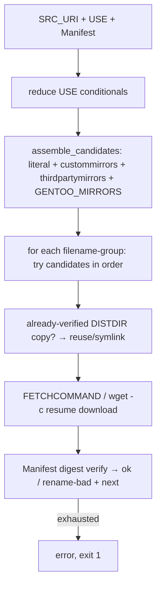

# 05 — Real execution: phases, fetch, package, merge, unmerge

## 5.1 Ebuild phase execution (`ebuild_phases.rs`, 6424 lines)

The `ebuild` applet (`ebuild.rs:122` `run`, helpers `:80` `wants_help`,
`:87` `print_help`, option/command tables in `ebuild_options.rs:53,67`
with `lookup_option` `:102`, `is_valid_command` `:114`) dispatches one
command (`COMMANDS`: `install merge unmerge package qmerge clean
pretend setup unpack prepare configure compile test preinst postinst
prerm postrm config info nofetch help …`) on one `.ebuild` file.

### Environment (`compute_environment`, `:398`)

Builds the `Environment` struct (`:379`) for a package:

- Splits `category/package-version-revision`
  (`split_package` `:276`, `PackageSplit` `:261`).
- Reads EAPI (`parse_eapi` `:218`, first-assignment scan, default `0`).
- Phase chain prerequisites (`phase_prerequisites` `:316`,
  `is_real_phase_command` `:337`, standalone set `:370`).
- Directory layout (`D`, `S`, `WORKDIR`, `T`, `FILESDIR`,
  `PORTAGE_BUILDDIR`; `create_directories` `:616`,
  fake-filesdir symlink `:592`).
- `phase_standalone_base_env` (`:926`), `phase_env_vars` (`:2386`),
  `phase_path` (`:2627`, helpers prepended), `eapi_path_var` (`:2610`),
  `phase_setup_script` (`:2658`, `shell_single_quote` `:2706`).
- Repo roots (`repo_root` `:652`, `repo_root_for` `:779`,
  `portage_checkout` `:670`, `bin_dir` `:698`, overlay `:749-756`).
- RESTRICT/PROPERTIES evaluation against USE
  (`restrict_and_properties` `:1030`, `flat_field_has_token` `:840`,
  `flat_field_on` `:877`, `restrict_{mirror,fetch,primaryuri}_from_restrict`
  `:810-828`, `depend_use_set` `:1091`).
- Fetch config (`resolved_fetch_config` `:1138`,
  `resolved_ro_distdirs` `:1174`), slot-operator binding
  (`bind_slot_operator` `:1366`), `package.env` vars
  (`match_package_env_vars` `:1060`), `eclass_locations_value` (`:2360`).
- Post-install metadata (`write_post_install_metadata` `:1428`,
  soname deps `:1583`, libc dep injection `:1674`, `dir_size_bytes`
  `:1712`).

### Backends and isolation

- `ShellBackend` (`:1770`): `bash` (default, real system bash via
  `run_one_phase_bash` `:2941`, `real_bash_path` `:2800`) or `brush`
  (embedded, opt-in via `--shell`). `environ_whitelisted` (`:1964`),
  feature gating (`features_string` `:1975`,
  `feature_token_present` `:1988`, `phase_features_value` `:2017`).
- Sandboxing: `network_sandbox_requested` (`:2022`),
  `network_sandbox_exempt` (`:2040`), `fs_sandbox_requested` (`:2050`),
  `sandbox_binary` (`:2059`), `fs_sandbox_for_phase` (`:2086`),
  `Isolation` (`:2108-2267`, `unshare_combo_usable` `:2162`,
  `sandbox_wrapped_command` `:2267`).
- Scheduler child registry (`new_scheduler_registry` `:3058`,
  `SchedulerRegistryGuard` `:3068`, `scope_scheduler_registry` `:3078`,
  `kill_registered_children` `:3090`, `spawn_trackable` `:3109`) so a
  hard failure kills still-running builds.
- `run_commands` (`:3839`) / `run_commands_logged` (`:3871`) with log
  pumps (`LogSink`/`LogPump` `:3923-3971`, `open_log_file` `:3971`,
  gzip pump); `run_misc_function` (`:3634`) over a shared tokio runtime
  (`:3617`), `run_misc_functions_bash` (`:3527`); brush param shaping
  (`brush_phase_params` `:4055`).

### Depend-phase metadata fallback

`run_depend_phase` (`:3152`, `DependError` `:3147`) runs the ebuild
`depend` phase and parses the aux map (`parse_aux_entry` `:3352`);
`depend_phase_metadata` (`:3277`) exposes it as the
`portage-repo` cache-miss provider; depcache paths
(`depcachedir` `:3384`, `depcache_entry_path` `:3367`).

### Phase order (observable contract)

`pkg_pretend` → `pkg_nofetch` (restricted only) → `pkg_setup` →
`src_unpack` → `src_prepare` → `src_configure` → `src_compile` →
`src_test` (if `test` feature) → `src_install` → `pkg_preinst` /
`pkg_postinst` (if defined) → `pkg_prerm` / `pkg_postrm`
(replaced packages) → `pkg_config` (on request) → `pkg_info`.
`doebuild merge` = install chain + merge; `qmerge` = merge only;
bare `install` = phases only. Pre-clean (`run_clean`) runs before
every source build and after `--buildpkgonly`/merge unless
`FEATURES=noclean`.

## 5.2 Fetch (`fetch.rs`, 2715 lines)

`fetch_src_uri` (`:655`, `FetchOptions` `:136` default `:221`):

- Mirror sources: `gentoo_mirrors_from_env` (`:105`),
  `portage_ssh_opts_from_config` (`:265`),
  `fetch_commands_from_config` (`:280`), `assemble_candidates` (`:338`),
  `primary_uris` (`:397`), `mirror_url` (`:495`), `fsmirrors` (`:563`)
  incl. `layout.conf` resolution, `copy_from_fsmirrors` (`:587`).
- Per-file grouping (`group_by_filename` `:455`), dedupe (attempt each
  repeated candidate once), checksum-failure cap then primary-only
  (`checksum_failure_max_tries` `:424`).
- `RESTRICT=mirror/fetch/primaryuri` handling (incl. `mirror+`/`fetch+`
  prefix re-permission); pre-verified `PORTAGE_RO_DISTDIRS` symlink.
- Space check (`has_enough_space` `:624`, `distdir_writable` `:612`);
  per-distfile locks; `wget_fetch` (`:257`).

## 5.3 Package (`ebuild_package.rs`, 1968 lines)

`run_package` (`:528`, `PackageOptions` `:110` default `:200`,
`is_real_package_command` `:101`): runs the install chain then packs
`${D}` + build-info into a binary package; `package_after_install`
(`:569`) finalises metadata (resolved USE into the `Packages` index).

- Compression: `compress_template` (`:231`, six real compressors),
  `find_binary` (`:246`), `resolve_compression_command` (`:281`,
  `bzip2`-var/flags/`jobs` substitution),
  `makeopts_to_job_count` (`:299`, greedy-regex parity),
  `phase_compression_command` (`:342`, resolved-config lookup),
  `resolve_compression_command_jobs` (`:355`).
- Index: `packages_index_header` (`:397`, `now_unix_time` `:374`),
  `format_packages_entry` (`:401`), `write_packages_index_entry`
  (`:430`, replace-on-rebuild, preserve others).
- Layouts: `binpkg_extension` (`:793`), multi-instance
  `cat/pn/` subdir (`multi_instance_binpkg_suffix` `:805`),
  `allocate_binpkg_build_id` (`:822`), checksums (`:866`),
  `invoke_dyn_package` (`:903`, `dyn_package` hook),
  `quickpkg_from_vdb` (`:1050`, re-pack installed),
  `copy_dir_recursive` (`:1269`); signing gate
  (`require_signing_config` `:500`).

## 5.4 Filesystem merge (`ebuild_merge.rs`, 6973 lines)

`run_merge` (`:2968`) = install chain via phases, then
`merge_after_install` (`:3131`); `run_qmerge` (`:3070`) = merge only;
`merge_binpkg` (`:3684`) = binary path (§3.7).

### `merge_tree` (`:1552`) — the copy loop

For each path in the image: dirs → create; files → copy/rename
(`needs_move` `:2001`, `files_equal` `:2019`); symlinks → recreate;
fifos/devices → `create_special_node` (`:1892`); ownership
(`lchown_or_chown` `:1962`); `CONTENTS` line per entry
(`format_contents_line` `:1511`, `mtime_secs` `:1533`).

### Collisions (`find_collisions` `:2696`)

`find_owners` (`:2814`) via the VDB `CONTENTS` seam;
`blocked_installed_packages` (`:2522`) and flat-dep blockers
(`:2609`); default `protect-owned` aborts on owned files;
`--collision-protect` aborts on any unowned overwrite but ignores
directory-target symlinks over real dirs (backed up);
symlink-over-directory always aborts (`collision_message` `:2867`).

### CONFIG_PROTECT (`protect_decision` `:694`)

`is_protected` (`:510`, longest-match + mask exclusion),
`new_protect_filename` (`:561`, sequential `._cfgNNNN_` with
content-reuse), `new_backup_path` (`:614`), `cfgfiledict` persistence
(`cfg_mem_path` `:766`, read `:774`, write `:787`).

### VDB write

`next_counter` (`:2067`), `write_vdb_entry` (`:2115`) incl.
`SLOT`/`USE`/`IUSE`/`EAPI`/`repository`/`BUILD_TIME`/
`NEEDED.ELF.2`/`environment.bz2`, `write_consolidated_metadata_file`
(`:2204`), `write_vdb_entry_from_dir` (`:2248`);
`read_installed_slot` (`:2315`), `installed_instance_pf` (`:2341`),
ownership queries (`owns_path` `:2377`, `owns_path_pf` `:2399`,
`owned_node_type/value_pf` `:2424-2455`); `repository_name_for`
(`:1485`), `parse_slot` (`:1462`), md5 (`:1498-1505`).

### Post-merge

`unmerge_replaced_same_slot` (`:3387`) + `unmerge_one_installed`
(`:3505`) with saved-env `pkg_prerm`/`pkg_postrm`
(`run_vdb_saved_env_phase` `:3600`); `apply_install_mask` (`:2144`);
`process_merge_elog` (`:2941`); `run_env_update` (§6.4);
`env_update`-scoped ldconfig; `feature_enabled` (`:2917` reads
resolved FEATURES via `MergeOptions::set_resolved_features` `:492`,
`from_env` `:427`, default `:387`).
`source_distfiles` (`:3096`) records fetch state.

### Preserved libraries

`PlibRegistry` (`:806`, path `:822`, JSON parse/quote `:830-973`);
`plib_inode_map` (`:1006`); `register_preserved_libs` (`:1153`),
`unregister_preserved_libs` (`:1035`), `remove_from_contents` (`:1089`,
also prunes `NEEDED.ELF.2`); `preserve_libs_on_unmerge` (`:1215`);
`preserved_lib_paths` (`:1281`); `find_unused_preserved_libs` (`:1310`);
`prune_unused_preserved_libs` (`:1384`).

## 5.5 Unmerge (`ebuild_unmerge.rs`, 1669 lines)

`run_unmerge` (`:702`, `UnmergeOptions` `:519` default `:549`,
`is_real_unmerge_command` `:161`):

1. Read `CONTENTS` (`parse_contents` `:178`, `ContentsEntry` `:165`).
2. `remove_contents` (`:235`): delete files/symlinks; keep
   locally-modified config files unless `--unmerge-orphans`; keep
   paths still owned by same-slot mates; tolerate shared dirs and
   already-gone entries; collect stale `cfgfiledict` paths.
3. `remove_dirs` (`:443`): bottom-up empty-dir removal;
   `cleanup_info_dir` (`:397`): `info`/`dir`/`dir.old` + env.d
   infopath handling via `info_dirs_inodes`.
4. `unmerge_pkgfiles` (`:577`): `pkg_prerm` from the saved env, then
   steps 1–3, then `delete_vdb_dir` (`:690`).
