# `emerge --pretend @world`

Read-only. Expands the world set, resolves the full deep dependency
graph for every world member, prints the merge list, and exits without
touching anything.

Entry: `pretend::run` (`rust/portuale/src/pretend.rs:8356`).

```mermaid
flowchart TD
    start["emerge --pretend @world"]:::entry --> help["--help? no → resolve config FIRST<br/>find_repos() + resolve_config(),<br/>then prepend EMERGE_DEFAULT_OPTS to argv"]
    help --> parse["parse options<br/>pretend = true, atom_args = ['@world']"]

    parse --> guard{"standalone action flag set?<br/>(--unmerge, --depclean, --config, ...)"}
    guard -->|no| cfg

    subgraph CFG["config resolution"]
        cfg["find_repos(config_root)<br/>main repo + every overlay from repos.conf"]
        cfg --> rc["resolve_config()<br/>profile inheritance chain + make.conf<br/>→ USE, ACCEPT_KEYWORDS, package.mask/.unmask,<br/>package.use, package.accept_keywords, system set"]
    end

    rc --> world["expand '@world' = sorted @profile<br/>+ @selected (var/lib/portage/world atoms<br/>+ nested world_sets) + sorted @system<br/>(@installed → one cat/pkg:slot per vdb entry)"]
    world --> moves["apply_updates_to_atom()<br/>rewrite each atom through profiles/updates/ moves"]
    moves --> empty{"atom list empty?"}
    empty -->|yes| err2["error → exit 2"]:::done
    empty -->|no| resolve

    subgraph RES["resolve_pretend_graph()  (portage-repo)"]
        resolve["for each requested atom"]
        resolve --> cand["list_candidates() across main + overlays<br/>filter by mask / keywords / visibility<br/>pick the winning version (or a binpkg<br/>candidate when --usepkg family is set)"]
        cand --> walk["recursive DEPEND / RDEPEND / BDEPEND walk<br/>use_reduce() flatten against that package's<br/>own resolved USE, slot-aware, cycle-safe,<br/>deduped"]
        walk --> classify["classify each node:<br/>New / NewSlot / Upgrade / Downgrade /<br/>Reinstall / AlreadyInstalled / NoVisibleCandidate"]
        classify --> report["collect blockers (!atom / !!atom),<br/>slot conflicts, autounmask suggestions,<br/>changed-deps, ABI/slot-operator rebuilds"]
        report --> order["topological_merge_order()<br/>dependency-first ordering"]
    end

    order --> disp{"output mode"}
    disp -->|"--json"| json["print_json()"]:::done
    disp -->|"--tree / -t"| tree["print_tree()"]
    disp -->|default| lines["print_entry_line() per entry<br/>N=new S=newslot U=upgrade D=downgrade R=reinstall<br/>+ USE= strings, slot / repo decoration at -pv"]

    tree --> extra
    lines --> extra
    extra["blocker lines, slot-conflict block,<br/>'Total: N packages' counters (at -v),<br/>autounmask / changed-deps advisories"]
    extra --> failq{"blockers or slot conflicts?"}
    failq -->|yes| exit1["exit 1 — nothing touched"]:::done
    failq -->|no| done["exit 0 — no vdb, no filesystem, no network touched"]:::done

    classDef entry fill:#1f6f43,color:#fff
    classDef done fill:#4a4a4a,color:#fff
```

## Notes

- `--pretend` never hits the network: even with the `--getbinpkg`
  family it resolves against whatever binhost index is already cached
  (the `!pretend && getbinpkg` refresh guard in `pretend::run`).
- `@world` = sorted `@profile` + `@selected` + sorted `@system`
  (real `_sets/__init__.py:97-98`): the world file's atoms plus the
  sets named in `var/lib/portage/world_sets`, expanded recursively,
  plus the profile's unstarred `packages` lines and the system's
  starred ones.
- The execution branch (`if !pretend`, `pretend.rs` dispatch) is skipped
  entirely — `pretend` is `true`, so `run` returns right after the
  display-then-fail band (exit 1 on blockers / slot conflicts).
