# `emerge -v --getbinpkgonly=y sys-apps/portage`

Binary-only. `--getbinpkgonly=y` implies `--usepkgonly` (no source
fallback) **and** turns on remote binhost candidate loading. Each remote
binhost index is refreshed live, the graph is resolved against the
binary pool, and every entry is downloaded and merged as a prebuilt
package.

Entry: `pretend::run` (`rust/portuale/src/pretend.rs:4859`).

```mermaid
flowchart TD
    start["emerge -v --getbinpkgonly=y sys-apps/portage"]:::entry --> parse["parse options<br/>pretend = false, verbose = true<br/>getbinpkgonly = true"]

    parse --> cfg["config resolution<br/>find_repos() + resolve_config()<br/>+ parse binrepos.conf / PORTAGE_BINHOST"]
    cfg --> expand["expand atoms + apply_updates_to_atom()"]

    expand --> fold["fold the --getbinpkg family:<br/>usepkgonly = true (binary only)<br/>usepkg = true<br/>getbinpkg = true (remote candidates)"]
    fold --> scan["if no $PKGDIR/Packages index:<br/>binpkg::scan_pkgdir() — synthesize an index<br/>from each local binpkg's embedded metadata"]

    scan --> refresh["!pretend && getbinpkg →<br/>emerge_getbinpkg::refresh_binhost_indexes()<br/>wget each http(s) binhost's Packages[.gz/.zst]<br/>into var/cache/edb/binhost/&lt;host&gt;/&lt;path&gt;/Packages<br/>(file:// binhosts need no refresh)"]

    refresh --> resolve["resolve_pretend_graph()  (usepkgonly)<br/>candidates come ONLY from the binary pool<br/>(local $PKGDIR + refreshed remote indexes)<br/>→ every entry has source = Binary<br/>'g' bracket column = remote binary not yet in $PKGDIR"]
    resolve --> unsat{"any dep with no binary candidate?"}
    unsat -->|yes| fail["NoVisibleCandidate on a top-level atom<br/>aborts resolution → error exit"]:::done
    unsat -->|no| display["render merge list (verbose)<br/>[binary] entries + counters"]

    display --> execgate{"if !pretend"}
    execgate --> ask{"--ask / -a ?"}
    ask -->|"no"| dispatch
    ask -->|"yes, declined"| exit130["exit 130"]:::done

    dispatch{"execution dispatch (pretend.rs:7127)<br/>getbinpkg = true"} --> rmp

    subgraph RMP["emerge_getbinpkg::run_merge_plan()"]
        rmp["for each entry in topological order<br/>(shared run_merge_loop)"]
        rmp --> srcq{"entry.source == Binary?"}
        srcq -->|"no (can't happen under -G)"| srcmerge["merge_one_source_entry()<br/>(source build fallback — --getbinpkg only)"]
        srcq -->|yes| binentry["merge_one_binary_entry()"]
    end

    binentry --> aiq{"outcome == AlreadyInstalled?"}
    aiq -->|yes| noop["silent no-op"]
    aiq -->|no| remoteq{"entry.remote_binary?"}

    remoteq -->|yes| dl["find_remote_binpkg() in a binhost Packages record<br/>download_and_verify(): wget into $PKGDIR,<br/>check SIZE, check the record's MD5<br/>(gpkg: also verify internal Manifest BLAKE2B/SHA512)"]
    remoteq -->|"no (local PKGDIR)"| local["resolve_local_binpkg()<br/>PKGDIR/cat/pf.tbz2 or pf.gpkg.tar"]

    dl --> mb
    local --> mb

    subgraph MB["ebuild_merge::merge_binpkg()"]
        mb[">>> Merging binary package cat/pkg-ver..."]
        mb --> extract["extract the tbz2 / gpkg into a scratch staging dir<br/>(xpak / gpkg; restore the saved build environment)"]
        extract --> setup["pkg_setup → pkg_preinst  (from the binpkg's saved env)"]
        setup --> copy["copy files into ROOT, write the vdb entry<br/>(CONTENTS, counter, SLOT, repository)"]
        copy --> replace["unmerge every replaced same-slot version<br/>(pkg_prerm → remove files → pkg_postrm)"]
        replace --> postinst["pkg_postinst → env_update() + ldconfig"]
    end

    postinst --> world["update_world_file()<br/>record sys-apps/portage in the world file"]
    noop --> world
    world --> done["exit 0"]:::done

    classDef entry fill:#1f6f43,color:#fff
    classDef done fill:#4a4a4a,color:#fff
```

## Notes

- `refresh_binhost_indexes` runs **before** resolution so the resolver
  sees the live remote pool; `--pretend` skips it and resolves against
  the cached index only.
- `--getbinpkgonly` never falls back to source: `usepkgonly` resolution
  simply never produces a non-`Binary` entry, so the `merge_one_source_entry`
  arm in `run_merge_plan` is unreachable under `-G` (it exists to serve
  the mixed `--getbinpkg` case).
- Digest verification covers `SIZE` + `MD5` for a tbz2 and the internal
  `Manifest` hashes for a gpkg; the GPG `.sig` layer is a documented v1
  cut.
- `-v` is display-only; `--getbinpkgonly` binary merges are always
  serial (nothing to build in parallel).
