# `emerge -v --getbinpkg=n sys-apps/portage`

Source build + merge. `--getbinpkg=n` explicitly disables binary
packages (this is also the default), so every resolved entry is built
from an ebuild and merged into the vdb. `-v` only makes the merge-list
display verbose; it does not change resolution or execution.

Entry: `pretend::run` (`rust/portuale/src/pretend.rs:4859`).

```mermaid
flowchart TD
    start["emerge -v --getbinpkg=n sys-apps/portage"]:::entry --> parse["parse options<br/>pretend = false, verbose = true<br/>getbinpkg = false (explicit =n)<br/>atom_args = ['sys-apps/portage']"]

    parse --> cfg["config resolution<br/>find_repos() + resolve_config()"]
    cfg --> expand["expand atoms (no @set here)<br/>apply_updates_to_atom()"]
    expand --> usepkg["fold --getbinpkg family into --usepkg<br/>getbinpkg=n → usepkg stays false → source only"]

    usepkg --> resolve["resolve_pretend_graph()<br/>candidate = ebuild only, recursive dep walk,<br/>outcome classification, topological merge order"]
    resolve --> display["render merge list (verbose)<br/>print_entry_line() + USE strings + counters"]

    display --> execgate{"if !pretend"}
    execgate --> ask{"--ask / -a ?"}
    ask -->|"no (default)"| dispatch
    ask -->|"yes, declined"| exit130["exit 130"]:::done

    dispatch{"execution dispatch<br/>(pretend.rs:7127)"}
    dispatch -->|"not buildpkgonly, not getbinpkg"| rsm

    subgraph RSM["emerge_build::run_source_merge()"]
        rsm["for each entry in topological order<br/>(run_merge_loop; --jobs&gt;1 → run_build_scheduler)"]
        rsm --> skipq{"outcome == AlreadyInstalled?"}
        skipq -->|yes| noop["silent no-op"]
        skipq -->|no| locate["locate_candidate()<br/>re-derive the winning ebuild's repo + path"]
        locate --> merge1["merge_one_source_entry()<br/>>>> Emerging (cat/pkg-ver)..."]
    end

    merge1 --> runmerge

    subgraph RM["ebuild_merge::run_merge()"]
        runmerge["run_commands(['install'])<br/>→ phase_prerequisites chain (ebuild_phases.rs)"]
        runmerge --> phases["pretend → setup → unpack → prepare →<br/>configure → compile → test → install<br/>(real bash src_* phases via embedded brush)"]
        phases --> bpq{"FEATURES=buildpkg / --buildpkg ?"}
        bpq -->|yes| binpkg["package_after_install()<br/>write a binpkg into $PKGDIR before the vdb merge"]
        bpq -->|no| mai
        binpkg --> mai
        mai["merge_after_install()"]
        mai --> collide["find_collisions() + collision-protect abort check"]
        collide --> preinst["pkg_preinst (run_single_phase)"]
        preinst --> copy["copy staged files / dirs / symlinks into ROOT<br/>compute CONTENTS (obj md5 / sym target)"]
        copy --> vdb["write_vdb_entry()  var/db/pkg/cat/pf/<br/>(CONTENTS, SLOT, repository, counter, ...)"]
        vdb --> replace["unmerge_replaced_same_slot()<br/>remove the previously-installed same-slot version"]
        replace --> postinst["pkg_postinst (run_single_phase)"]
        postinst --> envupd["env_update() + ldconfig"]
    end

    envupd --> world["update_world_file()<br/>record sys-apps/portage in var/lib/portage/world<br/>(skipped by --oneshot / --onlydeps / --buildpkgonly)"]
    world --> elog["elog: '* Messages for package ...' summary<br/>(FEATURES=echo)"]
    elog --> done["exit 0"]:::done

    noop --> world

    classDef entry fill:#1f6f43,color:#fff
    classDef done fill:#4a4a4a,color:#fff
```

## Notes

- On a build failure without `--keep-going`, `run_merge_loop` stops at
  the first error and `mtimedb::write_resume_list` records every
  still-unmerged package so `emerge --resume` can continue.
- With `--keep-going`, the failed package and every transitive dependent
  (via `GraphEntry::required_by`) are skipped and the rest are merged;
  `run` still exits non-zero.
- `--jobs N` (N > 1) routes to `run_build_scheduler`, which runs the
  `install` phase of independent entries concurrently but always
  serialises the vdb merge step — matching real portage.
- `sys-apps/portage` is not special here (it is special only for
  `--unmerge`, which refuses to remove `PORTAGE_PACKAGE_ATOM`).
