# `emerge -Cv app-portage/eix`

Removal. `-C` (`--unmerge`) is a standalone action: it does **not**
resolve a dependency graph. It matches the given atoms against installed
packages, shows a `selected` / `protected` / `omitted` preview, then
(without `--pretend`) really removes each selected package and deselects
it from the world file. `-v` has no effect on this path.

Entry: `pretend::run` → `run_unmerge_pretend`
(`rust/portuale/src/pretend.rs:2636`).

```mermaid
flowchart TD
    start["emerge -Cv app-portage/eix"]:::entry --> parse["parse options<br/>unmerge = true, pretend = false<br/>atom_args = ['app-portage/eix']"]

    parse --> cfg["config resolution<br/>find_repos() + resolve_config()<br/>(needed for @system targets + system-profile check)"]
    cfg --> dispatch["standalone action → run_unmerge_pretend(<br/>  targets, action = 'unmerge', pretend = false)"]

    dispatch --> expand["expand every @set target into member atoms<br/>(@world/@selected/@system/@installed + custom @name);<br/>resolve a path/ebuild-file arg to an atom<br/>(resolve_vdb_path_arg)"]
    expand --> hdrq{"pretend?"}
    hdrq -->|"yes (-pC)"| hdr[">>> These are the packages that would be unmerged:"]
    hdrq -->|"no"| match
    hdr --> match

    subgraph MATCH["per-atom vdb matching loop"]
        match["for each atom: match against installed vdb<br/>(bare name → borrow category from vdb,<br/>ambiguous category = hard error)"]
        match --> selfq{"is it PORTAGE_PACKAGE_ATOM<br/>(sys-apps/portage)?"}
        selfq -->|yes| protect["move to 'protected' + eerror note<br/>(portage never unmerges itself)"]
        selfq -->|no| sets{"still listed in a package set<br/>(world, or a non-active set)?"}
        sets -->|yes| omit["move to 'omitted'<br/>(+ higher-slot refinement check)"]
        sets -->|no| select["add version(s) to 'selected'"]
    end

    protect --> render
    omit --> render
    select --> render

    render["per-cp block:<br/>    selected: &lt;versions&gt;<br/>   protected: &lt;versions&gt;<br/>     omitted: &lt;versions&gt;<br/>+ 'All selected packages: ...'<br/>+ 'N packages are slated for removal.'"]

    render --> pretendq{"pretend?"}
    pretendq -->|"yes"| exit0["exit 0 — nothing removed"]:::done
    pretendq -->|"no"| ask{"--ask / -a ?"}
    ask -->|"yes, declined"| exit130["exit 130"]:::done
    ask -->|"no / accepted"| delay["clean_delay_countdown()"]

    delay --> exec

    subgraph EXEC["execute_unmerge()  (pretend.rs:3246)"]
        exec["for (idx, cpv) in removal_list<br/>>>> Unmerging (N of M) cat/pf..."]
        exec --> backup{"FEATURES=unmerge-backup?"}
        backup -->|yes| quickpkg["quickpkg the package first"]
        backup -->|no| u1
        quickpkg --> u1
        u1["ebuild_merge::unmerge_one_installed()"]
        u1 --> prerm["pkg_prerm  (from that version's own vdb-saved env)"]
        prerm --> rm["delete every file / symlink / dir in its CONTENTS<br/>(CONFIG_PROTECT-aware; preserve-libs consulted)"]
        rm --> postrm["pkg_postrm"]
        postrm --> del["dblink.delete() — drop var/db/pkg/cat/pf/"]
        del --> desel["deselect_from_world()<br/>drop matching world atoms unless another<br/>installed version still satisfies them;<br/>rewrite var/lib/portage/world sorted"]
    end

    desel --> more{"more packages in removal_list?"}
    more -->|yes| exec
    more -->|no| done["exit 0"]:::done

    classDef entry fill:#1f6f43,color:#fff
    classDef done fill:#4a4a4a,color:#fff
```

## Notes

- No depgraph: `--unmerge` removes exactly what you name (after set
  expansion). It does **not** pull in or check reverse dependencies —
  that is `--depclean` (`run_depclean_pretend`, which reuses this same
  `run_unmerge_pretend` machinery with a computed cleanlist).
- `-pC` (`--pretend --unmerge`) stops at the preview and never calls
  `execute_unmerge`.
- A `pkg_prerm` / `pkg_postrm` non-zero exit is logged and removal
  continues; the file-removal core failing is a hard error.
- `--rage-clean` is the same path with `action = "rage-clean"`: it skips
  the `CLEAN_DELAY` countdown and the prerm/postrm hooks.
- v1 cuts on the real removal loop: no `--ask` prompt inside
  `execute_unmerge` itself (handled by the caller), `CLEAN_DELAY` is a
  fixed countdown.
