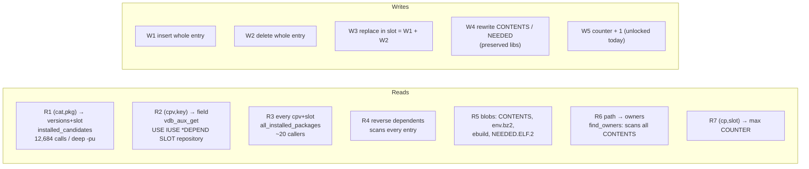
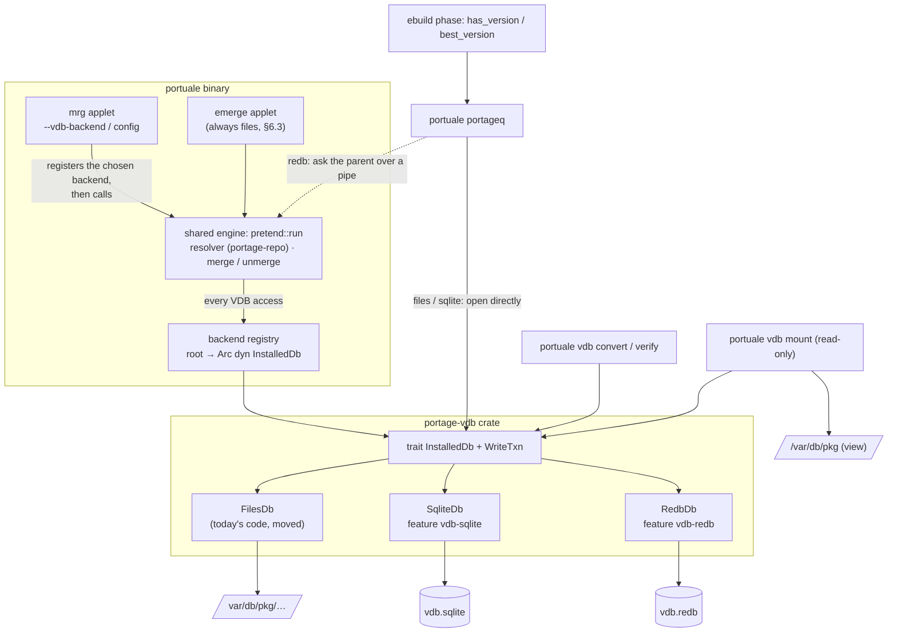
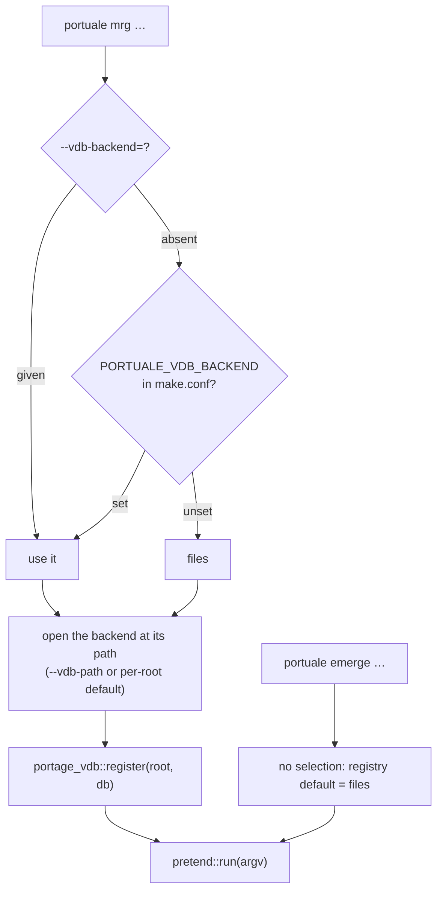
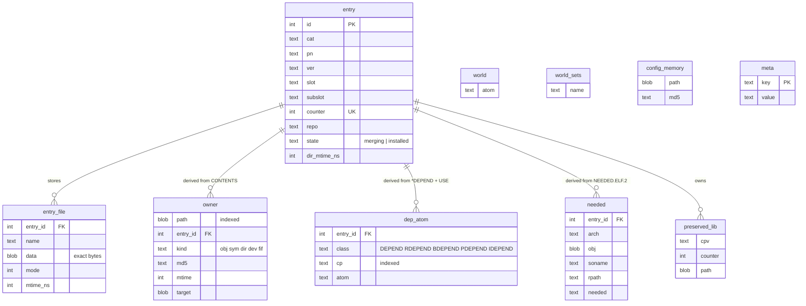
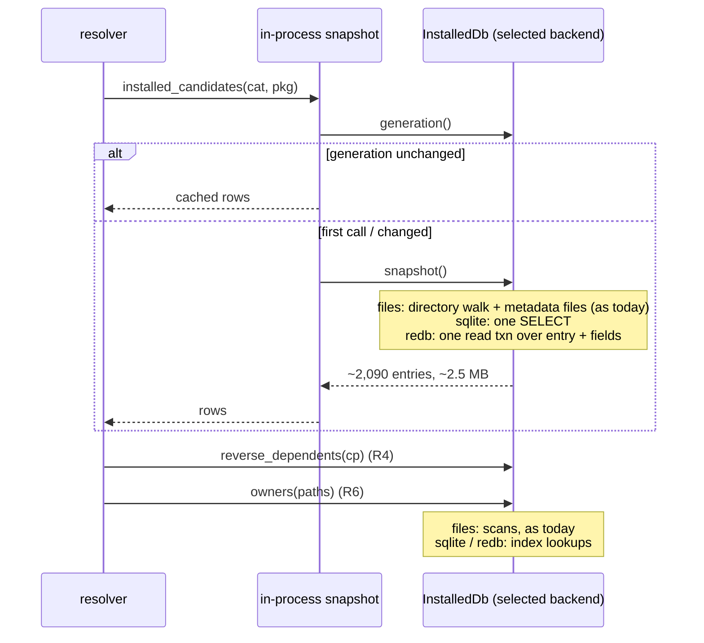
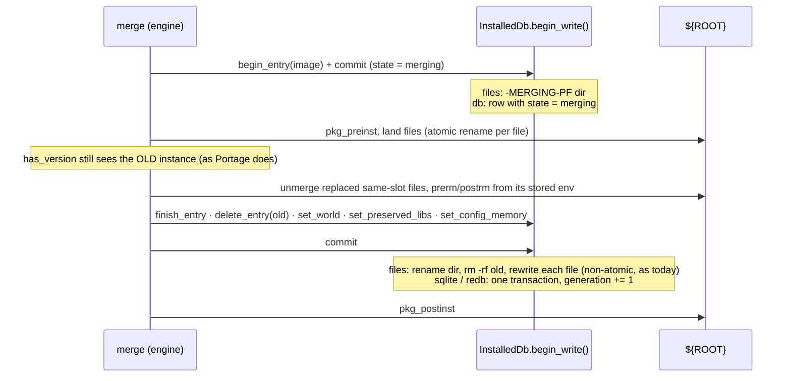
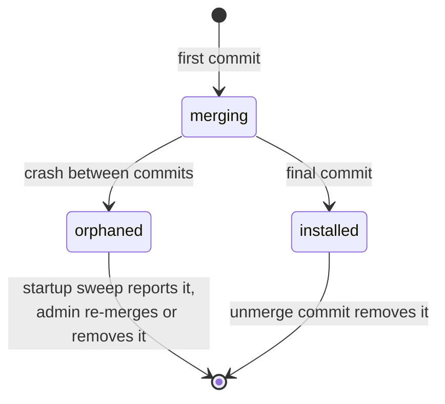
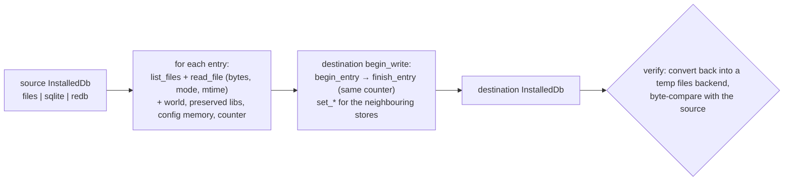
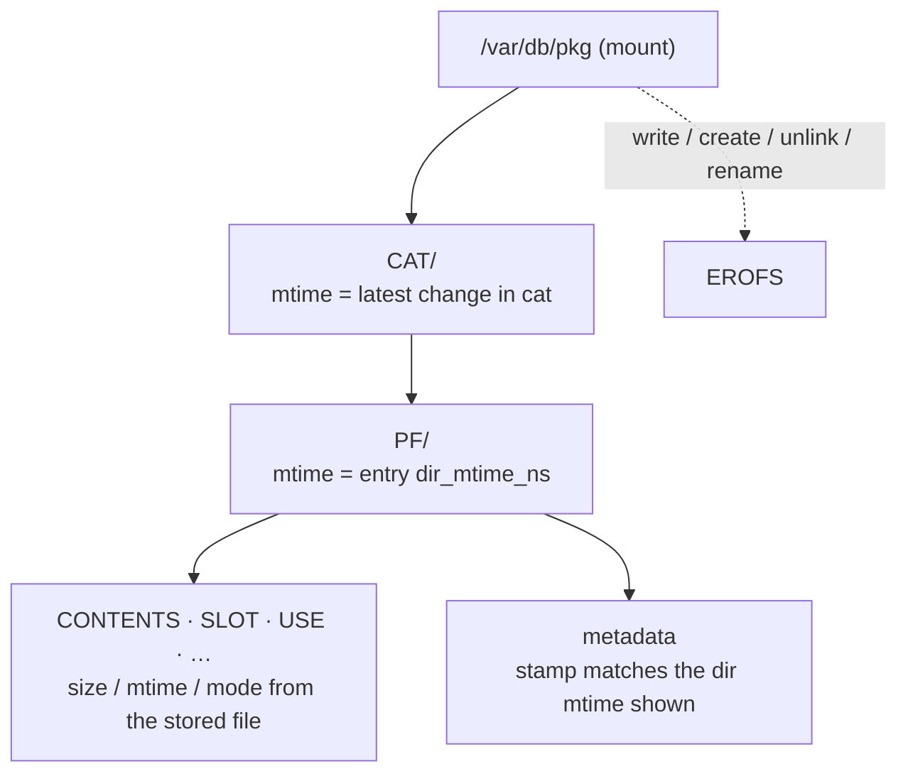
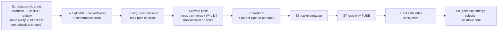

# A swappable installed-package database (VDB)

Design document for feature **#157**. The slice plan and verification
gates are in
[`feat-157-authoritative-vdb-database.md`](../LLM/feat-157-authoritative-vdb-database.md);
this document explains *what* is built and *why*. Status: **proposed
2026-09-25, revised the same day for three backends**. Diagrams are
Mermaid.

---

## 1. Summary

portuale stores installed packages today exactly like Portage: one
directory per `category/package-version` under `/var/db/pkg`, about 35
small files per entry, plus several separate state files elsewhere
(`world`, `preserved_libs_registry`, config memory, `counter`).

This design puts that store behind **one interface with three
interchangeable implementations**:

| Backend | Storage | Role |
|---|---|---|
| `files` | the historic on-disk VDB, unchanged | compatibility with Portage and outside tools; the test beds |
| `sqlite` | one SQLite file, WAL mode | **preferred** alternative |
| `redb` | one redb file (pure-Rust key-value store) | alternative with no C code |

Whichever backend is selected is the source of truth for that root.
Around the interface:

- **converters** copy a whole installed database from any backend to
  any other, byte for byte;
- a **read-only FUSE filesystem** shows any backend as `/var/db/pkg`;
- a **native `portageq` helper** answers `has_version` /
  `best_version` in ebuild phases from the selected backend;
- the **neighbouring state stores** live in the same backend, so on the
  database backends one merge is one transaction.

**Scope:** only the `mrg` applet selects a backend at first. `emerge`
stays on `files` (§6.3).

## 2. Owner decisions (2026-09-25)

| # | Decision |
|---|---|
| D0 | The selected backend is authoritative for its root. `/var/db/pkg` is one backend among three, or a view or export of another. |
| D1 | Converters go both ways between the on-disk VDB and the databases. With a common interface this becomes "convert from any backend to any other". |
| D2 | FUSE is read-only at first. Read-write is nice-to-have; until then, writers outside portuale use an export. |
| D3 | `portageq-wrapper` is replaced by a native helper that queries the selected backend. |
| D4 | `world`, `world_sets`, `preserved_libs_registry`, config memory and `counter` move into the backend. |
| D5 | Three swappable backends: `files` (historic), `sqlite` (preferred), `redb`. |
| D6 | Only `mrg` is required to support backend selection at first. `emerge` now or later, whichever is more convenient (recommendation: later, §6.3). |

## 3. Why: the measured access pattern

### 3.1 Data volume (reference host, 2026-09-25)

| Item | Count | Size |
|---|---|---|
| Installed entries | 2,090 in 102 categories | 75,533 files, 136 MB apparent / 242 MB on disk |
| `CONTENTS` | 2,090 | 84.5 MB, 735k lines (573k `obj`, 96k `dir`, 67k `sym`); median 3.8 KB, max 11.7 MB |
| `environment.bz2` | 2,090 | 41.9 MB; median 21 KB |
| `metadata` snapshot (23 fields) | 2,090 | **2.5 MB** in total |
| `<PF>.ebuild` | 2,090 | 4.3 MB |
| `NEEDED.ELF.2` | 1,290 | 1.8 MB |

What the resolver needs is small (2.5 MB). The bulk is file lists and
saved build environments, which are read one entry at a time.

### 3.2 Syscalls per command (strace, release binary)

| Command | VDB `openat` | VDB `statx` |
|---|---|---|
| `emerge -puDN @world` (27 s) | 4,457 | **447,658** |
| `emerge -p --depclean` (2.6 s) | 4,805 | 48,642 |

File reads are already few (one consolidated `metadata` file per entry,
plus in-process caches). Most of the cost is **cache validation**:
every `vdb_aux_get` call stats the entry directory, about 178 stats per
entry per `@world` run. The database backends replace all of them with
one generation number.

### 3.3 Read and write classes



Three properties drive the design:

1. **Read-heavy, keyed.** Every hot read is a key or key-prefix lookup,
   or a full scan of a small data set.
2. **Entries almost never change.** An entry is written once and
   deleted once; only W4 edits it in place. An installed entry's `USE`
   is fixed, so its flattened dependency atoms are fixed too. The
   reverse-dependency (R4) and file-owner (R6) indexes can therefore be
   built once, at insert time.
3. **Several processes.** portuale, the `portageq` helper spawned
   mid-merge, the FUSE daemon and the converters may all need the
   store at once. This is where the backends differ most (§4).

## 4. The three backends

| Property | `files` | `sqlite` | `redb` |
|---|---|---|---|
| Several processes at once | ✓ (no locking today) | ✓ WAL: one writer, snapshot readers | **✗ one process only** (`DatabaseAlreadyOpen`; unsafe opening corrupts data) |
| Atomic merge (W1+W3+W5+D4) | ✗ step by step, as today | ✓ one transaction | ✓ one write transaction |
| Cheap cache check | ✗ per-entry `statx` (today's code) | ✓ `meta.generation` | ✓ `meta.generation` |
| R4 / R6 indexes | ✗ scans (as today) | ✓ indexed tables | ✓ multimap tables |
| Reads at an offset (FUSE) | ✓ native | ✓ `sqlite3_blob_read` | whole value → store blobs in 64 KiB chunks |
| Outside tools can read it | ✓ (they read `/var/db/pkg`) | ✓ schema + `sqlite3` CLI | ✗ need FUSE or an export |
| Build | no dependency | `rusqlite` + `bundled` (C, static musl OK) | pure Rust |
| Portage parity | byte-identical today | through export | through export |

Consequences of redb's one-process rule (§9, §11):

- The `portageq` helper cannot open the redb file while `mrg` holds it.
  It asks the parent over a pipe instead, which is Portage's own
  `ebuild-ipc` pattern.
- The FUSE bridge over redb works only when nothing else has the file
  open, which makes it an offline view.
- Converters and `mrg` runs on the same redb file take turns.

SQLite rules: `journal_mode=WAL`, `synchronous=FULL` on the merge path,
`busy_timeout`, `BEGIN IMMEDIATE` for writers (the database is the
write lock), local filesystems only.

## 5. Architecture



`mrg` and `emerge` share one engine: `mrg` parses its options with clap
and hands the result to `pretend::run`, the function `emerge` runs
(`portuale/src/mrg.rs:1385`). So the backends live under the engine,
and **selection is the only per-applet part**.

## 6. The interface, the registry and selection

### 6.1 Interface (first cut)

```rust
pub trait InstalledDb: Send + Sync {
    fn kind(&self) -> BackendKind;                       // Files | Sqlite | Redb
    fn generation(&self) -> Result<u64>;                 // cache key for the snapshot
    fn snapshot(&self) -> Result<Arc<Snapshot>>;         // R1 R2 R3 R7: entries + 23 fields
    fn list_files(&self, cpv: &Cpv) -> Result<Vec<FileMeta>>;
    fn read_file(&self, cpv: &Cpv, name: &str) -> Result<Option<Vec<u8>>>;       // R5
    fn read_file_at(&self, cpv: &Cpv, name: &str, off: u64, len: usize)
        -> Result<Vec<u8>>;                              // FUSE
    fn reverse_dependents(&self, cp: &str) -> Result<Vec<DepEdge>>;             // R4
    fn owners(&self, paths: &[&[u8]]) -> Result<Vec<(Vec<u8>, Cpv)>>;          // R6
    fn world(&self) -> Result<World>;                    // world + world_sets
    fn preserved_libs(&self) -> Result<PreservedLibs>;
    fn config_memory(&self) -> Result<ConfigMemory>;
    fn begin_write(&self) -> Result<Box<dyn WriteTxn + '_>>;
}

pub trait WriteTxn {
    fn begin_entry(&mut self, image: EntryImage) -> Result<EntryId>;  // state = merging
    fn finish_entry(&mut self, id: EntryId) -> Result<Counter>;       // installed + counter
    fn delete_entry(&mut self, cpv: &Cpv) -> Result<()>;
    fn replace_file(&mut self, cpv: &Cpv, name: &str, data: &[u8]) -> Result<()>; // W4
    fn set_world(&mut self, w: &World) -> Result<()>;
    fn set_preserved_libs(&mut self, p: &PreservedLibs) -> Result<()>;
    fn set_config_memory(&mut self, c: &ConfigMemory) -> Result<()>;
    fn commit(self: Box<Self>) -> Result<()>;
}
```

- **`FilesDb`** is today's code, moved behind the interface with no
  change in behaviour. Its `WriteTxn` does the steps one by one (the
  `-MERGING-<pf>` directory, then rename; `counter` file; `world`
  file), so it stays byte-identical to Portage. Its `generation()`
  is today's directory-mtime fingerprint.
- **`SqliteDb` / `RedbDb`** make `commit` a real transaction.
- **One conformance test suite** runs against all three backends, plus
  a convert round-trip for every pair.
- The existing read-side seam `mrg_director::PackagesDb` (three
  queries, `VdbReader` and `MemoryDb`) is replaced by or adapted onto
  `InstalledDb`.

### 6.2 Registry: how one engine serves three backends

The resolver and the merge code call free functions that take a `root:
&Path` (`vdb_aux_get`, `installed_candidates`, `all_installed_packages`,
`installed_contents_files`, …). Rather than threading a new parameter
through about 20 callers, those functions look up the backend for their
root in a **process-wide registry**. This is the same env-free
process-global pattern the repo already uses for `set_resolver_debug`
and the `--binpkg-changed-deps` overrides:

```rust
portage_vdb::register(root, Arc<dyn InstalledDb>);   // mrg does this before pretend::run
portage_vdb::for_root(root) -> Arc<dyn InstalledDb>; // default: FilesDb::new(root)
```

**Work in slice S1: route every direct VDB access through the
registry.** About 140 path sites build `var/db/pkg` or its files by
hand (tests included), most in `ebuild_merge.rs` (44),
`portage-repo/src/lib.rs` (39), `emerge_getbinpkg.rs` (21) and
`ebuild_unmerge.rs` (11).

### 6.3 Selection and scope (D6)



**Recommendation: `emerge` later.** With the registry, "`emerge`
supports backends" is only the selection box above. It needs no engine
work, so doing it later costs nothing extra. Doing it now has real
costs:

- `emerge`'s option set must stay identical to Portage's `emerge`, so it
  can't take `--vdb-backend`. It would need a `make.conf` variable
  instead.
- `emerge` is the applet the L0–L3 beds grade byte for byte against
  Portage.

Keeping `emerge` on `files` keeps every existing test honest while
`mrg` exercises the database backends.

**Remote `mrg`** (`portuale/src/remote.rs`):

- A `client:<path>` VDB is written by generated bash on the client,
  which needs only bash and POSIX tools. It therefore stays in `files`
  format by construction.
- A `server:<path>` VDB (the "shadow") can use any backend.

## 7. Data model

### 7.1 `sqlite`



### 7.2 `redb`

The same logical content, as typed tables. Every table lives in one
file, and one write transaction covers them all.

| Table | Kind | Key | Value |
|---|---|---|---|
| `entry` | table | `(cat, pn, ver)` | `EntryRec { id, slot, subslot, counter, repo, state, dir_mtime_ns }` |
| `entry_by_id` | table | `id: u64` | `(cat, pn, ver)` |
| `entry_by_counter` | table | `counter: u64` | `id` |
| `entry_file_meta` | table | `(id, name)` | `{ len, mode, mtime_ns }` |
| `entry_file_chunk` | table | `(id, name, chunk: u32)` | ≤ 64 KiB of bytes (FUSE offset reads load one chunk) |
| `owner` | multimap | `path bytes` | `(id, kind, md5, mtime, target)` |
| `dep_atom` | multimap | `cp` | `(id, class, atom)` |
| `needed` | multimap | `id` | `NeededRow` |
| `world`, `world_sets`, `preserved_lib`, `config_memory` | table / multimap | natural key | row |
| `meta` | table | `&str` | `generation`, `schema_version`, `counter_hwm` |

### 7.3 Rules common to the database backends

- **Entry files are the truth.** Every file of an entry is stored as
  exact bytes, including files portuale never reads (`DEBUGBUILD`,
  `PKGUSE`, `CC`, …), so conversion back to `files` reproduces the tree
  exactly. The columns on `entry` are extracted from those files.
- **Derived tables can be rebuilt.** `owner`, `dep_atom` and `needed`
  are filled in the same transaction as their entry, and
  `portuale vdb rebuild-index` can recompute them.
- **Bytes, not text.** Paths and values keep invalid UTF-8; decoding
  stays the reader's job, as it is today.
- **`meta.generation`** is bumped by every write transaction.

## 8. Read path



Values are normalised exactly as `vdb_aux_get` does now (`"
".join(v.split())` for the 23 fields, raw bytes for `CONTENTS` and
`NEEDED.*`, invalid `SLOT` → `"0"`). All three backends therefore give
the resolver the same inputs, and `mrg --pretend` prints the same plan
on each (a conformance test).

## 9. Write path: one merge



| Today (`files`) | `sqlite` / `redb` |
|---|---|
| `-MERGING-<pf>` temp dir + `rename` | `state = merging` record |
| Replace = write the new entry, then a separate `rm -rf` of the old one | Both in one commit |
| `counter` read/+1/write with no lock | Inside the write transaction |
| `world` and preserved-libs written separately | Same commit |
| No VDB lock | sqlite: `BEGIN IMMEDIATE`; redb: one writer inside the only process |

### 9.1 Crash recovery



Same outcome as Portage's leftover `-MERGING-` directory (and the
`files` backend keeps exactly that), but on the database backends it
can be queried and swept.

## 10. Native `portageq` helper (D3)

The vendored `bin/portageq-wrapper` becomes a shim that runs
`portuale portageq {has_version|best_version} <eroot> <atom>`.

```mermaid
sequenceDiagram
  participant H as phase-helpers.sh:866-945
  participant P as portuale portageq (child)
  participant B as backend
  participant M as mrg (parent, holds redb)
  H->>P: has_version ROOT ATOM
  P->>P: parse atom (strict + EAPI only if EBUILD_PHASE set;<br/>failure → QA Notice via eqawarn)<br/>evaluate the atom's USE conditionals against $USE
  alt files or sqlite
    P->>B: open read-only, match at ROOT
  else redb (the parent holds the file)
    P->>M: query over the pipe named in PORTUALE_VDB_IPC
    M->>B: match inside the parent's own handle
    M-->>P: matches
  end
  P-->>H: rc 0 match / 1 none / 2 invalid atom / 3 bad args<br/>best_version prints the best cpv (empty line when none)
```

This behaviour is taken from Portage's `bin/portageq:80-198`, and a slice
pins it against Portage's `portageq` output. It also removes the L1 gate's
dependency on the gitignored `3rdparty/portage` checkout, which #151
only checks for up front.

The pipe is useful for every backend: a single code path would avoid
opening the database in the child at all. See open question Q5.

## 11. Converters (D1)

With one interface, import and export are the same operation, a copy
between two backends:



```
portuale vdb convert --from files:/var/db/pkg --to sqlite:/var/lib/portage/vdb.sqlite
portuale vdb convert --from sqlite:…          --to files:/tmp/vdb-export
portuale vdb verify  --against files:/var/db/pkg sqlite:…
```

- **Counters are preserved,** not renumbered: Portage's autoclean ordering
  depends on `COUNTER`.
- **The `metadata` stamp needs care** when writing to `files`. Portage's
  reader accepts the consolidated `metadata` file only if its
  `#dir_mtime=` equals the directory's `st_mtime_ns`. `FilesDb`
  therefore writes the body, stats the directory, and appends the stamp
  last, in Portage's `vartree.py:188-229` order. A stored stamp is never
  copied.
- **Directory mtimes** are applied last, for eix and Portage's `vardbapi`
  caches.

## 12. Read-only FUSE bridge (D2)



- **Works over any backend** through `InstalledDb`. It is most useful
  over `sqlite`, the only database backend that can be open in several
  processes. Over `redb` the mount holds the file, so `mrg` cannot run
  until it is unmounted: an offline view. Over `files` it is a
  pass-through, useful only for testing the bridge.
- **Consistent snapshot:** each `readdir` / `open` runs on one
  generation, so a tool never sees half a merge.
- **Offset reads** use `read_file_at` (SQLite incremental blob I/O,
  redb 64 KiB chunks).
- **mtimes follow Portage's `_bump_mtime` rules** (bug #290428).
- **What works:** eix, qlist, equery, Portage's `portageq`, Portage's
  `emerge -p`.
- **What does not, by design:** Portage's `emerge` / `ebuild` merges. Portage's
  `vardbapi.lock()` and `_slot_lock` must create lock files
  (`<cat>/.<pn>:<slot>.portage_lockfile`) inside the tree. Until
  read-write FUSE exists, the route is convert to `files` → merge with
  Portage → convert back.

## 13. Migration path



- **S1 is pure refactoring.** Every bed and the contract suite must
  stay byte-identical, because `files` is still the only backend in
  use.
- **From S4 on,** changes are merge-path work and need the glibc + bash
  test merge, on each database backend as it lands.
- **The beds (L1–L3)** keep running `emerge` on `files`. `mrg` on the
  database backends is graded by the conformance suite and by converting
  to `files` and diffing against a `files`-backend run of the same
  merge.

## 14. Open questions (owner)

1. **Default paths.** Is the database per `EROOT`, e.g.
   `${EROOT}/var/lib/portage/vdb.{sqlite,redb}`? This also decides how
   `has_version -b`/`-d` find the other root.
2. **`mrg` default backend.** The proposal is explicit selection only:
   `--vdb-backend` > `PORTUALE_VDB_BACKEND` > `files`. Should `mrg`
   instead pick `sqlite` automatically when the file exists?
3. **Portage on the same host.** Detect an on-disk VDB newer than
   the selected database and refuse or warn, or document "convert
   again after Portage's `emerge`"?
4. **Versioning.** Tie the database schema version to
   `METADATA_FILE_FORMAT_VERSION` (`portage-repo`), or keep them
   independent?
5. **`portageq` transport.** Use the parent pipe for redb only, or for
   all three backends (one code path, and the child never opens the
   database)?
6. **Cargo features.** Should `vdb-sqlite` / `vdb-redb` be off in the
   minimal static `emerge` build profile, or always on?

## 15. Sources

- Portage: `lib/portage/dbapi/vartree.py` (`_aux_get`,
  `_owners_db`, `lock`, `_slot_lock`, `_bump_mtime`,
  `counter_tick_core`, metadata write/stamp), `bin/portageq`,
  `bin/phase-helpers.sh`.
- portuale: `portage-repo/src/lib.rs` (`vdb_aux_get`,
  `installed_candidates`, `all_installed_packages`,
  `installed_reverse_dependents`), `portuale/src/ebuild_merge.rs`
  (`write_vdb_entry_from_dir`, `next_counter`, `find_owners`,
  `remove_from_contents`), `portuale/src/needed_elf.rs`,
  `mrg-director/src/lib.rs` (`PackagesDb`), `portuale/src/mrg.rs`
  (`run` → `pretend::run`), `portuale/src/remote.rs` (`--remote-vdb`
  placement, `load_vdb_shadow`), `portuale/src/ebuild_phases.rs`
  (`bin_dir`, `PORTAGE_PYM_PATH`).
- redb: one process only (`DatabaseAlreadyOpen`) — upstream issues
  cberner/redb #678, #838, #932.
- Earlier audit: `docs/on-disk-caches.md` §1 and "Are better
  alternatives worth it?" (its "keep the files" verdict assumed the
  files stayed the only store; D0/D5 keep them as the `files` backend).
- Measurements: strace runs of `emerge -puDN @world` and
  `emerge -p --depclean` on the reference host, 2026-09-25.
